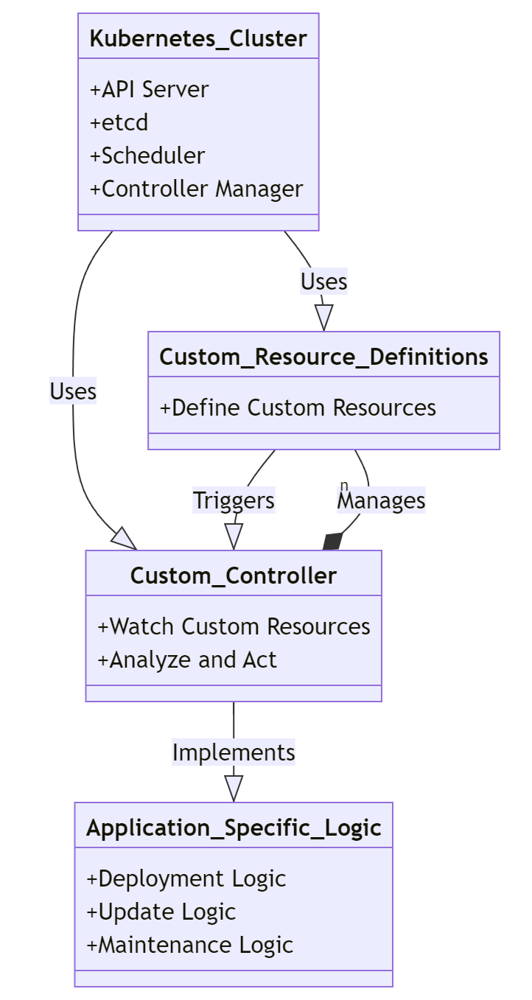
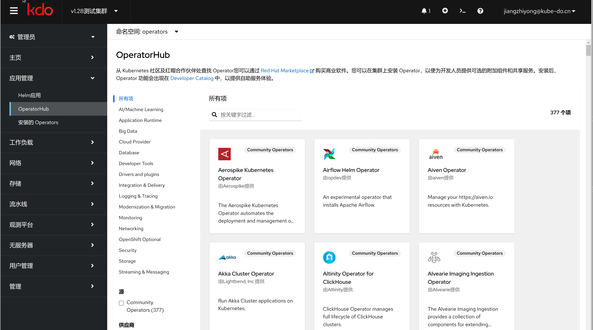

1. TOC
{:toc}

## Operator介绍

{: .note }
Kubernetes Operator 是一种专门用于扩展 Kubernetes API 的方法，它允许您为特定应用程序定义、部署和管理复杂的有状态应用。
Operator 是通过编写自定义资源（Custom Resource Definitions, CRD）来实现的，这些自定义资源可以看作是 Kubernetes API 的扩展，它们描述了您的应用程序的状态和行为。

### Operator的特点
1. **定制化:** 每个 Operator 都是为特定的应用程序或一组相关服务设计的。例如，数据库、监控系统、CI/CD 系统等都可以有自己的 Operator。
2. **领域知识:** Operator 包含了对所管理应用程序的深入理解，包括如何安装、配置、升级以及处理故障。这意味着 Operator 可以执行复杂的操作，如备份恢复、滚动更新等，而无需人工干预。
3. **自动化操作:** 通过使用控制器模式，Operator 可以自动响应集群中的变化，确保应用程序始终处于预期的状态。如果检测到异常情况，它可以采取适当的措施进行自我修复。
4. **声明式API:** Operator 使用 Kubernetes 的声明式 API 来管理应用程序的生命周期。用户只需要指定想要达到的目标状态，剩下的工作交给 Operator 去完成。
5. **Operator SDK:** 为了简化 Operator 的开发过程，社区提供了 Operator SDK，这是一个工具集，支持用 Go、Ansible 或 Helm 图表编写 Operator。它还包含了生成项目骨架、添加依赖项、构建镜像等功能。
6. **管理和监控:** Operator 可以集成 Prometheus 等监控工具，提供详细的指标和日志信息，帮助运维人员更好地理解和维护应用程序。
7. **版本控制与升级:** Operator 支持对应用程序及其组件进行版本控制，并且可以安全地执行滚动更新，以最小化停机时间。
8. **社区和生态系统:** 随着 Operator 的普及，已经形成了一个活跃的社区和丰富的生态系统，其中包含了许多现成的 Operator，可以直接应用于各种应用场景中。

## OperatorHub介绍

{: .note }
OperatorHub用于管理用户的operator，支持安装与部署operator。平台提供公开Operator和私有的Operator，公开的可直接安装，无需购买/上传； 私有的Operator支持上传，用户可根据实际的需要在在资产开放平台购买私有的Operator。
KDO平台通过 OLM（OperatorLifecycleManager）插件管理 operator，OLM作为Operator Framework的一部分，可以帮助用户进行Operator的自动安装，升级及其生命周期的管理。

### 创建Operator

{: .note }
创建Operator应用和创建[Helm应用](../../../dev/applications/helm)的流程类型，查找需要的Operator，选择`频道`和`版本`即可，一般Operator都是安装在operators这个命名空间(namespace)。

{: .warning }
有一部分Operator需要安装到特定的命名空间(namespace)，具体查看说明文档。

