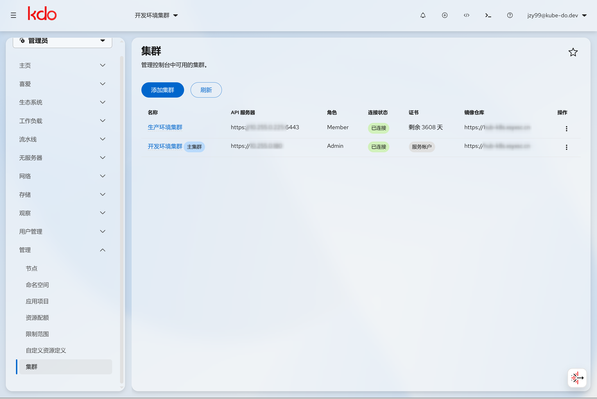
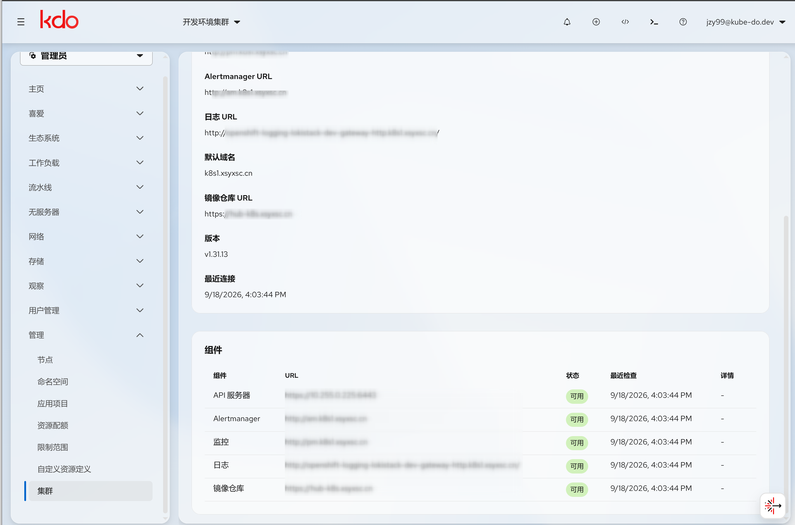
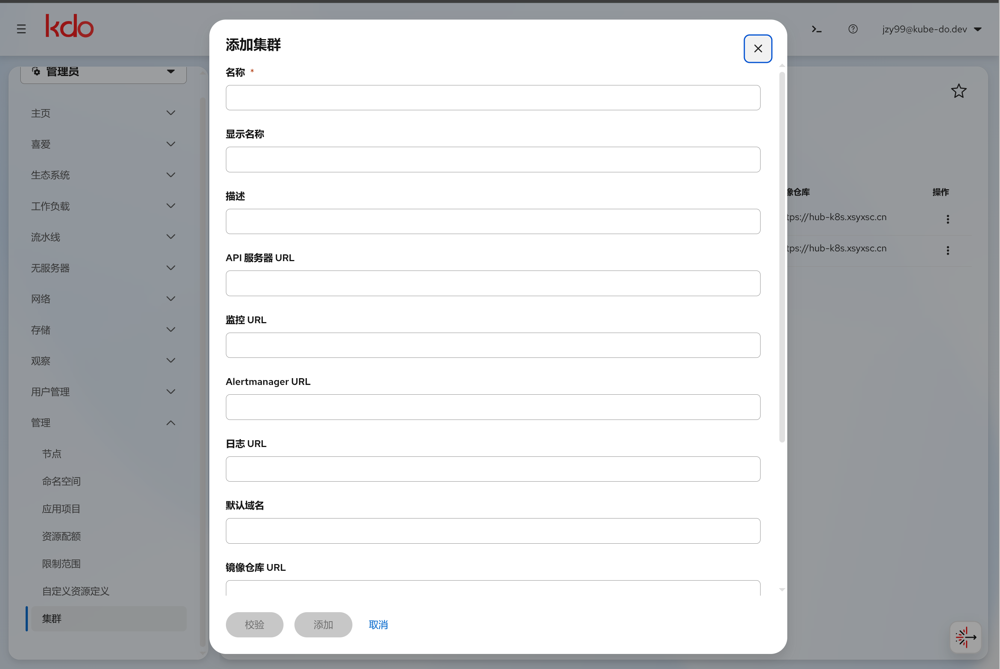
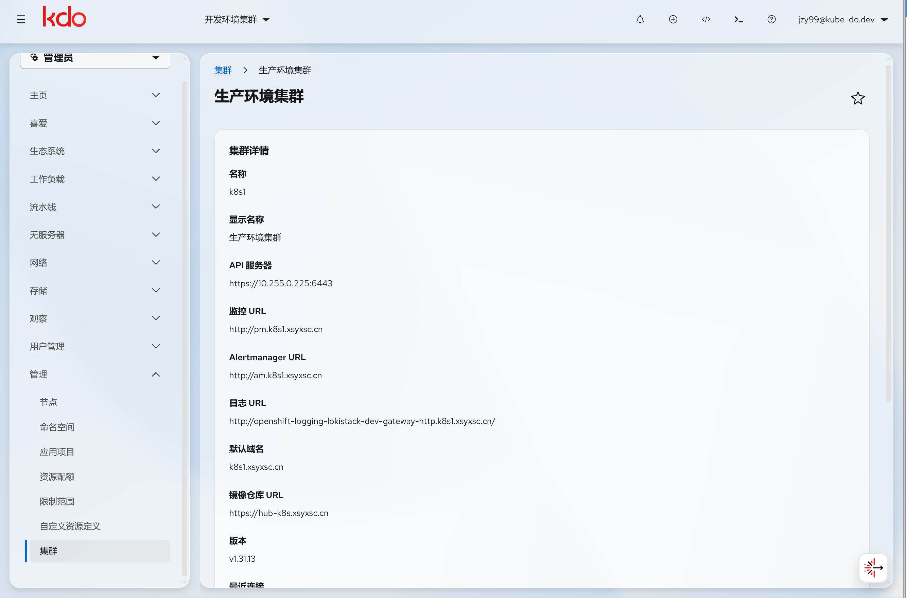

1. TOC
{:toc}

## 介绍

KDO Console 提供图形化的**多集群管理**能力。所有被纳管的集群以 `Cluster` CRD（`kube-do.cn/v1`）形式保存在**主集群**（管理集群）中，由 **KDC Controller** 负责调和，Console 提供列表、详情以及添加/编辑/删除操作。

入口：

| 页面 | 路径 | 说明 |
|------|------|------|
| 集群列表 | `/cluster-management` | 管理员视角 → **管理 → 集群**，查看所有纳管集群 |
| 集群详情 | `/cluster-management/<name>` | 点击列表中的集群名称进入，查看组件健康状态 |



## 核心概念

- **主集群（local-cluster）**：控制面所在的集群，使用控制器的 ServiceAccount 访问，不依赖 kubeconfig；其监控/告警 URL 未显式配置时由 Console 的 `monitoringInfo` 默认值提供。
- **托管集群**：通过 kubeconfig 纳管的其他集群。Console 转发用户 OIDC Token 访问目标集群，因此目标集群的 apiserver 必须信任与主集群相同的 OIDC 颁发者。

## Cluster CRD 字段

### spec

| 字段 | 类型 | 说明 |
|------|------|------|
| `name`（metadata.name） | string | 集群唯一标识（CR 名称） |
| `cname` | string | 集群显示名称 |
| `description` | string | 集群描述 |
| `apiServerURL` | string | API Server 访问地址 |
| `clusterMeteringURL` | string | 监控地址（Thanos / Prometheus） |
| `clusterAlertManagerURL` | string | AlertManager 告警地址 |
| `clusterLoggingURL` | string | 日志服务地址（LokiStack Gateway） |
| `defaultDomain` | string | Ingress 默认域名后缀 |
| `registryURL` | string | 镜像仓库（Harbor）地址 |
| `mainCluster` | bool | 是否为主管理集群 |
| `oidcIssuerURL` | string | 目标集群信任的 OIDC Issuer（由校验自动写入） |
| `insecureSkipTLSVerify` | bool | 是否跳过 TLS 证书校验（存在安全风险） |

### status

| 字段 | 类型 | 说明 |
|------|------|------|
| `version` | string | 目标集群 Kubernetes 版本 |
| `certificateExpiry` | time | kubeconfig 客户端证书最早到期时间 |
| `lastConnectedTime` | time | 最近一次成功连接时间 |
| `conditions` | []Condition | 连接状态，`Connected` 条件表示 API Server 可达 |
| `components` | []ComponentStatus | 各组件健康状态（见下文） |

**示例：**

```yaml
apiVersion: kube-do.cn/v1
kind: Cluster
metadata:
  name: k8s1
spec:
  cname: 生产环境集群
  description: 生产工作负载集群
  apiServerURL: https://10.255.0.225:6443
  clusterMeteringURL: http://pm.example.com
  clusterAlertManagerURL: http://am.example.com
  clusterLoggingURL: http://logging-gateway.example.com/
  defaultDomain: example.com
  registryURL: https://hub.example.com
  oidcIssuerURL: https://keycloak.example.com/realms/kdo
  insecureSkipTLSVerify: false
status:
  version: v1.31.13
  lastConnectedTime: "2026-09-18T07:28:48Z"
  conditions:
    - type: Connected
      status: "True"
      reason: Connected
  components:
    - name: Metering
      url: http://pm.example.com
      available: true
      lastProbeTime: "2026-09-18T07:28:48Z"
```

## 组件健康探测

KDC Controller **每 5 分钟**探测一次各组件 URL，并把结果写入 `status.components`。探测端点与判定如下：

| 组件 | 取值字段 | 探测端点 | 可达判定 |
|------|----------|----------|----------|
| `APIServer` | kubeconfig | 集群 discovery `/version` | 返回成功即可达 |
| `AlertManager` | `clusterAlertManagerURL` | `/-/healthy` | HTTP < 400 |
| `Metering` | `clusterMeteringURL` | `/-/healthy` | HTTP < 400 |
| `Logging` | `clusterLoggingURL` | `/` | HTTP < 400 |
| `Registry` | `registryURL` | `/v2/` | HTTP < 400，或 401/403（需认证也算可达） |

- 未配置 URL 的组件会被跳过，不参与健康判定。
- 探测超时为 5 秒；失败原因记录在 `message` 字段。
- 详情页对各组件不可用给出业务化提示，例如 **Metering 不可用 → “监控不可用，请检查监控 URL”**。



## 控制台操作

### 集群列表

列表列包含：**Name / API Server / Role / Connection / Certificate / Registry / Actions**。

- **Role**：主集群显示 `Admin`，托管集群显示 `Member`。
- **Connection**：读取 `Connected` 条件，显示 *Connected* / *Disconnected* / *Unknown*。
- **Certificate**：托管集群显示客户端证书剩余有效天数（少于 30 天橙色、过期红色）；主集群使用 ServiceAccount，显示 `ServiceAccount`。

### 添加集群

点击 **添加集群**，填写名称、kubeconfig（必填）及各组件 URL 后保存。保存前后端会先执行校验：

- kubeconfig 可解析、可连接、可访问目标集群；
- kubeconfig 必须具备**集群管理员权限**（对 namespaces、serviceaccounts、secrets、rolebindings、clusterrolebindings 等具备创建/删除权限）；
- 目标集群 OIDC 参数必须与主集群**保持一致**（issuerURL、clientID）；
- 客户端证书不足 30 天、TLS 跳过校验、API Server 与 kubeconfig 不一致等会给出警告。

校验不通过会阻止创建/更新，并在弹窗中展示原因。



### 集群详情

点击列表中的集群名称进入详情页，可查看集群基本信息（名称、显示名称、描述、各组件 URL、默认域名、镜像仓库 URL）以及 Kubernetes 版本、最近连接时间和各组件健康状态。



### 编辑与删除

- 主集群（`local-cluster`）禁止编辑与删除。
- 删除集群时会触发 KDC 的 finalizer 清理流程（见下文）。

## 删除与清理

`Cluster` 带有 finalizer `kube-do.cn/cluster-cleanup`。删除时 KDC 会：

1. 清理目标集群上由 KDO 创建的资源（AppEnv 命名空间、deployer ServiceAccount/Token、RoleBinding 等）；
2. 删除各项目命名空间中受限 kubeconfig 的对应 key；
3. 最后删除 `kubedo-system/cluster-kubeconfigs` 中的管理员 kubeconfig key。

{: .warning }
删除集群前**不要手动删除** `kubedo-system/cluster-kubeconfigs` 中该集群的管理员 kubeconfig，否则 finalizer 无法连接目标集群完成清理。该 key 由 KDC 在清理完成后自动删除。

## 升级与迁移注意

- 字段 **`clusterThanosURL` 已重命名为 `clusterMeteringURL`**。升级 CRD 前请先迁移现有对象：

  ```bash
  kubectl patch cluster k8s1 --type=merge \
    -p '{"spec":{"clusterMeteringURL":"http://pm.example.com"}}'
  ```

- 新版本 CRD 新增了 `spec.description`、`spec.oidcIssuerURL`、`spec.insecureSkipTLSVerify` 以及 `status.components`，需先 apply 新的 CRD。
- 已移除的字段：`jaegerHost`、`kialiHost`、`role`、`clusterGitOpsURL`。

## 命令行参考

```bash
# 列出所有纳管集群
kubectl get clusters.kube-do.cn

# 查看某个集群的 spec 与组件状态
kubectl get cluster k8s1 -o yaml

# 查看集群连接条件
kubectl get cluster k8s1 -o jsonpath='{.status.conditions}'
```

## 相关链接

- [Kdo Web 控制台配置](/docs/install/config/console/) — `monitoringInfo` 等默认 URL 配置
- [应用项目 (AppProject)](/docs/admin/management/appprojects/) — 项目与多环境管理
- [管理首页](/docs/admin/management/)
