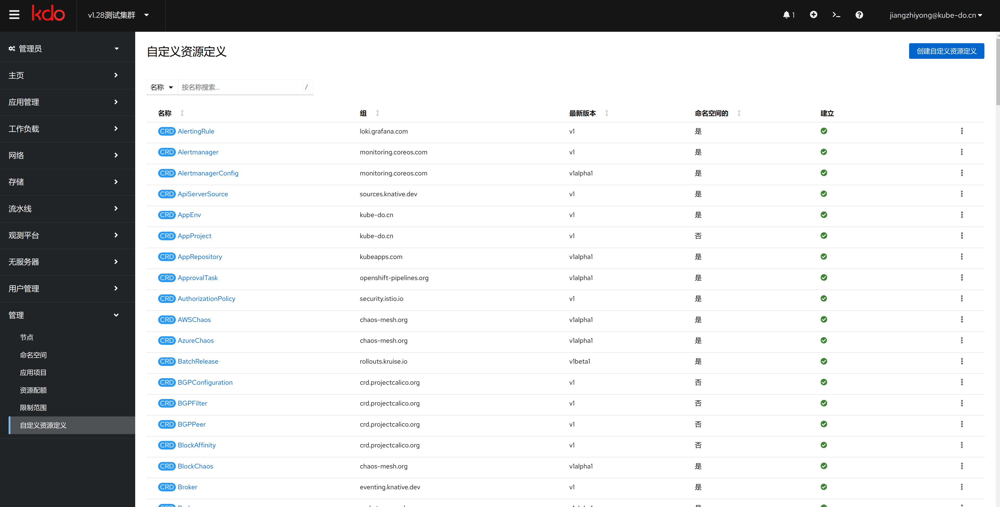
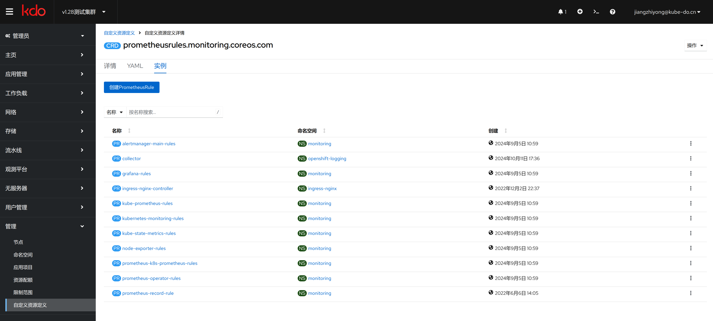

1. TOC
{:toc}

## 介绍

{: .note }
[Custom Resource Definitions (CRDs)](https://kubernetes.io/zh-cn/docs/concepts/extend-kubernetes/api-extension/custom-resources/) 是 Kubernetes 中用于扩展 API 的一种机制，允许用户定义自己的资源类型。
CRD 是一种 API 对象，它代表了一类自定义资源。 当你创建一个 CRD 时，Kubernetes API 服务器会自动为你提供存储和访问该类型的自定义资源的能力。
这使得开发者可以在不修改 Kubernetes 核心代码的情况下，轻松地为集群引入新的功能或抽象层。
KDO平台的很多组件都是通过CRD来实现的。

## 操作CRD

{: .note }
由于很多资源没有在KDO平台的菜单里面，比如用于监控的`PrometheusRule`，我们就可以CRD找到，进行增加、删除、修改等操作。

