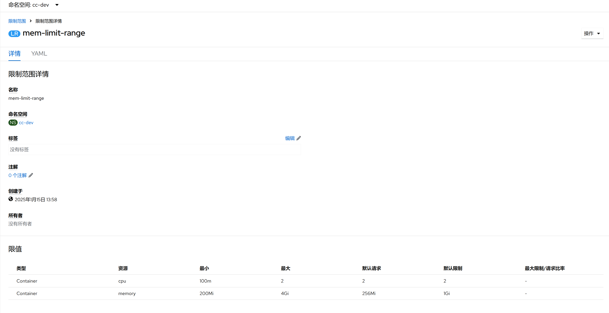

1. TOC
{:toc}

## 介绍

{: .note }
LimitRange(限制范围) 是 Kubernetes 中用于限制命名空间内资源使用的策略对象。
它允许管理员设置容器或 容器组(Pod) 的资源[请求(requests)和限制(limits)](/docs/workload-actions/edit-resource-limits)的默认值、最小值、最大值以及最大请求/限制比率等，从而确保容器不会消耗过多的资源，并且能够保证基本的资源分配。
[更多信息, 请参考官方文档。](https://kubernetes.io/zh-cn/docs/concepts/policy/limit-range/)

## 主要功能
1. **默认资源请求和限制:** 如果用户在创建 容器组(Pod) 或容器时没有指定资源请求或限制，LimitRange(限制范围) 可以为它们提供默认值。这有助于确保所有容器都有明确的资源需求，便于调度器进行有效的资源分配。
2. **资源请求和限制的上下限:** LimitRange(限制范围) 可以设定每个容器的资源请求和限制的最大值和最小值，防止容器请求过多或过少的资源。这对于维护集群稳定性和资源公平性非常重要。
3. **最大请求/限制比率:** 通过设置 maxLimitRequestRatio，可以控制资源限制与请求之间的比率，避免过度超售资源。
4. **持久卷声明（PVC）大小限制:** 对于 PersistentVolumeClaim (PVC)，LimitRange(限制范围) 还可以限制请求存储量的最小和最大值，确保有足够的存储资源可用，同时防止不必要的大容量请求。