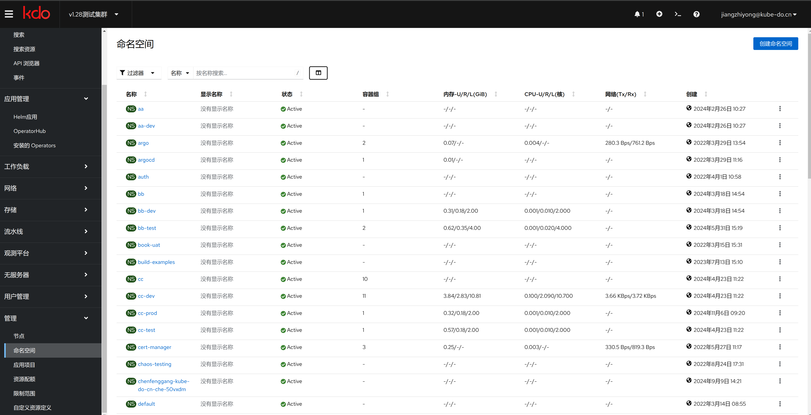
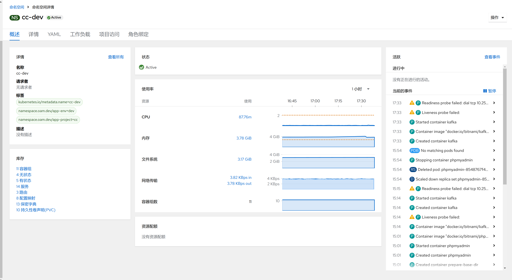
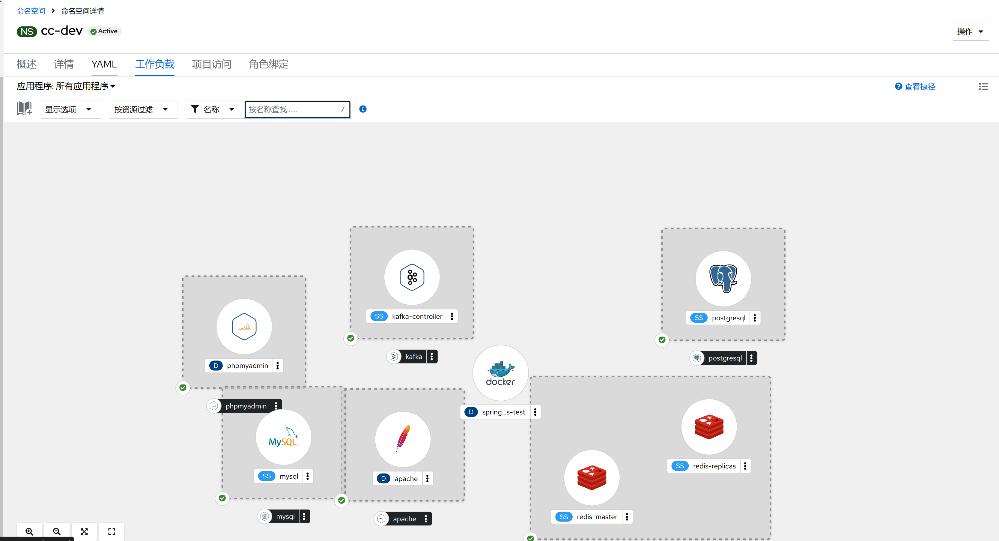
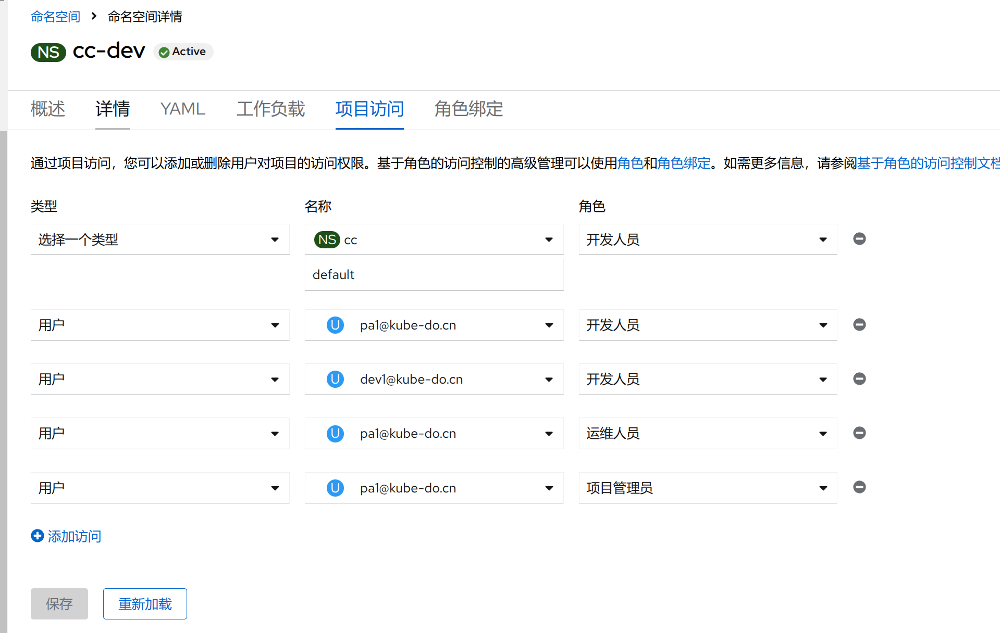
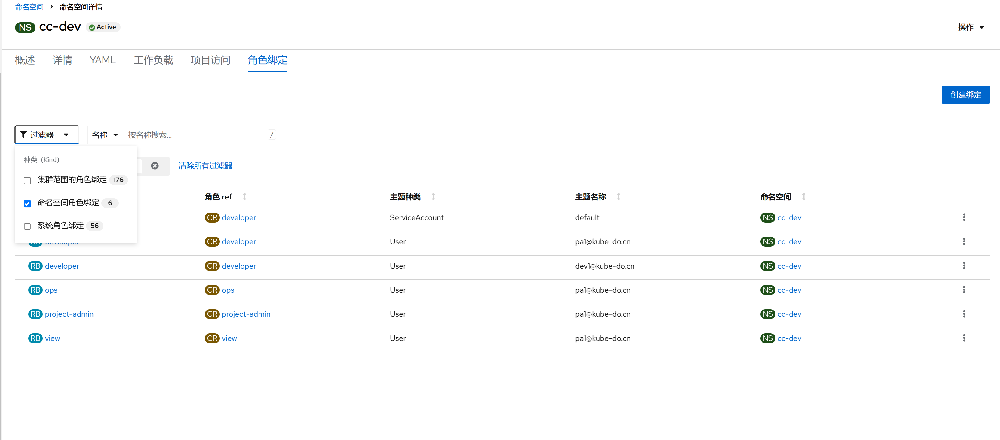

1. TOC
{:toc}

## 介绍

{: .note }
在 Kubernetes 中，名字空间(Namespace)提供一种机制，将同一集群中的资源划分为相互隔离的组。 同一名字空间内的资源名称要唯一，但跨名字空间时没有这个要求。 
名字空间作用域仅针对带有名字空间的对象(例如 Deployment、Service等)，这种作用域对集群范围的对象(例如 StorageClass、Node、PersistentVolume 等)不适用。

### 默认名字空间

{: .note }
Kubernetes 启动时会创建四个初始名字空间：

1. **default** Kubernetes 包含这个名字空间，以便于你无需创建新的名字空间即可开始使用新集群。
2. **kube-node-lease** 该名字空间包含用于与各个节点关联的 Lease（租约）对象。 节点租约允许 kubelet 发送心跳， 由此控制面能够检测到节点故障。
3. **kube-public** 所有的客户端（包括未经身份验证的客户端）都可以读取该名字空间。 该名字空间主要预留为集群使用，以便某些资源需要在整个集群中可见可读。 该名字空间的公共属性只是一种约定而非要求。
4. **kube-system** 该名字空间用于 Kubernetes 系统创建的对象。

### 命名空间感知命令
使用 kubectl 命令时，你可以通过 -n 或 --namespace 参数来指定操作的命名空间。如果不指定，它将会作用于默认命名空间。
你可以使用`kubectl config set-context --current --namespace=<namespace_name>`来更改当前上下文的命名空间。

### 生命周期
当命名空间被创建后，它可以容纳各种类型的资源。当命名空间被删除时，它内部的所有资源也会被删除。

### 隔离性
- 名字空间(Namespace) 提供了一定程度的名称隔离。不同命名空间中的对象可以有相同的名字，因为它们由命名空间的上下文所区分。 
- 它们也提供了配置的隔离，例如，[资源配额(ResourceQuota)](../resourcequotas)和[限制范围(LimitRange)](../limitranges)可以在命名空间级别定义。

### 名字空间和DNS
当你创建一个服务时， Kubernetes 会创建一个相应的 DNS 条目。
该条目的形式是` <服务名称>.<名字空间名称>.svc.cluster.local`，这意味着如果容器只使用 <服务名称>，它将被解析到本地名字空间的服务。
这对于跨多个名字空间（如开发、测试和生产） 使用相同的配置非常有用。如果你希望跨名字空间访问，则需要使用完全限定域名（FQDN）

## 查看命名空间

在命名空间列表，是对整个集群的命名空间的概述

| 菜单            | 说明                                                                                                                                                         |
|:--------------|:-----------------------------------------------------------------------------------------------------------------------------------------------------------|
| 名称            | 命名空间的名字                                                                                                                                                    |
| 显示名称          | 命名空间的显示名称                                                                                                                                                  |
| 状态            | 命名空间的状况                                                                                                                                                    |
| 容器组           | 命名空间内运行的容器组数量                                                                                                                                              |
| 内存-U/R/L(GiB) | 命名空间的内存状态，U表示命名空间内全部容器组实际使用的内存量， R表示命名空间内全部容器组`请求值(Request)`的内存量， L表示命名空间内全部容器组`限制值(Limit)`的内存量。[更多内容](../../../workload-actions/edit-resource-limits)     |
| CPU-U/R/L(核)  | 命名空间的CPU状态，U表示命名空间内全部容器组实际使用的CPU量， R表示命名空间内全部容器组`请求值(Request)`的CPU量， L表示命名空间内全部容器组`限制值(Limit)`的CPU量。[更多内容](../../../workload-actions/edit-resource-limits) |
| 网络(Tx/Rx)     | 命名空间内全部容器组的`网络发送(Tx)`和`接收(Tx)`的网络速率。                                                                                                                       |
| 创建            | 命名空间的创建时间                                                                                                                                                  |

## 命名空间详情

### 命名空间概述

### 命名空间工作负载

### 命名空间访问控制

### 命名空间角色绑定
