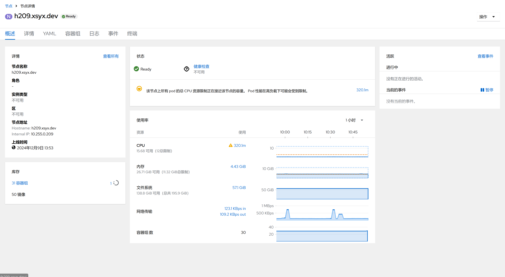

1. TOC
{:toc}

## 介绍

{: .note }
Kubernetes 通过将容器放入在节点（Node）上运行的 Pod 中来执行你的工作负载。 节点可以是一个虚拟机或者物理机器，取决于所在的集群配置。 每个节点包含运行 Pod 所需的服务； 这些节点由控制面负责管理。
通常集群中会有若干个节点；而在一个学习所用或者资源受限的环境中，你的集群中也可能只有一个节点。 节点上的组件包括 kubelet、 容器运行时以及 kube-proxy。

## 节点列表

{: .note }
节点有以下菜单：

| 菜单            | 说明                                                           |
|:--------------|:-------------------------------------------------------------|
| 名称            | 节点的名字                                                        |
| 状态            | 节点的状况，参考[节点状况表格](#节点状况)                                      |
| 节点IP          | 节点的IP地址                                                      |
| 角色            | 节点的角色，一般分为master和worker                                      |
| 容器组           | 节点内运行的容器组数量                                                  |
| 内存-U/R/H(GiB) | 节点的内存状态，U表示节点实际使用的内存量， R表示节点容器组Request的内存量， H表示节点可用的总内存量     |
| CPU-U/R/H(核)  | 节点的CPU状态，U表示节点实际使用的CPU量， R表示节点容器组Request的CPU量， H表示节点可用的总CPU量 |
| 文件系统-U/H(GiB) | 节点的存储卷使用情况，U表示实际使用量，H表示总可使用量                                 |
| 创建            | 节点的创建时间                                                      |

### 节点状况

{: .note }
节点的conditions 字段描述了所有 Running 节点的状况。状况的示例包括：

| 节点状况               | 描述                                                                                                                    |
|:-------------------|:----------------------------------------------------------------------------------------------------------------------|
| Ready              | 如节点是健康的并已经准备好接收 Pod 则为 True；False 表示节点不健康而且不能接收 Pod；Unknown 表示节点控制器在最近 node-monitor-grace-period 期间（默认 50 秒）没有收到节点的消息 |
| DiskPressure       | True 表示节点存在磁盘空间压力，即磁盘可用量低，否则为 False                                                                                   |
| MemoryPressure     | True 表示节点存在内存压力，即节点内存可用量低，否则为 False                                                                                   |
| PIDPressure        | True 表示节点存在进程压力，即节点上进程过多；否则为 False                                                                                    |
| NetworkUnavailable | rue 表示节点网络配置不正确；否则为 False                                                                                             |

## 节点详情

点击对应的节点，可以打开节点页面，里面有以下菜单：

| 菜单   | 描述                          |
|:-----|:----------------------------|
| 概述   | 节点的整体                       |
| 详情   | 节点的详细情况                     |
| YAML | 节点的YAML文件                   |
| 容器组  | 节点内运行的容器组                   |
| 日志   | 节点的日志                       |
| 事件   | 节点的事件                       |
| 终端   | 通过bash访问节点，和SSH类似，可以上传和下载文件 |

### 节点终端

## 节点操作

{: .note }
点击节点详情页面右上角的`操作`按钮，可以对节点进行一些运维操作

| 菜单          | 描述                         |
|:------------|:---------------------------|
| 标识为不可调度/可调度 | 标识为不可调度后，容器组将不被调度到这个节点     |
| 排干节点的容器组    | 把这个节点的容器组全部驱逐并把这个节点设置为不可调度 |
| 驱逐未运行的容器组   | 把节点上没有正常运行的容器组全部删除         |
| 编辑Node      | 编辑Node                     |
| 删除Node      | 删除Node                     |
