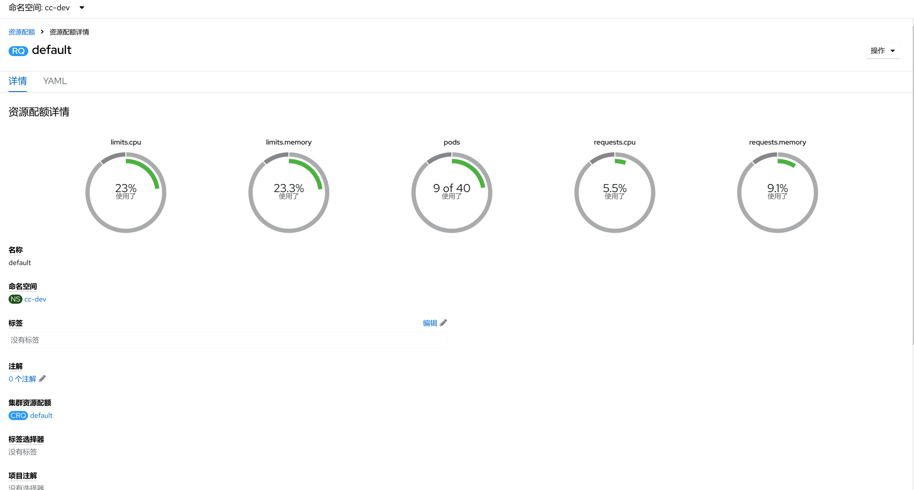

1. TOC
{:toc}

## 介绍

{: .note }
资源配额(ResourceQuota) 是 Kubernetes 中用于限制命名空间内资源总量的一种策略对象。
它允许集群管理员对每个命名空间设置资源使用上限，从而控制该命名空间内的资源消耗，确保整个集群的资源不会被单个命名空间耗尽。
这有助于在多租户环境中实现资源的公平分配和隔离。

## 主要功能

1. **硬性配额(Hard limits):** ResourceQuota 可以为各种计算资源（如 CPU、内存）、存储资源（如持久卷声明 PVC），以及对象数量（如 Pod、Service、ConfigMap 等）设定硬性的使用上限。一旦达到这些上限，任何进一步的资源请求都会被拒绝。
2. **作用于命名空间级别:** 每个 ResourceQuota 对象只影响它所属的命名空间。这意味着你可以为不同的团队或项目创建独立的命名空间，并为每个命名空间单独配置配额，以满足各自的资源需求。
3. **支持多种资源类型:** 除了常见的计算和存储资源外，ResourceQuota 还可以限制其他类型的 Kubernetes 对象数量，例如 Secrets、Services、Deployment 等等。这对于防止意外创建过多的对象，保持集群整洁有序非常重要。
4. **与[限制范围(LimitRange)](../limitranges) 协同工作:** 虽然`限制范围(LimitRange)`主要用于设置单个容器或 Pod 的资源使用限制，但 ResourceQuota 则是针对整个命名空间的总量限制。两者可以一起使用来提供更精细的资源管理。

##  注意事项
1. ResourceQuota 只能应用于[命名空间](../namespaces)级别的资源，因此需要为每个目标命名空间单独配置。
2. 如果你在命名空间中同时使用了 LimitRange 和 ResourceQuota，请确保它们之间的配置是一致且兼容的，以避免冲突。
3. 当你删除 ResourceQuota 或修改其配置时，现有资源不受影响；只有新创建的资源会受到新的配额规则约束。
4. 配置合理的 ResourceQuota 需要考虑命名空间的实际需求和集群的整体资源情况，以平衡资源利用率和服务质量。