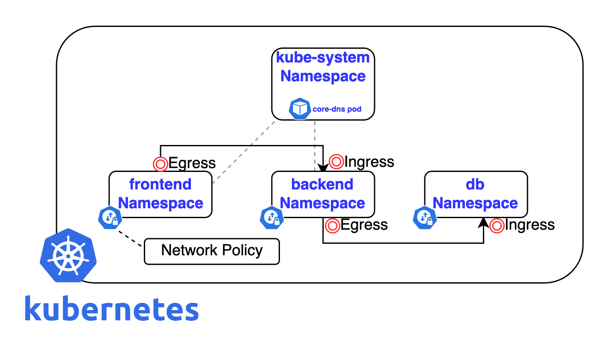

1. TOC
{:toc}

## 介绍

{: .note }
Kubernetes 的 NetworkPolicy 是一种用于定义 容器组 之间以及 容器组 与其他网络端点之间的网络隔离策略的资源。它允许集群管理员或开发者指定哪些流量可以进入或离开一组 容器组，从而增强了集群内部的安全性和通信控制。

## 基本概念
1. **选择器（容器组 Selector）：** 每个 NetworkPolicy 都包含一个 podSelector，它指定了该策略应用于哪些 容器组。选择器使用标签来匹配目标 容器组。
2. **规则（Rules）：** 策略中定义了 ingress（入站）和 egress（出站）规则，这些规则描述了允许什么样的流量进出被选中的 容器组。
3. **类型（Policy Types）：** 可以是 Ingress、Egress 或两者兼有。这决定了策略是只影响入站流量、只影响出站流量还是同时影响两者。

## 工作原理
NetworkPolicy 本身并不直接执行任何网络行为；它需要一个支持网络策略的 CNI（Container Network Interface）插件来实现这些策略。常见的支持网络策略的 CNI 插件包括 Calico、Cilium、Weave Net 等。
默认情况下，所有 容器组 在同一命名空间内都是完全连通的。一旦为某个命名空间定义了至少一条 NetworkPolicy，那么未被任何策略明确允许的流量将被拒绝。
如果没有配置任何 NetworkPolicy，则默认允许所有 容器组 之间的通信。

## 管理网络策略

