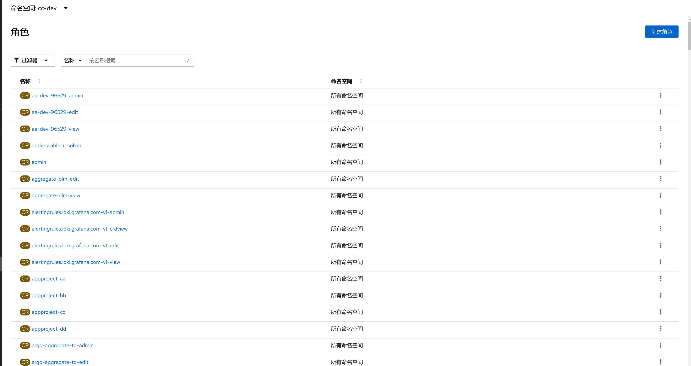
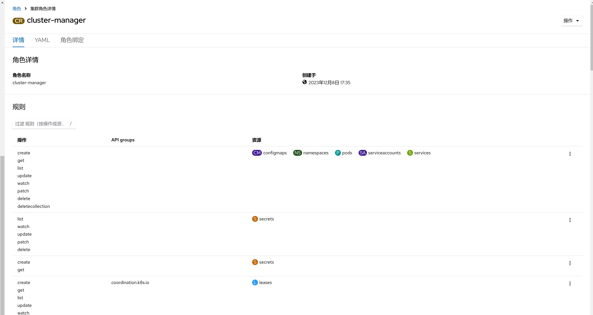

1. TOC
{:toc}

## 介绍

{: .note }
RBAC 的 Role 或 ClusterRole 中包含一组代表相关权限的规则。 这些权限是纯粹累加的（不存在拒绝某操作的规则）。

Role 总是用来在某个名字空间内设置访问权限； 在你创建 Role 时，你必须指定该 Role 所属的名字空间。

与之相对，ClusterRole 则是一个集群作用域的资源。这两种资源的名字不同（Role 和 ClusterRole） 是因为 Kubernetes 对象要么是名字空间作用域的，要么是集群作用域的，不可两者兼具。

ClusterRole 有若干用法。你可以用它来：

定义对某名字空间域对象的访问权限，并将在个别名字空间内被授予访问权限；
为名字空间作用域的对象设置访问权限，并被授予跨所有名字空间的访问权限；
为集群作用域的资源定义访问权限。
如果你希望在名字空间内定义角色，应该使用 Role； 如果你希望定义集群范围的角色，应该使用 ClusterRole。

## 角色说明

