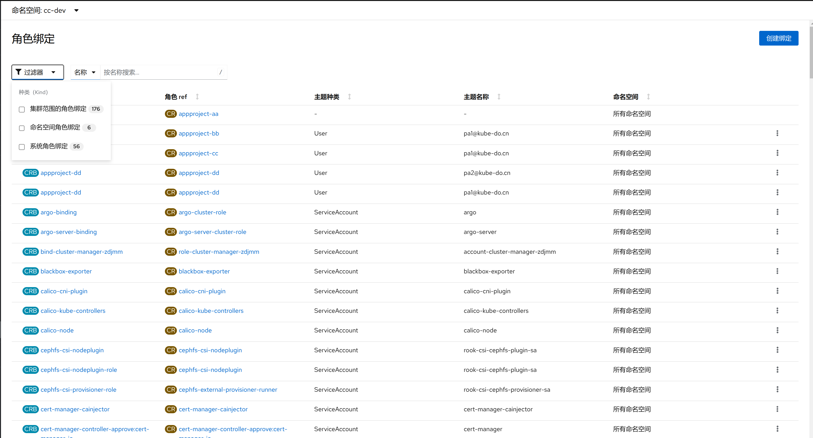
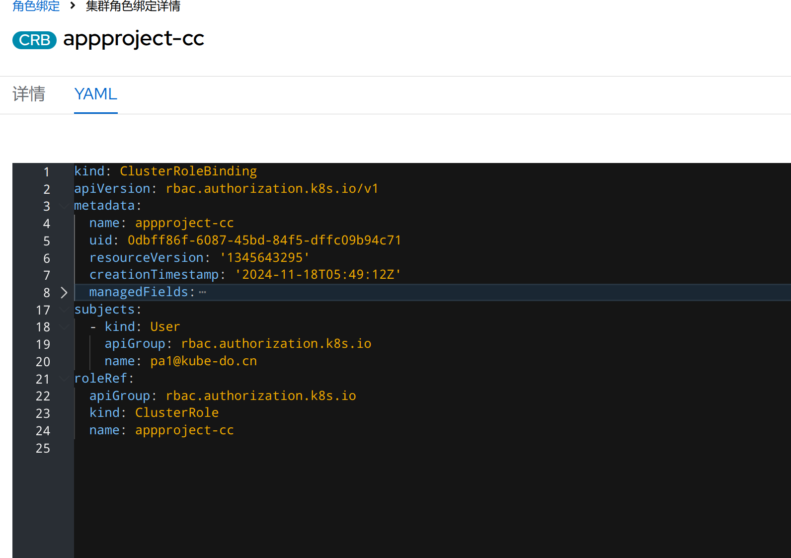

1. TOC
{:toc}

## 介绍

{: .note }
角色绑定（Role Binding）是将角色中定义的权限赋予一个或者一组用户。 它包含若干主体（Subject）（用户、组或服务账户）的列表和对这些主体所获得的角色的引用。 RoleBinding 在指定的名字空间中执行授权，而 ClusterRoleBinding 在集群范围执行授权。
一个 RoleBinding 可以引用同一的名字空间中的任何 Role。 或者，一个 RoleBinding 可以引用某 ClusterRole 并将该 ClusterRole 绑定到 RoleBinding 所在的名字空间。 如果你希望将某 ClusterRole 绑定到集群中所有名字空间，你要使用 ClusterRoleBinding。
RoleBinding 或 ClusterRoleBinding 对象的名称必须是合法的 路径分段名称。

## 角色绑定说明

## 创建角色绑定

