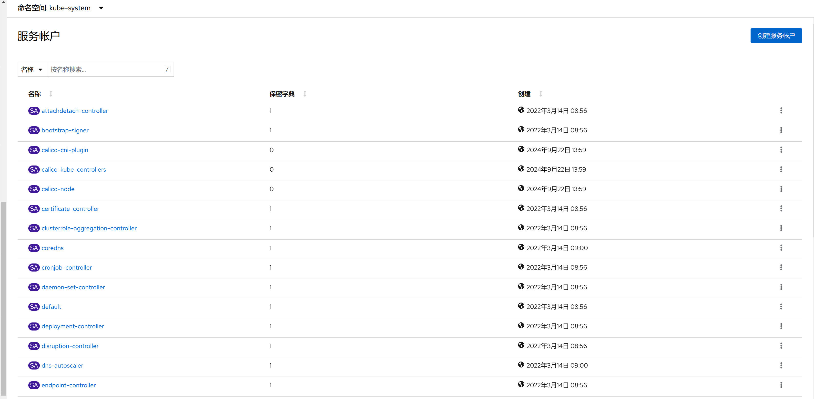

1. TOC
{:toc}

## 介绍

{: .note }
服务账号(ServiceAccount)是在 Kubernetes 中一种用于非人类用户的账号，在 Kubernetes 集群中提供不同的身份标识。 应用 Pod、系统组件以及集群内外的实体可以使用特定 ServiceAccount 的凭据来将自己标识为该 ServiceAccount。 这种身份可用于许多场景，包括向 API 服务器进行身份认证或实现基于身份的安全策略。
服务账号以 ServiceAccount 对象的形式存在于 API 服务器中。

### 服务账号具有以下属性：
1. **名字空间限定:** 每个服务账号都与一个 Kubernetes 名字空间绑定。 每个名字空间在创建时，会获得一个名为 default 的 ServiceAccount。
2. **轻量级:** 服务账号存在于集群中，并在 Kubernetes API 中定义。你可以快速创建服务账号以支持特定任务。
3. **可移植性:** 复杂的容器化工作负载的配置包中可能包括针对系统组件的服务账号定义。 服务账号的轻量级性质和名字空间作用域的身份使得这类配置可移植。

