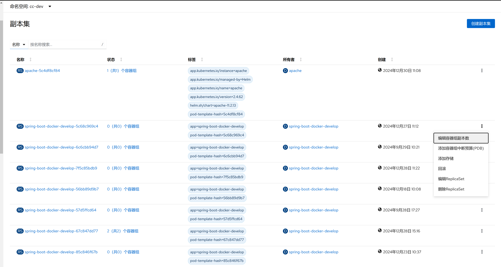

1. TOC
{:toc}

## 介绍

{: .note }
ReplicaSet是kubernetes中的一种副本控制器，简称rs，主要作用是控制由其管理的容器组，使容器组副本的数量始终维持在预设的个数。
它的主要作用就是保证一定数量的容器组能够在集群中正常运行，它会持续监听这些容器组的运行状态，在容器组发生故障时重启容器组，容器组数量减少时重新运行新的 容器组副本。
[更多信息](https://kubernetes.io/zh-cn/docs/concepts/workloads/controllers/replicaset/)

官方推荐不要直接使用ReplicaSet，用Deployments取而代之，Deployments是比ReplicaSet更高级的概念，它会管理ReplicaSet并提供很多其它有用的特性，最重要的是Deployments支持声明式更新，声明式更新的好处是不会丢失历史变更。
所以Deployment控制器不直接管理容器组对象，而是由 Deployment 管理ReplicaSet，再由ReplicaSet负责管理容器组对象。

## 工作原理
Replicaset核心作用在于用户创建指定数量的容器组副本，并确保容器组副本一直处于满足用户期望的数量， 起到多退少补的作用，并且还具有自动扩容缩容等制。
Replicaset控制器主要由三个部分组成：
1. **用户期望的容器组副本数：** 用来定义由这个控制器管控的容器组副本有几个 
2. **标签选择器：** 选定哪些容器组是自己管理的，如果通过标签选择器选到的容器组副本数量少于我们指定的数量，需要用到下面的组件 
3. **容器组资源模板：** 如果集群中现存的容器组数量不够我们定义的副本中期望的数量怎么办，需要新建容器组，这就需要容器组模板，新建的容器组是基于模板来创建的。

