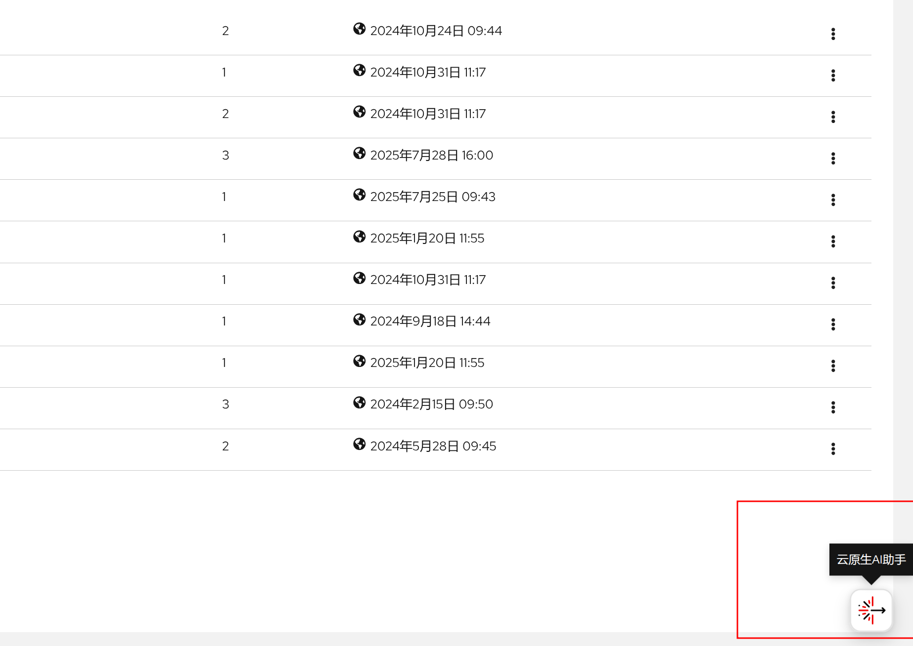

好的，我来为您详细介绍 **云原生AI助手**。

这是一个集成了 **生成式 AI** 能力的智能辅助平台，旨在彻底改变开发者在 KDO云平台 上的应用开发、部署和运维体验。

它的核心是 **AI 大模型** 技术，专门为 云原生 和 Kubernetes 环境进行了优化。

---

### 一、核心是什么？

云原生AI助手 本质上是一个 **AI 驱动的智能编码和运维助手**。它通过分析您的自然语言指令或代码上下文，提供高质量的代码建议、自动化脚本和运维指令，帮助您更高效地在 KDO云平台 平台上工作。

### 二、主要功能与能力

1.  **智能代码生成 (Intelligent Code Suggestions)**
    *   **自然语言生成代码**：开发者可以用英文描述他们想要实现的功能（例如："创建一个部署三个副本的 nginx 应用，并配置一个负载均衡器服务"），AI助手 会自动生成对应的 YAML 清单文件（如 Deployment、Service 等）。
    *   **代码补全与优化**：在编写 YAML、Helm Charts、Terraform 或 Operator SDK 代码时，云原生AI助手 能提供实时的、上下文感知的代码补全和建议，提高编写效率和准确性。

2.  **专家知识内嵌 (Embedded Expert Knowledge)**
    *   其训练数据包含了 云原生的**大量优秀实践、安全策略和合规性要求**。这意味着它生成的代码不仅能用，而且符合生产环境的最佳实践（例如：自动设置资源限制、安全上下文、Pod 反亲和性等）。
    *   帮助开发者避免常见错误，降低学习 Kubernetes 和 KDO云平台 复杂概念的门槛。

3.  **运维任务自动化 (Operational Task Automation)**
    *   运维人员可以用自然语言查询如何执行特定任务（例如："如何扩展我的 frontend 部署到 5 个副本？" 或 "如何诊断 Pod 启动失败的问题？"）。
    *   AI助手 会生成相应的 `oc`（KDO云平台 CLI）或 `kubectl` 命令，甚至提供详细的故障排除步骤和文档链接。

4.  **与开发工具深度集成**
    *   它主要集成在开发者的 **IDE**（如 VS Code） 和 **Web 控制台** 中，提供无缝的交互体验。
    *   在 **KDO云平台 Developer Perspective** Web 控制台中，开发者可以直接与 AI 交互来创建和部署应用。

### 三、技术架构与核心组件

云原生AI助手 的架构通常包含以下组件：

| 组件          | 描述                                                                      |
|:------------|:------------------------------------------------------------------------|
| **前端集成**    | VS Code 插件、KDO云平台 Web 控制台，为用户提供交互界面。                                    |
| **后端服务**    | 运行在 KDO云平台 上的服务，处理用户请求，管理与 AI 模型的交互。                                    |
| **AI 模型**   | 核心是 **AI 大模型**，这是一个经过大量代码（如 GitHub 上的开源代码）和特定领域知识（如红帽官方文档、最佳实践）训练的专有模型。 |
| **知识库与上下文** | 提供实时的、特定于集群的上下文信息（如现有的 API 资源、Operator、配置），使建议更加准确和相关。                  |

### 四、核心价值与优势

| 优势             | 说明                                        |
|:---------------|:------------------------------------------|
| **大幅提升开发者生产力** | 自动化编写样板代码，让开发者更专注于业务逻辑。                   |
| **降低技术门槛**     | 新手开发者或运维人员无需记忆复杂的 K8s/KDO云平台 命令和概念即可完成工作。 |
| **提升代码质量与一致性** | 生成的代码遵循最佳实践，减少了人为错误和安全漏洞。                 |
| **加速应用现代化**    | 帮助企业更快地将传统应用迁移并现代化到云原生平台。                 |
| **增强开发者体验**    | 让开发过程更流畅、更直观，减少在文档中搜索的时间。                 |

### 五、一个简单的工作流程示例

1.  **开发者输入**（在 IDE 或 Web 控制台中）：
    > "Create a Python Flask application with a Redis cache. Use a ConfigMap for configuration and expose it with an Ingress."

2.  **AI助手 处理**：
    *   理解自然语言指令。
    *   调用 AI 模型生成符合要求的代码。
    *   参考集群的当前上下文。

3.  **输出**：
    *   生成一组完整的 YAML 文件，包括：
        *   `Deployment`（用于 Flask 应用和 Redis）
        *   `Service`（用于内部网络通信）
        *   `ConfigMap`（存放配置）
        *   `Ingress`（用于外部访问）
    *   提供一键部署或复制代码的选项。

### 总结

**云原生AI助手 是将生成式 AI 融入其核心平台战略的关键一步。它不仅仅是一个代码补全工具，更是一个理解 KDO云平台 和云原生领域的 AI 助手，旨在让复杂的容器平台变得更容易使用和管理，最终实现“让每一个开发者都成为云原生专家”的愿景。**

它代表了平台工程和开发者体验的未来方向，即通过 AI 来抽象底层基础设施的复杂性。