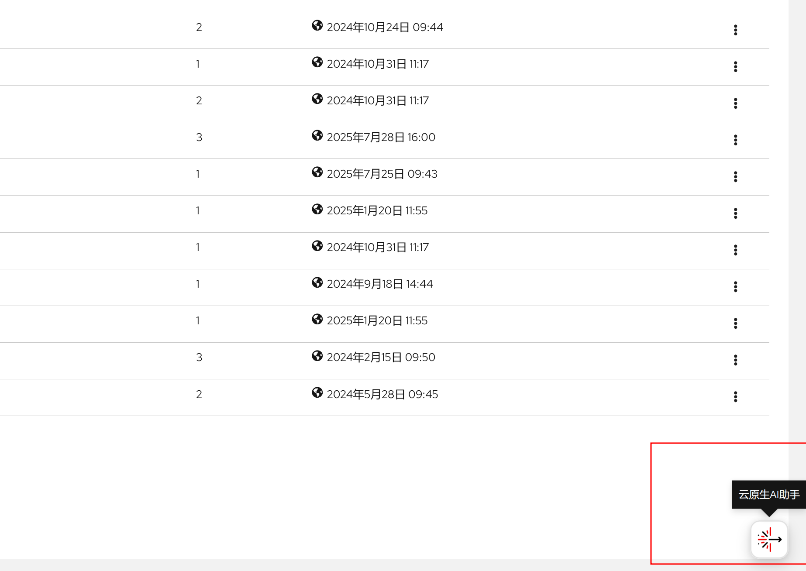
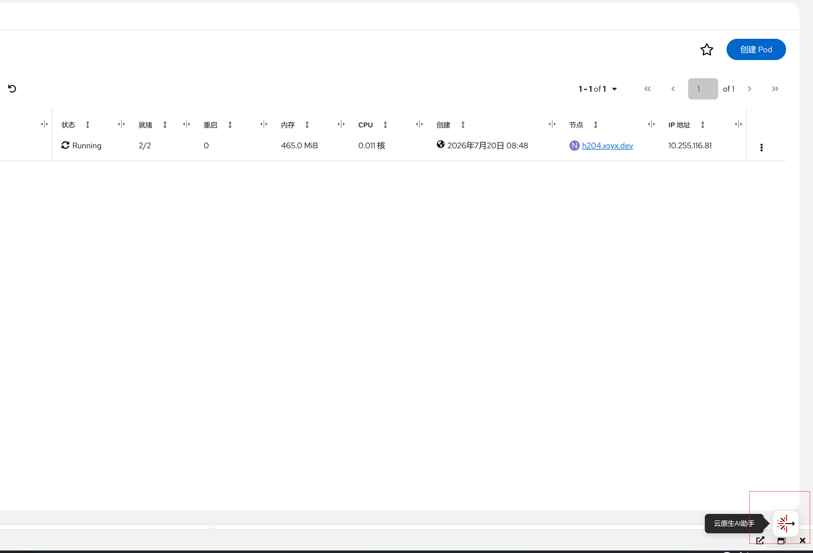
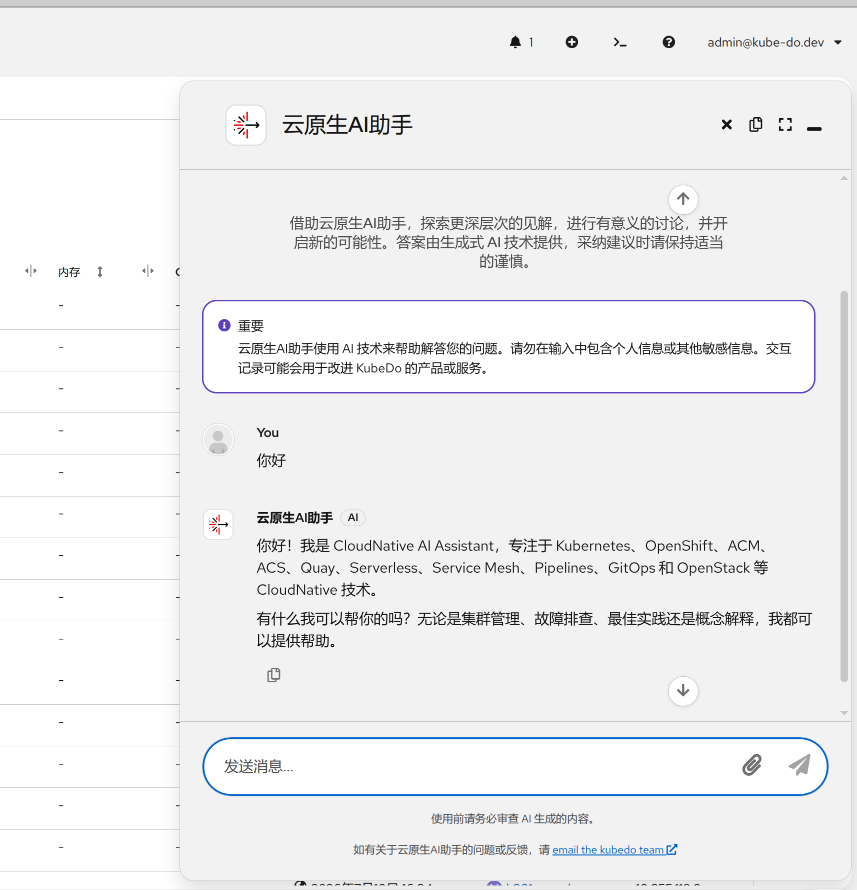
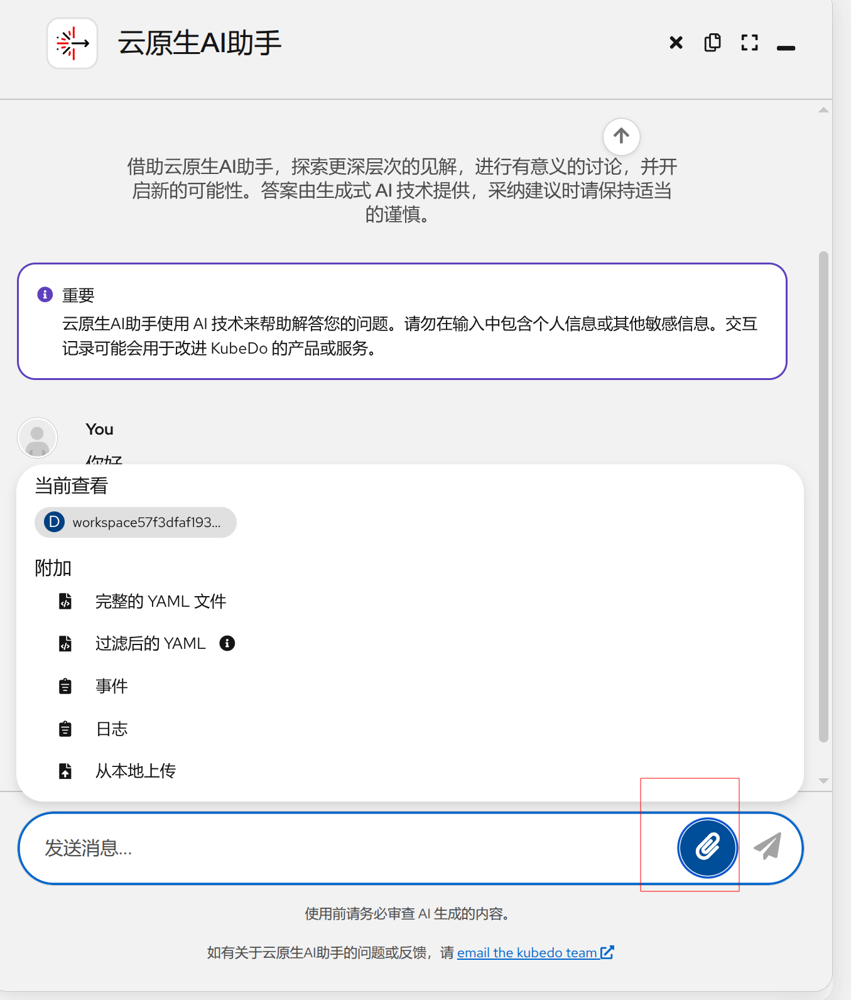

1. TOC
{:toc}

## 介绍

{: .note }
KDO平台集成了 **云原生 AI 智能助手** —— 一个基于生成式 AI 的智能虚拟助手。它直接嵌入在 Web 控制台中，用户可以通过自然语言与 AI 进行交互，获取关于 Kubernetes 及云原生应用的实时指导和帮助。



### 核心特性

| 特性 | 说明 |
|------|------|
| **自然语言交互** | 无需记忆复杂命令，使用日常英语即可与 AI 对话 |
| **上下文感知** | 可附加集群资源对象（Pod、Deployment 等）获取针对性建议 |
| **专家知识** | 基于 Red Hat 官方文档和最佳实践提供权威回答 |
| **告警诊断** | 可附加集群告警，获取根因分析和修复建议 |
| **多 LLM 支持** | 支持 OpenAI、Azure OpenAI、watsonx、RHEL AI、云原生 AI 等模型提供商 |

## 配置说明

{: .note }
Kubernetes Lightspeed 通过 `ConfigMap` 中的 `olsconfig.yaml` 文件进行配置。配置文件位于 `kubedo-system` 命名空间下的 `olsconfig` ConfigMap 中。
大模型api key的配置是`kubedo-system` 命名空间下的 `openai` 这个Secret。


### 配置文件示例

```yaml
kind: ConfigMap
apiVersion: v1
metadata:
  name: olsconfig
  namespace: kubedo-system
  labels:
    app.kubernetes.io/component: lightspeed-w-rag
    app.kubernetes.io/instance: lightspeed-w-rag
    app.kubernetes.io/name: lightspeed-w-rag
    app.kubernetes.io/part-of: lightspeed-w-rag-app
data:
  olsconfig.yaml: |
    llm_providers:
      - name: openai
        url: "https://api.deepseek.com"
        credentials_path: config/openai/openai_api_key.txt
        models:
          - name: deepseek-v4-flash
    ols_config:
      max_workers: 1
      reference_content:
        product_docs_index_path: "./vector_db/ocp_product_docs/4.19"
        product_docs_index_id: ocp-product-docs-4_19
        embeddings_model_path: "./embeddings_model"
        indexes:
        - product_docs_index_path: "./vector_db/ocp_product_docs/4.19"
          product_docs_index_id: ocp-product-docs-4_19
      conversation_cache:
        type: memory
        memory:
          max_entries: 1000
      logging_config:
        app_log_level: info
        lib_log_level: info
      tls_config:
        tls_certificate_path: /app-root/certs/tls.crt
        tls_key_path: /app-root/certs/tls.key
      default_provider: openai
      default_model: deepseek-v4-flash
      user_data_collection:
        feedback_disabled: true
        transcripts_disabled: true
    dev_config:
      enable_dev_ui: false
      disable_auth: false
    mcp_servers:
      - name: openshift
        transport: stdio
        stdio:
          command: "python3.11"
          args:
            - ./mcp_local/openshift.py
```

### llm_providers 配置

LLM 提供商配置，定义 AI 模型的接入方式。

| 字段 | 类型 | 说明 |
|------|------|------|
| `name` | string | 提供商名称标识，用于 `default_provider` 引用 |
| `url` | string | LLM 服务的 API 端点地址。支持远程 API（如 `https://api.deepseek.com`）或集群内服务（如 `http://litellm.default.svc:4000`） |
| `credentials_path` | string | API Key 文件的路径，相对于配置目录 |
| `models` | list | 可用模型列表 |
| `models[].name` | string | 模型名称，用于 `default_model` 引用 |

{: .note }
`url` 支持两种接入方式：
- **远程 API**：直接调用外部 LLM 服务，如 `https://api.deepseek.com`
- **集群内代理**：通过 LiteLLM 等代理服务转发，如 `http://litellm.default.svc:4000`，适合统一管理多个模型提供商

### ols_config 配置

Lightspeed 服务的核心运行配置。

#### reference_content（知识库配置）

配置 RAG（检索增强生成）所需的产品文档索引，用于增强 AI 回答的准确性。

| 字段 | 类型 | 说明 |
|------|------|------|
| `product_docs_index_path` | string | Kubernetes 产品文档向量索引的存储路径 |
| `product_docs_index_id` | string | 文档索引的唯一标识符 |
| `embeddings_model_path` | string | Embedding 模型的本地路径，用于将用户问题向量化 |
| `indexes` | list | 多个文档索引的配置列表，支持同时加载多个版本的文档索引 |

#### conversation_cache（对话缓存）

配置对话历史的缓存方式。

| 字段 | 类型 | 说明 |
|------|------|------|
| `type` | string | 缓存类型：`memory`（内存缓存）或 `postgres`（数据库缓存） |
| `memory.max_entries` | int | 内存缓存模式下最大缓存条目数（仅 `type: memory` 时生效） |

{: .note }
生产环境建议使用 `postgres` 类型以持久化对话历史。当前配置使用 `memory` 类型，服务重启后对话记录会丢失。

#### logging_config（日志配置）

| 字段 | 类型 | 说明 |
|------|------|------|
| `app_log_level` | string | 应用日志级别：`debug`、`info`、`warn`、`error` |
| `lib_log_level` | string | 依赖库日志级别：`debug`、`info`、`warn`、`error` |

#### tls_config（TLS 配置）

配置 HTTPS 通信所需的证书。

| 字段 | 类型 | 说明 |
|------|------|------|
| `tls_certificate_path` | string | TLS 证书文件路径 |
| `tls_key_path` | string | TLS 私钥文件路径 |

#### 其他配置项

| 字段 | 类型 | 说明 |
|------|------|------|
| `max_workers` | int | 最大并发工作线程数，控制同时处理的请求数量 |
| `default_provider` | string | 默认使用的 LLM 提供商名称，需与 `llm_providers[].name` 对应 |
| `default_model` | string | 默认使用的模型名称，需与 `llm_providers[].models[].name` 对应 |


### dev_config 配置

开发调试相关的配置项。

| 字段 | 类型 | 说明 |
|------|------|------|
| `enable_dev_ui` | bool | 是否启用开发调试 UI，默认 `false` |
| `disable_auth` | bool | 是否禁用身份认证，默认 `false`（生产环境请勿启用） |

### mcp_servers 配置

配置 MCP（Model Context Protocol）服务器，为 AI 提供与集群交互的能力。

| 字段 | 类型 | 说明 |
|------|------|------|
| `name` | string | MCP 服务器名称 |
| `transport` | string | 通信方式：`stdio`（标准输入输出） |
| `stdio.command` | string | 启动 MCP 服务器的命令 |
| `stdio.args` | list | 传递给命令的参数列表 |

{: .important }
MCP 服务器（如 `openshift.py`）允许 Lightspeed 直接查询集群资源状态，实现集群交互（Cluster Interaction）功能。通过 MCP，AI 可以获取当前集群的实时信息，提供更精准的回答。

## 使用指南

### 打开对话窗口

1. 登录 KDO 平台 Web 控制台
2. 点击页面右下角的 **Kubernetes Lightspeed 图标**
3. 对话窗口将在屏幕右下角展开



### 提问方式

#### 提交问题

1. 在对话窗口底部的 `Send a message` 输入框中输入问题
2. 点击 `Submit` 按钮或按 `Enter` 发送
3. Kubernetes Lightspeed 将基于您的问题返回回答



#### 关联追问

{: .note }
对话历史会被用作上下文。在同一个对话中提出后续问题，AI 会参考之前的对话内容提供更精确的回答。

1. 在已有对话的基础上，输入后续问题
2. 点击 `Submit` 发送
3. AI 将结合之前的对话历史给出更精准的回答

例如：
1. 第一次提问："How are Kubernetes security context constraints used?"
2. 追问："Can I control who can use a particular SCC?"
3. 再追问："Can you give me an example?"

#### 附加资源对象

{: .important }
附加资源对象可以让 AI 获取具体的集群上下文，从而给出更具针对性的建议。

1. 在 Web 控制台中导航到目标资源（如 Pods、Deployments）
2. 点击 Lightspeed 图标打开对话窗口
3. 点击 `Add` 按钮
4. 选择要附加的资源对象
5. 输入问题并提交




### 故障排查告警

1. 导航到 `Observe → Alerting`
2. 展开或点击要排查的告警
3. 点击 Lightspeed 图标打开对话窗口
4. 点击 `Attach context`，选择 `Alert`
5. 输入 `What should I do about this alert?`
6. AI 将返回告警的根因分析、相关文档和修复建议


### 提供反馈

1. 在 AI 返回回答后，点击回答下方的反馈按钮
2. 选择反馈类型（有帮助 / 无帮助）
3. 可选填写具体反馈内容

### 开始新对话

{: .note }
刷新浏览器页面会清除对话历史，效果等同于点击 `Clear chat` 按钮。

- 点击 `Clear chat` 按钮清除对话历史
- 新对话不受之前对话上下文影响

## 使用示例

### 示例 1：通用 Kubernetes 问题

**输入：**
> What is a Kubernetes image stream used for?

**AI 回答：** 提供 ImageStream 的概念解释、用途说明和使用场景。

### 示例 2：关联追问

**输入 1：**
> How are Kubernetes security context constraints used?

**输入 2：**
> Can I control who can use a particular SCC?

**输入 3：**
> Can you give me an example?

**AI 回答：** 结合对话历史，逐步深入提供更详细的信息和示例代码。

### 示例 3：附加资源分析

1. 导航到 `Workloads → Pods`，选择一个 Pod
2. 打开 Lightspeed，点击 `Add` 附加该 Pod
3. 输入：`Why is this pod in CrashLoopBackOff?`

**AI 回答：** 分析该 Pod 的具体状态，给出可能的原因和排查步骤。

### 示例 4：告警排查

1. 导航到 `Observe → Alerting`
2. 选择一个告警，附加到对话
3. 输入：`What should I do about this alert?`

**AI 回答：** 提供告警的根因分析、相关文档链接和修复命令。

{: .note }
**提问技巧：**
- 使用具体、明确的语言描述问题
- 指明具体的产品或组件名称（如 "Kubernetes Virtualization" 而非 "virtual machine"）
- 利用对话历史进行追问以获取更精确的回答
- 尽量附加相关的资源对象以提供更多上下文


## 总结

**云原生 AI 智能助手 是 KDO 平台的 AI 智能助手，通过自然语言交互显著降低了 Kubernetes 和云原生平台的使用门槛。** 无论是新手开发者还是经验丰富的运维人员，都可以通过它快速获取文档指导、排查集群问题和执行日常运维任务，从而提升整体生产力和平台使用体验。
