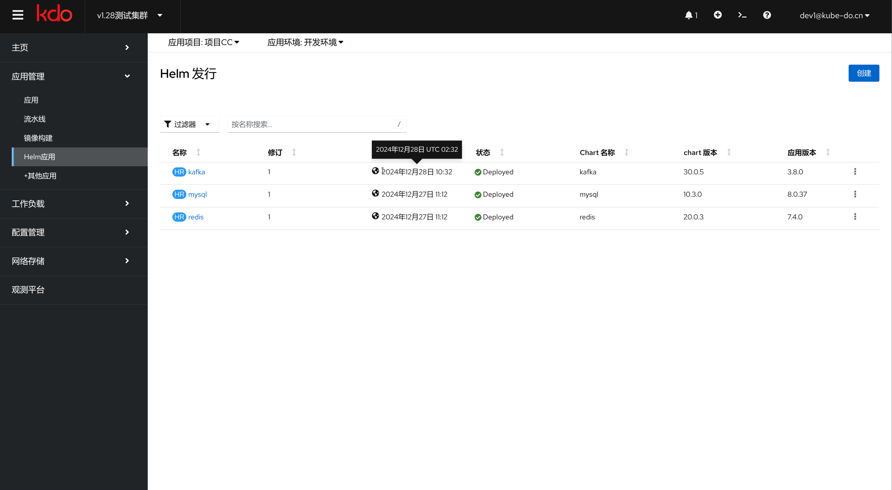

1. TOC
{:toc}

   
## 介绍 
很多人都使用过Ubuntu下的ap-get或者CentOS下的yum, 这两者都是Linux系统下的包管理工具。采用apt-get/yum,应用开发者可以管理应用包之间的依赖关系，发布应用；用户则可以以简单的方式查找、安装、升级、卸载应用程序
Helm可以非常方便的部署一些组件， 比如：MySQL, Redis, Kafka这些。

下面是 Helm 的架构图。
Helm 架构图

## 创建Helm应用

{: .note } 
- 访问Helm菜单，点击`新建`
- 搜索对应组件名，查看说明内容后，选择`创建`
- 设置Helm名字，选择对应版本，配置参数后，选择`创建`,一个Helm应用就创建好了

## 管理Helm应用

{: .note }
点击对应Helm应用，可以更新或者删除Helm应用，也可以查看Helm应用的信息

