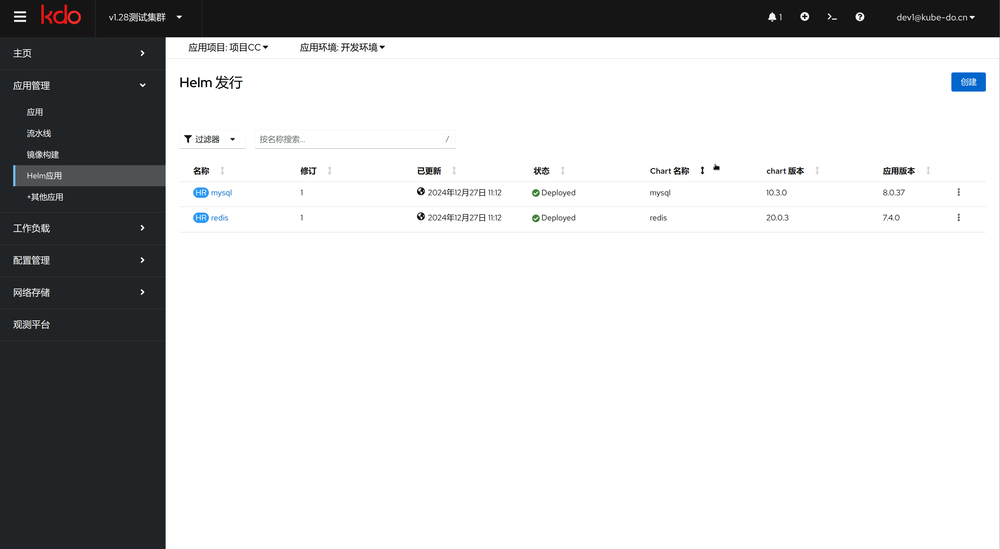

1. TOC
{:toc}

   
## 介绍

{: .note }
许多人熟悉在Ubuntu中使用apt-get或在CentOS下使用yum，这两者均为Linux系统中高效的包管理工具。通过apt-get或yum，应用开发者能够有效地处理应用包的依赖关系，并发布他们的应用。
类似地，Helm也是一种包管理工具，但它并非针对Linux操作系统设计，而是专为Kubernetes集群打造的应用包管理器。
借助Helm，用户可以采用一种更为简便的方法来查找、安装、升级以及卸载应用程序。它极大地简化了如MySQL、Redis和Kafka等组件的部署过程，使得向Kubernetes集群添加复杂应用变得更加直观和高效。
接下来展示的是Helm的架构图，它将帮助您更好地理解这一工具的工作原理及其组成部分。

## 创建Helm应用

1. 访问Helm菜单，点击`新建`；
2. 搜索对应组件名，查看说明内容后，选择`创建`；
3. 设置Helm名字(一般使用默认即可)，选择对应版本，配置组件参数后，选择`创建`，一个Helm应用就创建好了。

## 管理Helm应用

{: .note }
点击对应的Helm应用，您可以执行多种管理操作，包括更新或删除该Helm应用。 此外，您还能查看当前Helm应用的详细信息，如版本号、安装时间等重要数据。
对于需要进行版本控制和回滚操作的情况，系统还提供了历史版本的浏览功能。

