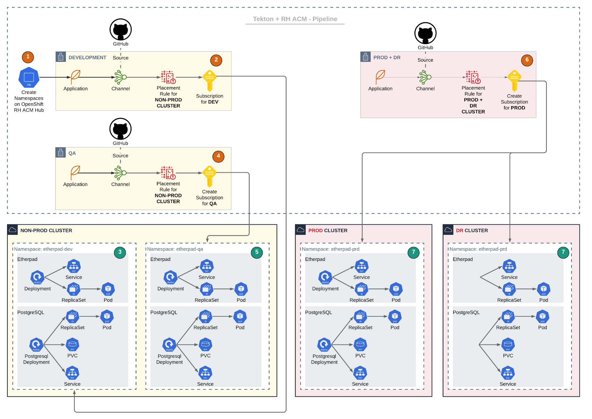

1. TOC
{:toc}

## 介绍
应用是满足用户某些需求的程序代码的集合，可以是某个解耦的微服务或是某个单体应用，所有功能都会围绕应用服务进行。
在KDO平台里面，标准的应用是指基于[Pipelines as Code](repository#pipelines-as-code介绍)方式创建的应用。
当然，KDO 还支持使用[Helm](helm)、[Operator(需要管理员权限)](/docs/admin/application-management/operators)、[镜像、Dockerfile、YAML](add)等方式来创建应用。

通过[Pipelines as Code](repository#pipelines-as-code介绍)的方法，KDO对接 Git 代码仓库，直接从源代码仓库创建应用组件。
目前 KDO 支持和`GitHub`、`GitLab`、`Gitee`、`Gitea` 这四种Git仓库进行对接。
只需`Git URL`和用户的`Token`就可以自动生成支持**多环境和多分支**的流水线，流水线支持**自动构建与自动部署**，功能非常强大。

