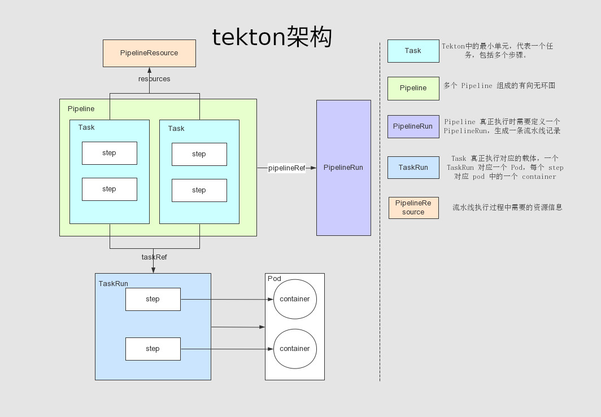

##  概述
KDO的流水线是基于[Tekton](https://tekton.dev/)， Tekton 是一个强大、灵活的构建 CI/CD 流水线系统的开源框架，允许开发者构建、测试和发布应用。Tekton 是云原生的，通过定义 CRD ，让用户快速灵活定义流水线。

### 使用 tekton 的好处
- 可定制的：Tekton实体是完全可定制的，从而具有高度的灵活性。平台工程师可以定义非常详细的构建基目录，以供开发人员在各种情况下使用
- 可重复使用的：Tekton实体是完全可移植的，因此一旦定义，组织内的任何人都可以使用给定的管道并重用其构造块。这使开发人员可以快速构建复杂的管道，而无需“重新发明轮子”。
- 可扩展的：Tekton Catalog是Tekton社区驱动的存储库。您可以使用Tekton目录中的预制组件快速创建新的并展开现有管道。
- 标准化：Tekton在您的Kubernetes集群上作为扩展安装并运行，并使用完善的Kubernetes资源模型。 Tekton工作负载在Kubernetes容器中执行。
- 缩放性：为了增加工作负载容量，您可以简单地将节点添加到群集。 Tekton与您的群集进行缩放，无需重新定义您的资源分配或对管道的任何其他修改

### Tekton 中的组件
- Tekton Pipelines：tekton 的基础，定义了一组 CRD，用于定义 pipeline
- Tekton Triggers：允许基于 event 实例化 pipeline。比如：git的pr请求
- Tekton Cli：提供命令行工具和 tekton 交互
- Tekton Dashboard：图形化界面展示 pipeline 信息
- Tekton Catalog：高质量的、社区贡献的 pipeline 仓库
- Tekton Hub：图形化界面访问 tekton catalog
- Tekton Operator：在k8s上安装、移除、更新tekton组件的项目
  如无特殊说明，后文提到的Tekton专指 Tekton Pipeline 组件

### 基本概念
Tekton 最重要的五个概念：Task、TaskRun、Pipeline、PipelineRun、PipelineResources

- Task：Tekton中的最小单元，代表一个任务模板，包括多个步骤。每一个操作定义为Task中的一个step
- Pipeline：多个 Task 组成的有向无环图，定义了流水线的模板
- PipelineRun：Pipeline 真正执行时需要定义一个PipelineRun，作为流水线的实例，生成一条流水线记录
- TaskRun：Task 真正执行的实例，记录任务状态。一个TaskRun 会创建一个对应的 Pod，每个 step 对应 pod 中的一个 container
- PipelineResource：流水线执行过程中需要的资源信息

