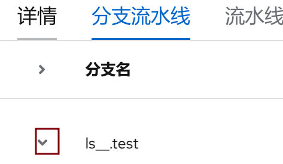

1. TOC
{:toc}

##  概述

{: .note }
kdo平台的流水线模块是基于[Tekton](https://tekton.dev/)实现的， Tekton 是一个强大、灵活的构建 CI/CD 流水线系统的开源框架，允许开发者构建、测试和发布应用。Tekton 是云原生的，通过定义 CRD ，让用户快速灵活定义流水线。


## Tekton的优点

1. **可定制的：** Tekton实体是完全可定制的，从而具有高度的灵活性。平台工程师可以定义非常详细的构建基目录，以供开发人员在各种情况下使用
2. **可重复使用的：** Tekton实体是完全可移植的，因此一旦定义，组织内的任何人都可以使用给定的管道并重用其构造块。这使开发人员可以快速构建复杂的管道，而无需“重新发明轮子”。
3. **可扩展的：** Tekton Catalog是Tekton社区驱动的存储库。您可以使用Tekton目录中的预制组件快速创建新的并展开现有管道。 
4. **标准化：** Tekton在您的Kubernetes集群上作为扩展安装并运行，并使用完善的Kubernetes资源模型。 Tekton工作负载在Kubernetes容器中执行。 
5. **缩放性：** 为了增加工作负载容量，您可以简单地将节点添加到群集。 Tekton与您的群集进行缩放，无需重新定义您的资源分配或对管道的任何其他修改

## 和其他工具的对比


| 指标     | Tekton                                    | Jenkins X                                  | Argo CD                               |
|:-------|:------------------------------------------|--------------------------------------------|---------------------------------------|
| 安装与部署  | 提供Tekton Operator用于安装、移除、更新Tekton组件       | 提供一个方便使用的命令行工具 jx可用来安装Jenkins X            | 通过k8s yaml文件部署，并且提供多租户的部署模式           |
| 高可用    | 通过配置Deployment的多副本实现	                     | 通过配置Deployment的多副本实现	                      | 通过配置Deployment的多副本实现                  |
| 并发构建性能 | 依赖Kubernetes 的 Pod 调度能力，通过对集群节点扩容即可提升并发能力 | 依赖Kubernetes 的 Pod 调度能力，通过对集群节点扩容即可提升并发能力	 | 不提供CI能力依赖其他工具，CD性能取决于Git仓库和Kubernetes |
| 易用性    | kdo平台提供功能丰富的Web UI页面	                     | 提供功能丰富的Web UI页面	                           | 提供功能丰富的Web UI页面                       |
| 扩展性    | Tekton Hub提供100+插件。自研插件也比较简单，没有开发语言限制	    | 插件生态丰富	                                    | 不支持插件扩展                               |
| 成熟度    | CD基金会项目，开源社区活跃Github star数7.7k。           | CD基金会项目，开源社区活跃Github star数4.3k。	           | 开源社区活跃Github star数12.3k。              |
| 复杂度    | 非常轻量，易于维护	                                | 架构较为复杂，组件众多，需要一定的维护成本	                     | 架构比较简单，易于维护                           |
| 开发工具集成 | 支持	                                       | 不支持                                        | 不支持                                   |


## Tekton的基本概念

{: .note }
Tekton 资源对象是构成 Tekton Pipelines 的核心组件，它们定义了 CI/CD 流水线中的各种逻辑和行为。
通过这些资源对象，Tekton 提供了一个灵活且强大的框架，用于构建和管理持续集成和持续交付 (CI/CD) 流程。每个资源都有其独特的功能，并且可以根据需求组合起来创建复杂的工作流。


### Task
**任务(Task)** 是执行具体工作单元的基本构建块。它定义了一组按顺序执行的步骤（Steps），每个步骤都是一个容器操作。可以接受参数 (params) 和输出结果 (results)。支持声明工作区 (workspaces) 以便于数据共享。步骤之间可以互相传递数据。 

### ClusterTask
**集群任务(ClusterTask)** 与普通 Task 类似，但是 ClusterTask 是集群范围内的资源，可以在整个 Kubernetes 集群中使用。 ClusterTask 不局限于某个命名空间，适用于跨命名空间的任务定义。

### TaskRun
**任务运行(TaskRun)** 是对单个 Task 的一次具体执行实例化。 提供具体的参数值、工作区绑定等运行时信息给 Task。 记录执行的状态和结果。

### Pipeline
**流水线(Pipeline)** 定义了一个或多个 Task 的执行流程，以及这些任务之间的依赖关系。 Pipeline组织多个 Task 成为一个有序的工作流。 支持并行执行任务。 可以定义参数来动态配置 Pipeline 行为。 

### PipelineRun
**流水线运行(PipelineRun)** 是对 Pipeline 的一次具体执行实例化。 PipelineRun实例化并触发 Pipeline 中定义的所有 Task。 可以提供参数、工作区和其他运行时配置。

### Condition 
**条件(Conditions)** 允许在 Tekton Pipelines 中基于某些检查的结果来决定是否继续执行流水线。 它可用于实现更复杂的业务逻辑控制。Conditions支持自定义条件逻辑。

### Resource 
**资源(Resource)** 在早期版本来表示输入和输出的数据源，但在较新的版本中已经被弃用，转而推荐使用 Workspaces 和 Params 来处理数据。

### Trigger
**触发器(Triggers)** 允许你设置规则，当满足特定事件时自动启动 PipelineRuns 或 TaskRuns。 Triggers包括 EventListener 和 TriggerTemplate 等子组件。
它支持 Git 提交、PR 创建等多种触发方式。

### Params
**参数(Params)** 允许你向Pipelines、Tasks 和 PipelineRuns 传递配置信息，使得这些资源可以更加灵活和动态地执行。参数可以用于定义诸如版本号、构建选项、环境变量等可以在运行时改变的值。

### Workspaces
**工作区(Workspace)** 允许你为 PipelineRuns 和 TaskRuns 指定持久卷或其他存储资源。工作区提供了一种机制，使得 Tasks 可以访问共享的数据或代码库，并且可以在多个步骤之间保持数据的一致性和可用性。


## kdo流水线

{: .note }
kdo平台使用流水线主要通过两种方式： **标准流水线**、**嵌入流水线**，下面分别进行说明。


### 标准流水线

{: .note }
标准流水线就是一个Kubernetes的Pipeline对象，下面有个例子：

```yaml
apiVersion: tekton.dev/v1
kind: Pipeline
metadata:
  name: pipeline-git-clone-build-push-deploy
  namespace: cc-dev
spec:
  description: |
    该管道提供了典型的 CI/CD 流程，流程包括：
      - 获取 git 存储库作为源
      - 使用buildah通过Dockerfile构建Docker镜像
      - 将构建的 Docker 镜像推送到所需的存储库
      - 将其部署到 Kubernetes 集群
  params:
    - description: 要从中克隆的git存储库URL
      name: repo-url
      type: string
    - description: 要克隆的git标签
      name: tag-name
      type: string
    - description: 'The image full path to host the built image, with version tag, e.g. image-registry.openshift-image-registry.svc:5000/tekton-pipelines/spring-boot-docker:v1.0.0.'
      name: image-full-path-with-tag
      type: string
    - description: 用于部署的清单文件.
      name: deployment-manifest
      type: string
  tasks:
    - name: fetch-repository
      params:
        - name: url
          value: $(params.repo-url)
        - name: revision
          value: $(params.tag-name)
        - name: deleteExisting
          value: 'true'
      taskRef:
        kind: Task
        name: git-clone
      workspaces:
        - name: output
          workspace: workspace
    - name: maven
      params:
        - name: GOALS
          value:
            - '-B'
            - '-DskipTests'
            - clean
            - package
      runAfter:
        - fetch-repository
      taskRef:
        kind: Task
        name: maven
      workspaces:
        - name: maven-settings
          workspace: maven-settings
        - name: source
          workspace: workspace
    - name: buildah
      params:
        - name: IMAGE
          value: $(params.image-full-path-with-tag)
      runAfter:
        - maven
      taskRef:
        kind: Task
        name: buildah
      workspaces:
        - name: source
          workspace: workspace
    - name: deploy
      params:
        - name: script
          value: |
            kubectl apply -f $(params.deployment-manifest)
            echo "----------"
            kubectl get deployment
      runAfter:
        - buildah
      taskRef:
        kind: Task
        name: kubernetes-actions
      workspaces:
        - name: kubeconfig-dir
          workspace: empty-dir
        - name: manifest-dir
          workspace: empty-dir
  workspaces:
    - name: workspace
    - name: maven-settings
    - name: empty-dir
```

### 编辑标准流水线


## 嵌入流水线

{: .note }
**嵌入流水线**和标准流水线不一样，它不是[Pipeline](#pipeline)资源对象，是一个[PipelineRun](#pipelinerun)资源对象，通过模板把这个PipelineRun对象实例化，就可以实现流水线的运行。
主要用于kdo平台的[应用](../repository)，创建应用时它根据模板自动生成。


```yaml
apiVersion: tekton.dev/v1
kind: PipelineRun
metadata:
  name: spring-boot-docker-dev-ls-test
  namespace: cc
spec:
  params:
    - name: repo_url
      value: '{{ repo_url }}'
    - name: revision
      value: '{{ revision }}'
  pipelineSpec:
    tasks:
      - name: fetch-repository
        taskRef:
          name: git-clone
          kind: ClusterTask
        workspaces:
          - name: output
            workspace: workspace
          - name: basic-auth
            workspace: basic-auth
        params:
          - name: url
            value: $(params.repo_url)
          - name: revision
            value: $(params.revision)
      - name: maven
        params:
          - name: MAVEN_IMAGE
            value: 'registry.cn-shenzhen.aliyuncs.com/kubedo/maven:3-openjdk-8'
          - name: GOALS
            value:
              - 'dependency:go-offline'
              - '-DskipTests'
              - clean
              - package
        runAfter:
          - fetch-repository
        taskRef:
          kind: ClusterTask
          name: maven
        workspaces:
          - name: source
            workspace: workspace
          - name: maven-settings
            workspace: maven-repo
          - name: maven-local-repo
            workspace: maven-repo
      - name: buildah
        params:
          - name: IMAGE
            value: 'hub-k8s.kube-do.cn/cc-dev/spring-boot-docker:$(params.image_tag)'
          - name: DOCKERFILE
            value: docker/Dockerfile
        runAfter:
          - maven
        taskRef:
          kind: ClusterTask
          name: buildah
        workspaces:
          - name: source
            workspace: workspace
          - name: dockerconfig
            workspace: dockerconfig-ws
      - name: deploy
        params:
          - name: script
            value: >
              kubectl set image deployment/$DEPLOYMENT_NAME $APP_NAME=hub-k8s.xsyxsc.cn/cc-dev/spring-boot-docker:$(params.image_tag) -n $NAMESPACE
        runAfter:
          - buildah
        taskRef:
          kind: ClusterTask
          name: kubernetes-actions
        workspaces:
          - name: kubeconfig-dir
            workspace: workspace
          - name: manifest-dir
            workspace: workspace
        status:
          reason: Skipped
  workspaces:
    - name: workspace
      persistentVolumeClaim:
        claimName: workspace
    - name: maven-repo
      persistentVolumeClaim:
        claimName: maven-repo
    - name: dockerconfig-ws
      secret:
        secretName: registry
```

### 和标准流水线的区别

`嵌入流水线`和`标准流水线`的主要区别，标准流水线的参数(Params)和工作区(Workspaces)默认需要手动输入，嵌入流水线可以通过平台从应用信息里面自动生成，实现了流水线的自动化。

### 编辑嵌入流水线

{: .note }
在分支流水线选择对应的分支，扩展后就只能编辑嵌入流水线流水线了。

嵌入流水线的编辑有两种方式：流水线运行构建器(图形化)、YAML视图。 一般情况都是采用图形化的来编辑。

在**流水线运行构建器**的页面，主要有三部分： [任务](#task)、[参数](#params)、[工作区](#workspaces)，其中`工作区`和`参数`主要用于传递信息，`任务`可以通过图形化拖拽各种`组件模板`实现流水线任务的编辑。


