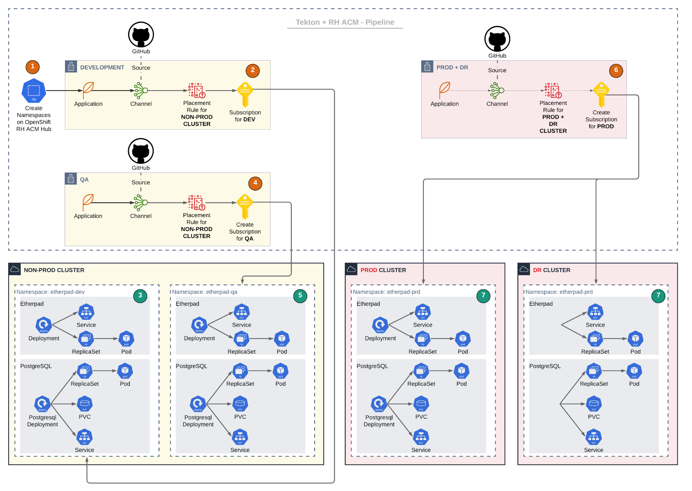

1. TOC
{:toc}


## 介绍
应用是满足用户某些需求的程序代码的集合，可以是某个解耦的微服务或是某个单体应用，所有功能都会围绕应用服务进行。

在KDO平台里面，标准的应用是指基于[Pipelines as Code](#pipelines-as-code介绍)方式创建的应用。
通过[Pipelines as Code](#pipelines-as-code介绍)的方法，KDO对接 `Git` 代码仓库，直接从源代码仓库创建应用组件。
目前 KDO 支持和`GitHub`、`GitLab`、`Gitee`、`Gitea` 这四种Git仓库进行对接。

只需`Git URL`和用户的`Git Token`就可以自动生成支持**多环境和多分支**的流水线，流水线支持**自动构建与自动部署**，功能非常强大。


## Pipelines as Code介绍
`Pipelines as Code` 是一种实践方法，它将CI/CD（持续集成/持续部署）流水线的定义与源代码一同存储在版本控制系统中，如`GitHub`或`GitLab`。
这种方法使用[Tekton PipelineRuns和Tasks](../pipelines#tekton的资源对象)来定义具体的`CI/CD`流程，并将其保存在一个文件里，该文件位于项目的源代码管理(SCM)系统中。


### 主要特点
1. **集中化定义：** 通过在一个文件中定义`CI/CD`流程，使得整个团队可以更容易地理解和修改这些流程。
2. **版本控制：** 因为流水线定义是作为代码存储的，所以它可以像其他任何代码一样被版本化、审查和协作处理。
3. **自动化创建：** 这个文件能够自动为`Pull Request`或者分支推送创建相应的`CI/CD`流水线。
4. **状态查看与执行控制：** 可以直接从`SCM`查看流水线的状态并控制其执行，而不需要切换到不同的系统进行操作。
5. **增强协作：**  开发人员可以在同一个平台上同时处理应用程序代码和流水线定义，提高了工作效率。
6. **变更追踪：** 每一次对流水线定义的更改都可以被记录下来，方便追踪和审核。

## Pipelines-as-Code核心组件
KDO Pipelines-as-Code的架构主要由以下组件构成：

**Tekton Pipelines:** Tekton 是 KDO Pipelines-as-Code 的核心引擎，负责执行流水线任务。

**Pipelines-as-Code Controller:** 这是 KDO Pipelines-as-Code 的核心组件，负责将代码仓库中的流水线定义（如 .tekton/ 目录下的 YAML 文件）转换为 Tekton 资源。
它监听代码仓库的事件（如 Pull Request 或 Push），并根据事件触发流水线。
   
**Git Provider 集成：** Pipelines-as-Code 支持与多种 Git 提供程序集成，例如 GitHub、GitLab、Bitbucket 等。
它通过 Webhook 监听代码仓库的事件，并将事件传递给 Pipelines-as-Code Controller。

**Kubernetes 集成：** Pipelines-as-Code 与 Kubernetes 深度集成，利用 Kubernetes 的 RBAC、命名空间、资源配额等特性。 
流水线运行在 Kubernetes 的 Pod 中，使用 Kubernetes 的容器运行时和存储。

## Pipelines-as-Code工作流程
以下是 KDO Pipelines-as-Code 的典型工作流程：


**代码推送或 Pull Request：**
开发者向代码仓库推送更改或创建 Pull Request。 Git 提供程序（如 GitHub）通过 Webhook 将事件发送到 Pipelines-as-Code Controller。
当然也可以手动点击触发流水线。

**流水线定义解析：**
Pipelines-as-Code Controller 从代码仓库中读取流水线定义文件（如 .tekton/pipeline.yaml、kubernetes/deployment.yaml、docker/Dockerfile 等）。
这些文件定义了流水线的分支、任务、步骤和参数，部署的集群和环境。

**流水线触发：**
Pipelines-as-Code  Controller 将流水线定义转换为 Tekton 资源（如 PipelineRun 和 TaskRun）。
Tekton Controller 接收到这些资源后，开始在 Kubernetes 集群中调度和执行任务。

**任务执行：**
Tekton 在 Kubernetes 集群中创建 Pod 来执行流水线任务。 每个任务可以包含多个步骤，每个步骤运行在一个容器中。

**结果反馈：**
流水线执行完成后，Pipelines-as-Code 将结果（如成功或失败）反馈到代码仓库。
例如，在 GitHub 中，结果会显示在 Pull Request 的检查状态中。

以下是 KDO Pipelines-as-Code 的简化架构图：
```
+-------------------+       +-------------------+       +-------------------+
|                   |       |                   |       |                   |
|   Git Provider    |       | Kubernetes Cluster|       | Pipelines-as-Code |
|  (GitHub/GitLab   |<----->|   (Tekton Engine) |<----->|     Controller    |
|   Gitee/Gitea)    |       |                   |       |                   |
+-------------------+       +-------------------+       +-------------------+
|                           |                           |
| Webhook Events            | Pipeline Runs             | Pipeline Definitions
v                           v                           v
+-------------------+       +-------------------+       +-------------------+
| Code Repository   |       |                   |       |                   |
| (.tekton/*.yaml   |       |   Task Pods       |       |   Tekton CRDs     |
| kubrnetes/*.yaml  |       | (Kubernetes Pods) |       |  (PipelineRun,    |
| docker/Dockerfile)|       |                   |       |   Task, etc.)     | 
+-------------------+       +-------------------+       +-------------------+
```

## KDO自动创建的文件
KDO Pipelines-as-Code相关的文件都是存储在应用的代码仓库，其中包括`应用定义文件`、`流水线定义文件`、`应用镜像配置文件`、`部署配置文件`等。这些文件都通过KDO Controller根据模板**自动创建**的。

**应用定义文件** 在应用Git仓库主分支(比如`master/main`)的根目录下，有一个应用定义文件`devfile.yaml`。它定义了应用名、开发语言等信息，以及其他应用参数。

**流水线定义文件：** 在应用Git仓库主分支(比如`master/main`)的`.tekton/`目录下，是流水线定义的核心文件，它定义了流水线的分支、任务、步骤和参数。
每个环境分支的流水线对应一个yaml文件，命名是应用名-环境-分支，比如：`spring-boot-scheduler-dev-develop.yaml`表示应用名为`spring-boot-scheduler`，环境为`dev`，分支为`develop`。
里面的内容就是一个嵌入流水线。关于嵌入流水线，可以参考[嵌入流水线](../pipelines#嵌入流水线)

**应用镜像配置文件：** 在应用Git仓库分支(比如`develop/release`)的`docker/`目录下，它定义了应用的镜像的参数，一般就是Dockerfile，可以根据需要进行修改

**部署配置文件：** 在应用Git仓库分支(比如`develop/release`)的`kubernetes/`目录下。
它定义了部署参数，一般就是[无状态(Deployment)](/docs/dev/workloads/deployments)/[有状态(StatefulSet)](/docs/dev/workloads/statefulsets)和[服务(Service)](/docs/dev/network-stroage/services)等。


## 创建应用

- KDO支持多环境多分支的应用管理，在**应用项目**选择对应的项目，选择**应用管理 -> 应用**
- KDO创建应用主要需要两个信息: **应用的Git地址、访问Git的Token**, 其他信息根据应用进行选择，包括： `开发语言`、`应用模板`、`应用端口`等。
- 应用基本参数设置好后，就可以开始设置自动分支流水线，不同环境选对应的分支，最后点击`添加`，这个支持多环境自动化流水线的应用就创建完成了。

[创建Java应用](/docs/devops/app-deploy/java)
[创建Python应用](/docs/devops/app-deploy/python)
[创建Golang应用](/docs/devops/app-deploy/golang)
[创建PHP应用](/docs/devops/app-deploy/php)


## 应用管理

{: .note }
应用创建完成以后，如果需要对应用进行管理，选择**应用管理 -> 应用**，点击对应的应用，有四个菜单。


| 菜单    | 说明                                       |
|:------|:-----------------------------------------|
| 详情    | 应用详情页面提供了全面的信息概览，包括应用的URL、开发语言、端口号等关键细节。 |
| 分支流水线 | 管理分支流水线功能允许您对应用在不同环境中的流水线进行精细化管理。        |
| 流水线运行 | 查看和管理流水线运行，包括运行过的流水线，可以选对应的进行流水线的回滚。     |
| YAML  | 这个应用的YAML定义文件，一些不能在图形化编辑的功能，可以在这里编辑。     |


### 管理分支流水线

{: .note }
在分支流水线菜单，我们可以对对应分支的流水线进行管理，包括新增分支流水线、[编辑流水线](../pipelines#编辑嵌入流水线)、手动运行流水线(必须先禁用自动触发)等。
无论是开发、测试还是生产环境，您都可以针对各个分支配置和调整相应的流水线，以满足特定环境下的需求。 
流水线的编辑支持图形化和YAML文件方式，请参考[嵌入流水线](../pipelines#嵌入流水线)。


### 管理流水线运行

{: .note }
在流水线运行菜单中，您可以查看所有已执行的流水线详情，包括每个流水线的耗时、日志记录以及所使用的参数等信息。
您可以按需查看和筛选流水线运行记录，以便更好地了解流水线的执行情况，并进行相应的操作，如回滚、重新运行等。

  