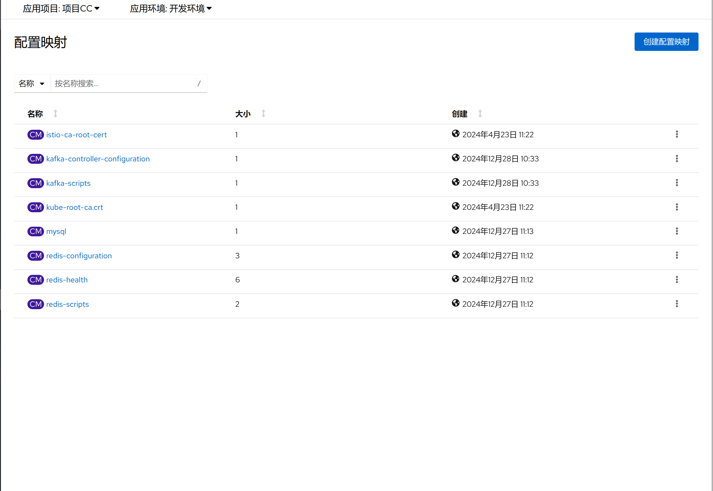
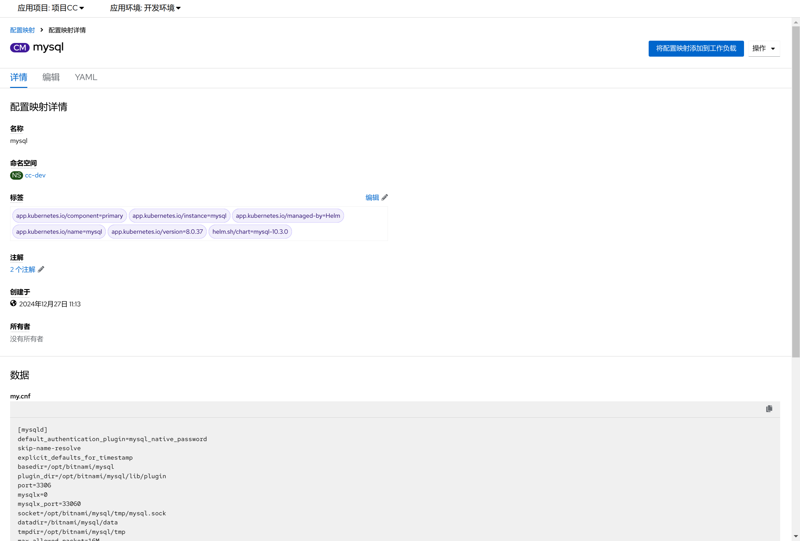
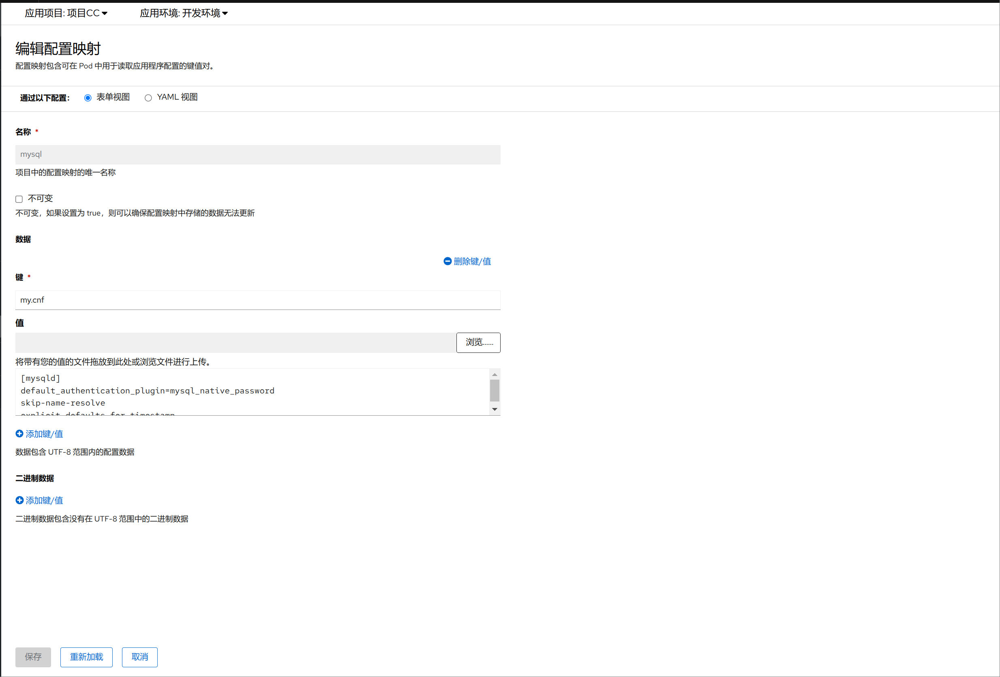
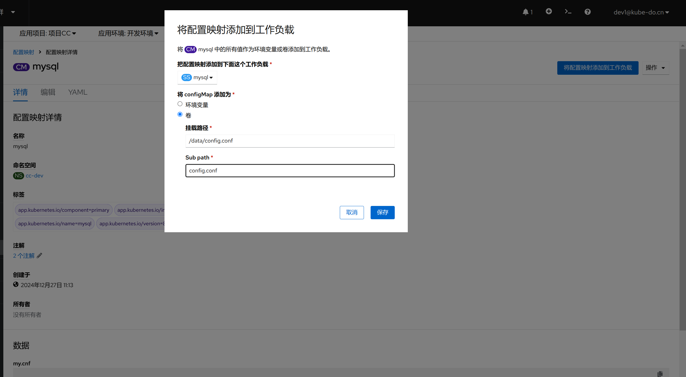

1. TOC
{:toc}

## 介绍

{: .note }
配置映射(ConfigMap) 是一种 API 对象，用来将非机密性的数据保存到键值对中。使用时， 容器组可以将其用作环境变量、命令行参数或者存储卷中的配置文件。
ConfigMap 将你的环境配置信息和容器镜像解耦，便于应用配置的修改。

{: .warning }
配置映射(ConfigMap) 并不提供保密或者加密功能。 如果你想存储的数据是机密的，请使用保密字典(Secret)， 或者使用其他第三方工具来保证你的数据的私密性，而不是用 ConfigMap。

## 查看配置映射

## 编辑配置映射

{: .note }
配置映射采用键/值对的方式存储数据，可以通过图形化或者YAML方式进行编辑

## 使用配置映射

{: .note }
配置映射(ConfigMap)可以作为数据卷挂载。ConfigMap 也可被系统的其他组件使用， 而不一定直接暴露给 Pod。例如，ConfigMap 可以保存系统中其他组件要使用的配置数据。
ConfigMap 最常见的用法是为同一命名空间里某 Pod 中运行的容器执行配置。 你也可以单独使用 ConfigMap。

