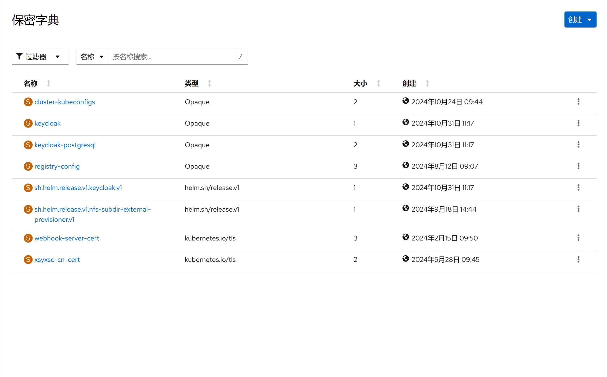

1. TOC
{:toc}

## 介绍

{: .note }
保密字典(Secret) 是一种包含少量敏感信息例如密码、令牌或密钥的对象。 这样的信息可能会被放在容器组规约中或者镜像中。 使用保密字典意味着你不需要在应用程序代码中包含机密数据。
保密字典类似于配置映射(ConfigMap)但专门用于保存机密数据，它是通过base64编码后存储。

## 日常操作

{: .note }
保密字典的操作基本和配置映射(configmap)一样，日常操作如编辑和挂载可以参考[配置映射](../configmaps)。