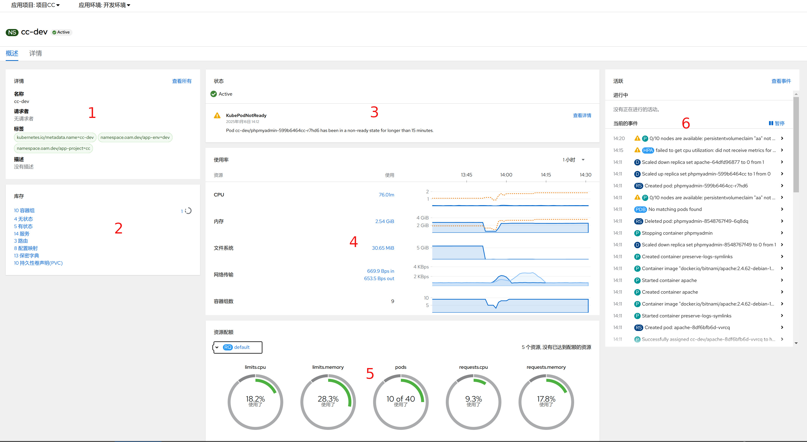
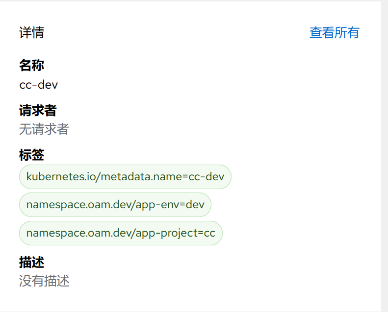
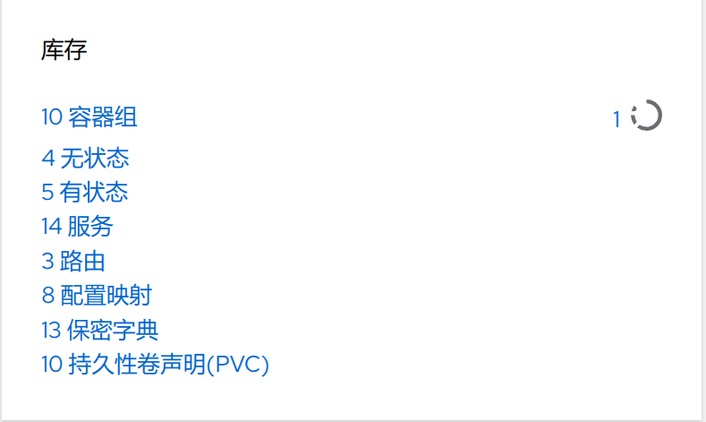
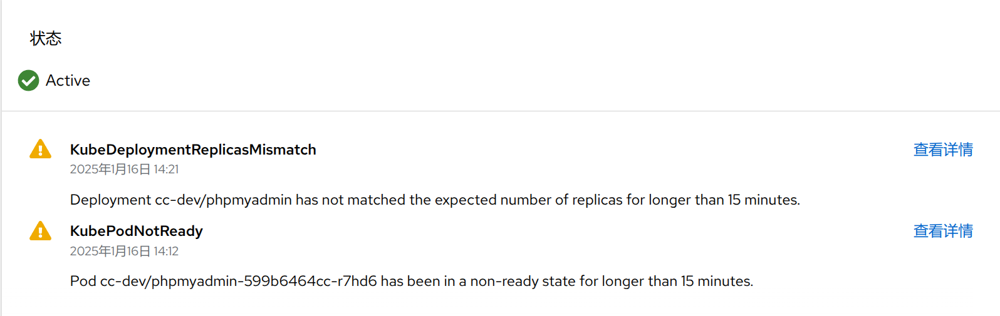
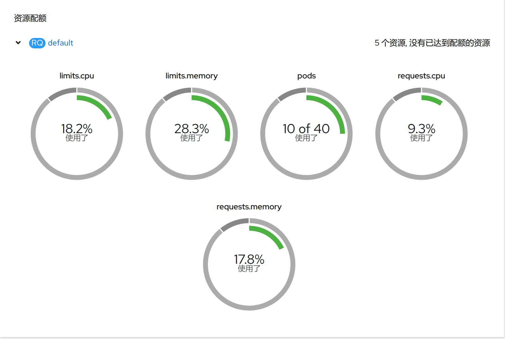
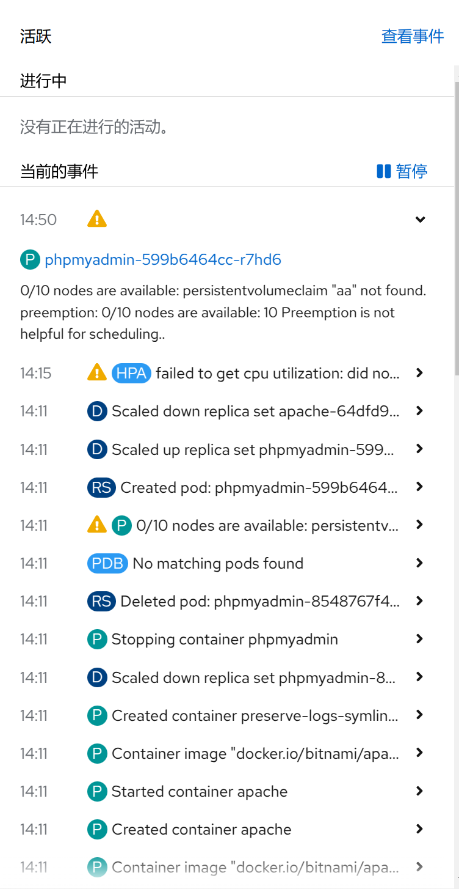

1. TOC
{:toc}

## 介绍

{: .note }
在kdo平台，开发者页面的**环境**资源是对应Kubernetes的[命名空间](../../../admin/management/namespaces)资源。
在**环境概览**页面，可以对当前项目的当前环境有个整体认识，主要有六个页面：[详情(1)](#详情)、[库存(2)](#库存)、[状态(3)](#状态)、[使用率(4)](#使用率)、[资源配额(5)](#资源配额)、[事件(6)](#事件)。
点击对应链接可以直接访问对应的资源。

## 详情

在详情子页面，可以查看当前环境的基本信息，包括名字、标签、描述等信息，点击查看所有可以获取这个环境更多信息。

## 库存

在库存子页面，可以获取当前环境内的各类资源，包括: [容器组](../../workloads/pods)、[无状态](../../workloads/deployments)、[有状态](../../workloads/statefulsets)、
[配置映射](../../configurations/configmaps)、[服务](../../network-stroage/services)、[持久化声明](../../network-stroage/persistent-volume-claims)等。点击对应的资源链接，可以直接跳转资源页面。

## 状态

在状态子页面，可能当前环境是否正常，应用有没有异常告警，点击告警`查看详情`链接，可以查看告警的详情。

## 使用率

在使用率子页面，可以当前环境的资源使用情况，可以选择时间段，点击进去可以查看详情。

## 资源配额

如果管理员设置了[资源配额](../../../admin/management/resourcequotas)，可以查看当资源的使用情况，如果资源不足，可以联系管理员进行扩容。

## 事件

可以查看这个环境内所有资源的事件。关于事件，请访问[更多信息](../../../observability/events)。

