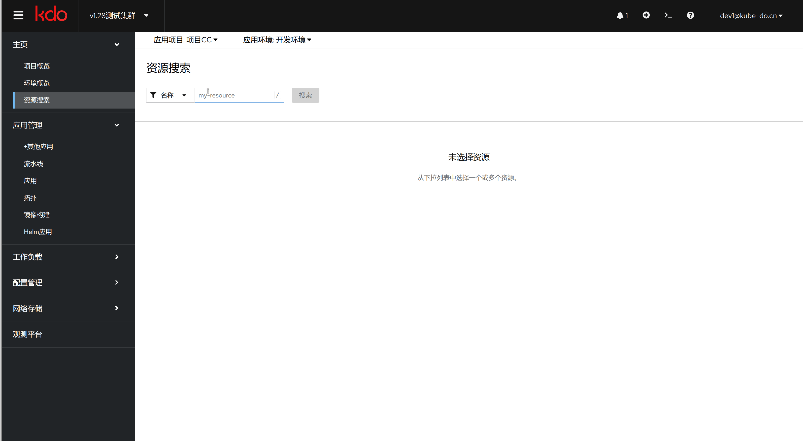

## 项目概览

{: .note }
在**项目概览**页面，可以对当前项目有个整体认识，包括基本信息，资源使用，监控信息，事件等。

## 环境概览

{: .note }
在**环境概览**页面，可以对当前项目的当前环境有个整体认识，包括基本信息，资源使用，监控信息，事件等。

## 资源搜索

{: .note }
在**资源搜索**页面，可以通过资源的`名字`或`IP`搜索对应的资源，包括:无状态应用，有状态应用，配置文件，服务，Ingress等

{: .warning }
由于KDO平台三基于Kubernetes RBAC的权限模型，有些资源虽然可以搜索到，但是却没有权限可以访问，所以不用担心有安全问题。

