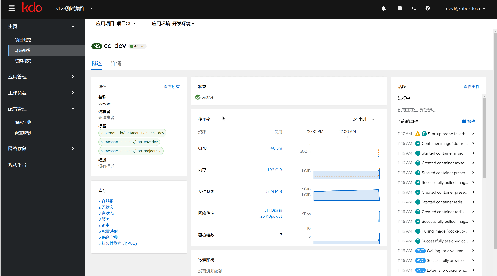
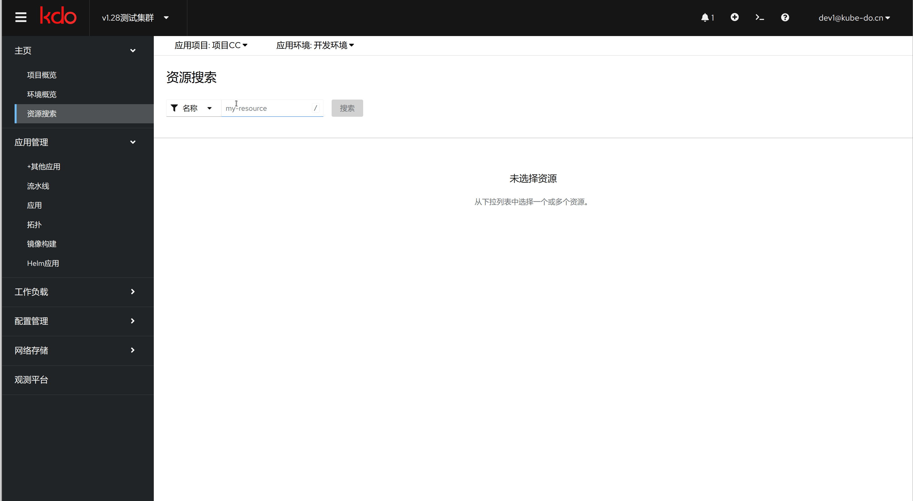

1. TOC
{:toc}

## 项目概览

{: .note }
在**项目概览**页面，可以对当前项目有个整体认识，包括基本信息，资源使用，监控信息，事件等。[更多信息，访问应用项目](/docs/devops/project-manage)

## 环境概览

{: .note }
在**环境概览**页面，可以对当前项目的当前环境有个整体认识，包括基本信息、资源使用、监控信息、[事件](/docs/observability/events)等，点击对应链接可以直接访问对应的资源。

## 资源搜索

{: .note }
在**资源搜索**页面，可以通过资源的`名字`或`IP`搜索对应的资源，包括:容器组、无状态应用、有状态应用、配置文件、服务、路由等， `名字`或`IP`需要输入完整的名字或IP地址。

{: .warning }
由于KDO平台是基于[Kubernetes RBAC的权限模型](/docs/rbac)，有些资源虽然可以搜索到，但是却没有权限可以访问，不用担心有安全问题。

## 顶栏快捷入口

{: .note }
控制台右上角工具栏提供了常用的全局快捷入口：

| 入口 | 说明 |
|------|------|
| 多集群切换 | 在多集群环境下切换当前操作的集群 |
| 应用启动器 | 打开已配置的外部应用/链接 |
| 快速创建 | 快速创建常用资源 |
| 访问云开发环境 (Open in Che) | 已配置 Eclipse Che 时显示，点击可在 Che 中打开云开发环境 |
| CloudShell | 打开云端命令行终端，[更多信息](/docs/terminal/) |
| 帮助菜单 | 文档、关于、反馈等 |
| 用户菜单 | 复制登录命令、下载 kubeconfig、退出登录等 |