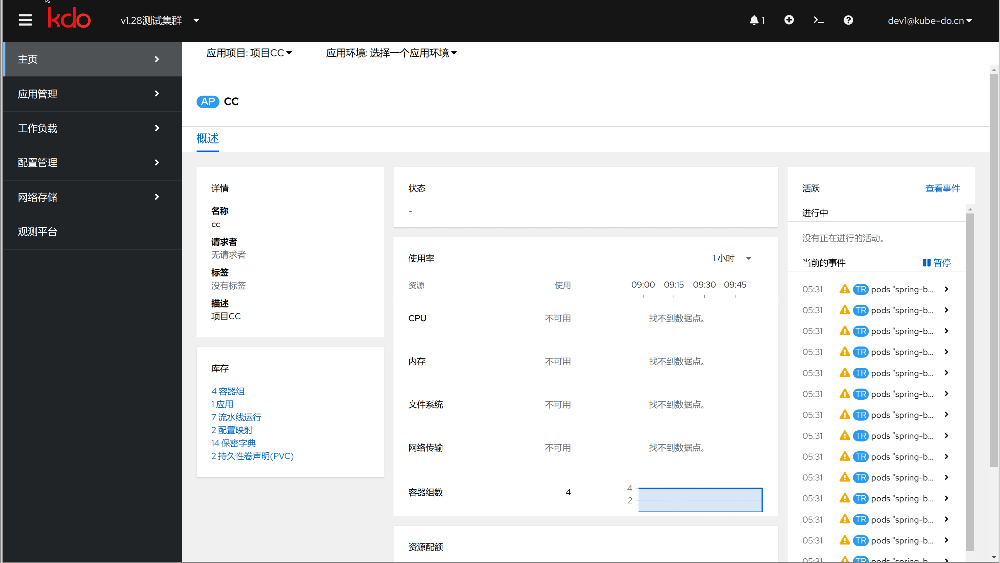

## 开发者界面
开发者界面专注于优化应用的研发流程，使得开发者无需深入了解容器和Kubernetes的底层原理即可高效工作。
主要面向开发者和测试人员，开发者界面采用了`项目`、`环境`、`应用`三层模型，简化了复杂的应用管理任务：

1. **项目：** 代表一组相关的应用程序和服务，通常对应一个业务线或大型功能模块。[更多信息](/docs/devops/project-manage)
2. **环境：** 定义了运行应用的不同场景，如开发、测试或生产环境，确保代码可以在不同的阶段无缝迁移。[更多信息](/docs/devops/project-manage)
3. **应用：** 具体的应用程序单元，包含部署所需的全部信息和资源。[更多信息](applications/repository)

这种结构不仅促进了团队间的协作，还通过清晰的层次划分提高了管理效率，使得开发者可以更加专注于创新和代码质量，而无需担心底层架构的复杂性。

