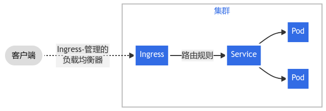
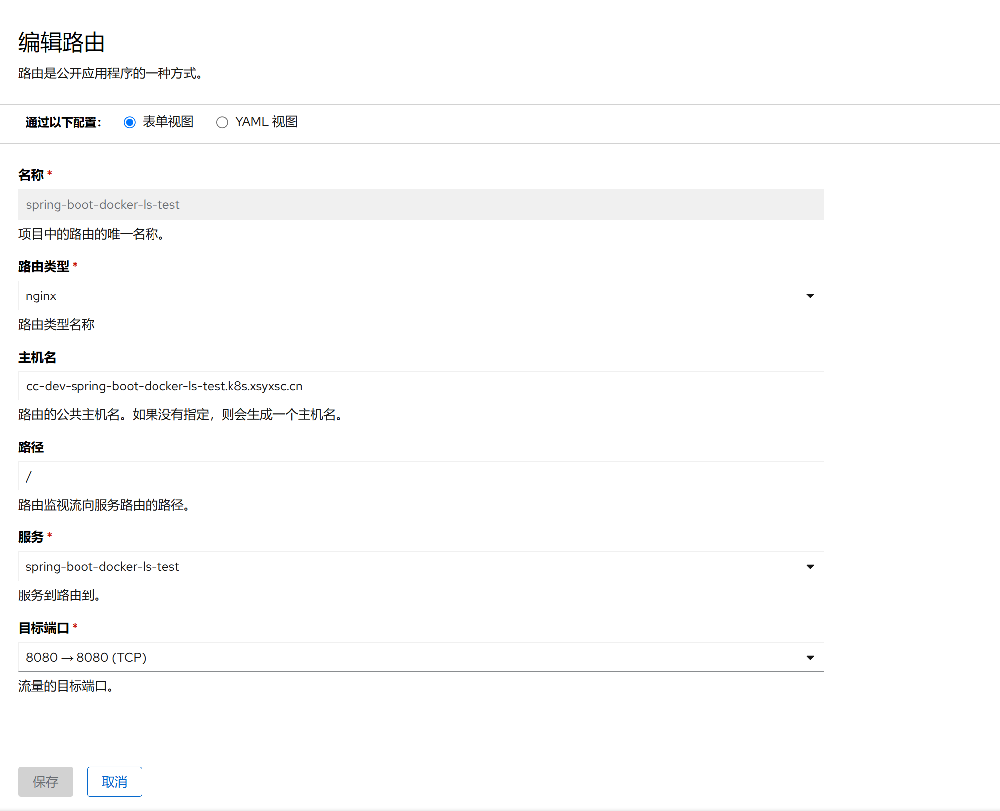

1. TOC
{:toc}

## 介绍
{: .note }
路由(Ingress)概念允许你通过 Kubernetes API 定义的规则将流量映射到不同后端。路由使用一种能感知协议配置的机制来解析 URI、主机名称、路径等 Web 概念， 让你的 HTTP（或 HTTPS）网络服务可被访问。
[更多资料](https://kubernetes.io/zh-cn/docs/concepts/services-networking/ingress/)

## 编辑路由

