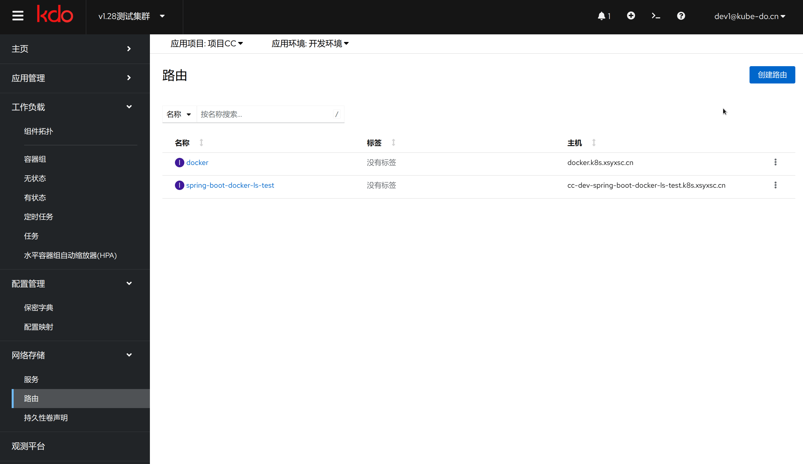

1. TOC
{:toc}

## 介绍

{: .note }
路由(Ingress)概念允许你通过 Kubernetes API 定义的规则将流量映射到不同后端。路由使用一种能感知协议配置的机制来解析 URI、主机名称、路径等 Web 概念， 让你的 HTTP（或 HTTPS）网络服务可被访问。
[更多资料](https://kubernetes.io/zh-cn/docs/concepts/services-networking/ingress/)

## 新增路由

{: .note }
新增/路由编辑有表单视图和YAML视图，默认一些简单路由可以使用表单视图，如果要一些高级能力，需要使用YAML编辑。
在添加路由，只需要选择对应的服务和端口，其他的选项都可以自动生成，需要自定义，可以手动修改。

 ### 常用字段 

| 菜单   | 说明                                                           |
|:-----|:-------------------------------------------------------------|
| 名称   | 这个资源对象的名字                                                    |
| 路由类型 | 路由类型(ingressclass) 资源用于定义和区分不同类型的路由控制器，现在默认使用的是nginx-ingress |
| 主机名  | 应用的域名，要确保已经设置了DNS，把域名指向了路由控制器的IP                             |
| 路径   | 应用的根路径，一般为`/`                                                |
| 服务   | 要对外暴露的服务                                                     |
| 目标端口 | 服务的监听端口                                                      |

## 编辑路由

{: .note }
在图形化界面只能进行一些基础的配置，需要更多高级特性，需要手动编辑YAML配置，请参考[路由高级特性](https://www.w3ccoo.com/nginx/nginx_ingress_annotations.html)

