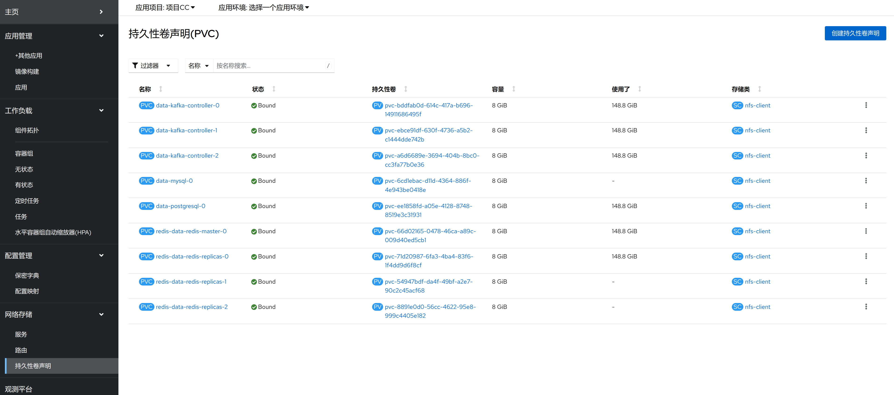

1. TOC
{:toc}

## 介绍

{: .note }
在 Kubernetes 中，存储卷 (PV) 和 PersistentVolumeClaim (PVC) 是用于管理持久存储的核心概念。它们提供了一种方式来解耦应用程序和存储资源，并允许动态管理和分配存储。[更多资料](https://kubernetes.io/zh-cn/docs/concepts/storage/persistent-volumes/)

**存储卷 (PV):** 存储卷声明 是集群中的一块网络存储，它由管理员设置或通过动态供应自动创建。PV 是一个集群资源，独立于任何单个 Pod 的生命周期存在。PV 可以基于多种后端存储提供，例如 NFS、iSCSI、云提供商的存储服务（如 AWS EBS、GCE PD）等。
PV 定义了存储的详细信息，比如大小、访问模式（ReadWriteOnce, ReadOnlyMany, ReadWriteMany）、回收策略（Retain, Recycle, Delete）等。PV 是静态配置的，即一旦创建就具有固定的属性。
**存储卷声明 (PVC)** 存储卷声明 是用户对存储资源的请求。开发人员不需要关心底层存储的具体实现细节，只需要声明他们需要多少存储空间以及所需的访问模式。Kubernetes 集群会根据 PVC 的要求去寻找合适的 PV 进行绑定。

## 存储卷类型

{: .note }
Kubernetes 存储卷（Volume）是容器持久化数据的一种方式，允许你将数据保存在 Pod 的生命周期之外。即使 Pod 被销毁或重新创建，存储卷中的数据依然存在。Kubernetes 支持多种类型的存储卷，以适应不同的使用场景和需求。

**以下是一些常见的 Kubernetes 存储卷类型：**

1. **EmptyDir:** 当 Pod 分配到 Node 上时，会创建一个空的目录。它的生命周期与 Pod 相同，当 Pod 从 Node 上移除时，EmptyDir 中的数据也会被删除。这种卷通常用于临时存储，例如缓存数据。
2. **HostPath:** 将主机节点文件系统上的文件或目录挂载到 Pod 中。这对于开发和调试非常有用，但在生产环境中需要小心使用，因为它紧密耦合了 Pod 和底层基础设施。
3. **存储卷 (PV) 和 存储卷声明 (PVC):** PV 是集群中的一块网络存储，由管理员设置。PVC 是用户对存储资源的请求，它会根据请求绑定到合适的 PV。这种方式提供了灵活的存储管理，并支持动态供应。
4. **ConfigMap 和 Secret:** ConfigMap 用于存储配置数据，而 Secret 用于存储敏感信息如密码。它们都可以作为环境变量或者文件挂载到 Pod 中。
5. **其他云提供商特定的卷类型:** 比如 AWS EBS、GCE PD、Azure Disk 等等，这些是由云服务提供商提供的持久化存储解决方案。
6. **CSI (Container Storage Interface):** 这是一个标准接口，用来让存储供应商创建自己的插件，从而可以更容易地集成新的存储系统。
7. **Local:** 允许将本地磁盘直接用作持久卷，适合性能要求高的应用，但同样会引入可用性和调度问题。
8. **NFS (Network File System):** 可以通过 NFS 协议将远程服务器上的共享文件夹挂载为 Pod 的一部分。
9. **CephFS, Glusterfs, iSCSI, RBD (Ceph Block Device), Quobyte, VsphereVolume 等等:** 这些都是企业级存储解决方案，适用于不同规模和需求的企业环境。

## 