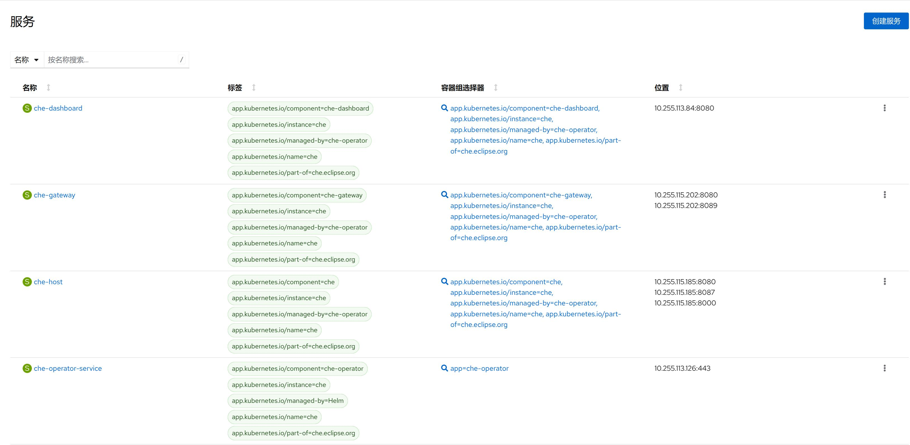
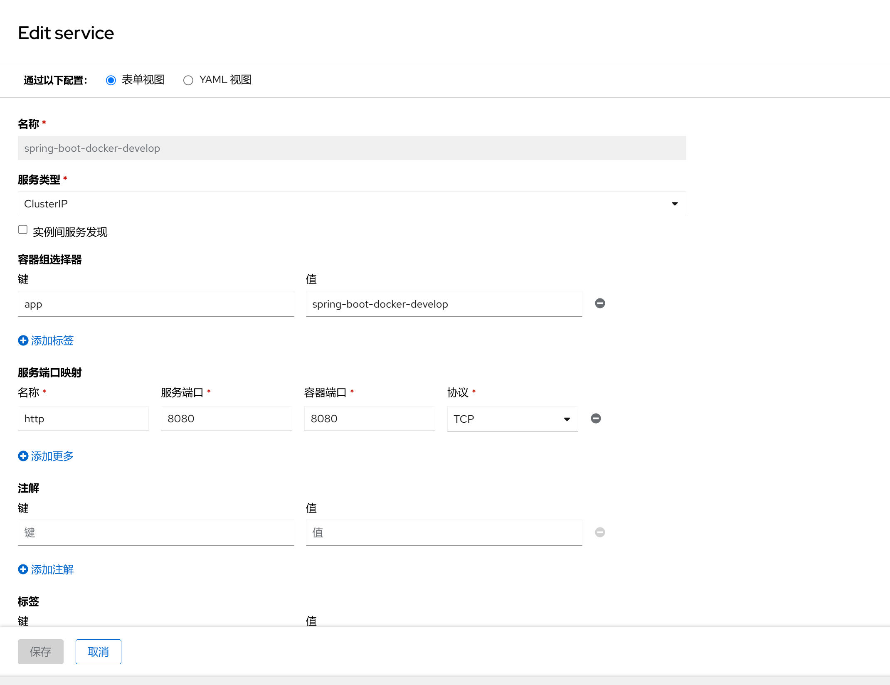

1. TOC
{:toc}

## 介绍

{: .note }
Kubernetes 中服务(Service)是 将运行在一个或一组容器组上的网络应用程序公开为网络服务的方法。
Kubernetes 中服务(Service)的一个关键目标是让你无需修改现有应用以使用某种不熟悉的服务发现机制。 你可以在容器组集合中运行代码，无论该代码是为云原生环境设计的，还是被容器化的老应用。 你可以使用服务让一组容器组可在网络上访问，这样客户端就能与之交互。

## 服务类型
对一些应用的某些部分（如前端），你可能希望将其公开于某外部 IP 地址， 也就是可以从集群外部访问的某个地址。
Kubernetes Service 类型允许指定你所需要的 Service 类型。
可用的 type 值及其行为有：
- **ClusterIP** 通过集群的内部 IP 公开 Service，选择该值时 Service 只能够在集群内部访问。 这也是你没有为 Service 显式指定 type 时使用的默认值。 你可以使用 Ingress 或者 Gateway API 向公共互联网公开服务。
- **NodePort** 通过每个节点上的 IP 和静态端口（NodePort）公开 Service。 为了让 Service 可通过节点端口访问，Kubernetes 会为 Service 配置集群 IP 地址， 相当于你请求了 type: ClusterIP 的 Service。
- **LoadBalancer** 使用云平台的负载均衡器向外部公开 Service。Kubernetes 不直接提供负载均衡组件； 你必须提供一个，或者将你的 Kubernetes 集群与某个云平台集成。
- **ExternalName**  将服务映射到 externalName 字段的内容（例如，映射到主机名 api.foo.bar.example）。 该映射将集群的 DNS 服务器配置为返回具有该外部主机名值的 CNAME 记录。 集群不会为之创建任何类型代理。

