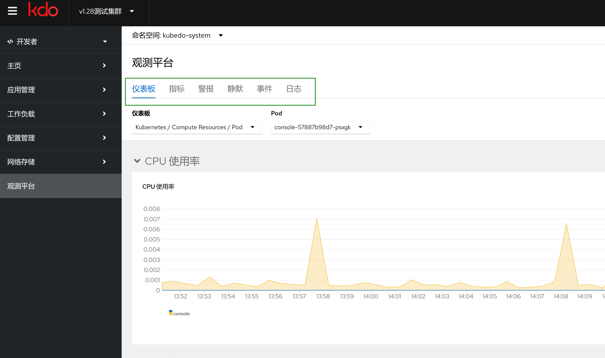

## 开发者观测平台
{: .note }
开发者观测平台专注项目和环境层面，以确保应用的稳定性、性能。
开发者观测平台页面有六个Tab页面

1. [仪表盘](../../dev/workloads/topology)
2. [指标](../../dev/workloads/pods)
3. [警报](../../dev/workloads/deployments)
4. [静默](../../dev/workloads/statefulsets)
5. [事件](../../observability/events)
6. [日志](../../observability/logging)