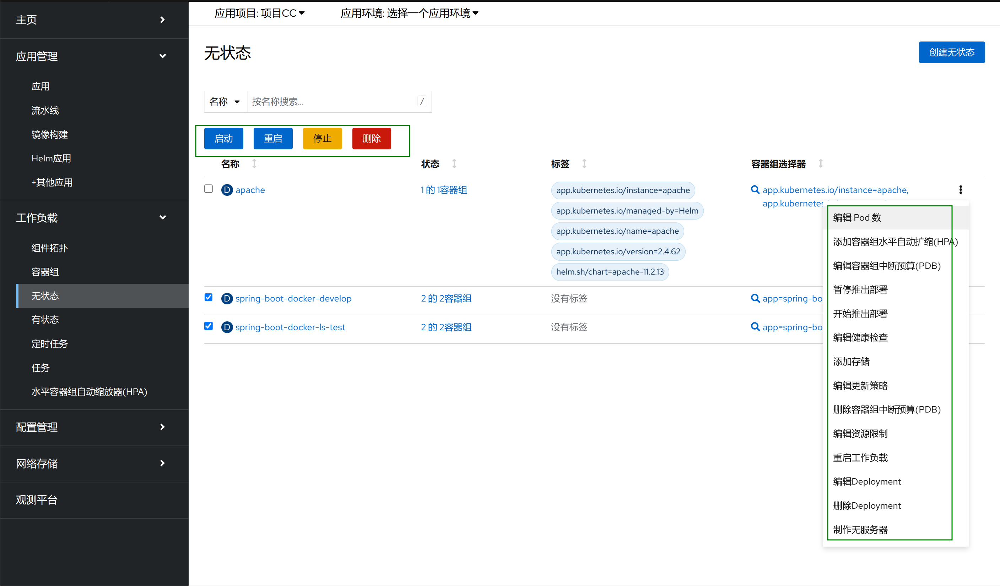
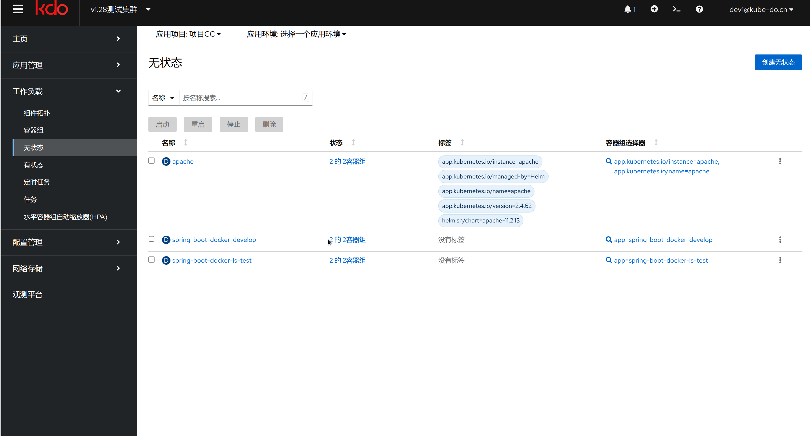
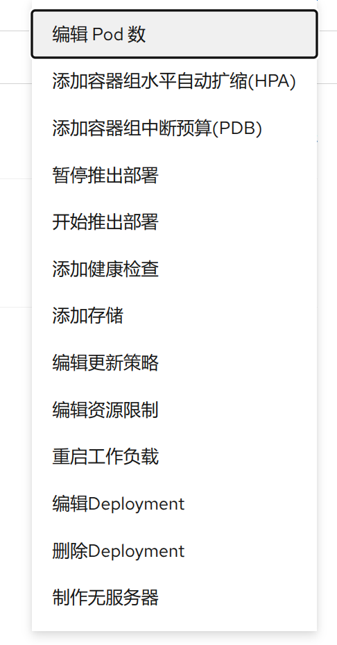

1. TOC
{:toc}

## 介绍

{: .note }
无状态应用（Deployment）用于管理运行一个应用负载的一组容器组，通常适用于不需要保持状态的负载，比如：Web服务，微服务。
[更多信息](https://kubernetes.io/zh-cn/docs/concepts/workloads/controllers/deployment)

[Pod信息](../pods)

## 无状态列表

- 在无状态列表上有个四个按钮，可以批量化操作无状态应用。
 

| 按钮                       | 说明                                           |
|:-------------------------|:---------------------------------------------|
| [启动](){: .btn .btn-blue} | 批量启动无状态应用，默认是启动两个副本，如果是通过批量停止， 启动会恢复到停止前的副本数 |
| [重启](){: .btn .btn-blue} | 批量重启无状态应用                                    |
| [停止](){: .btn .btn-blue} | 批量停止无状态应用                                    |
| [删除](){: .btn .btn-blue} | 批量删除无状态应用，需要键入`confirmed`进行确认                |

## 访问无状态应用

- 点击访问单个无状态应用，可以看到以下菜单

| 菜单   | 说明                            |
|:-----|:------------------------------|
| 详情   | 无状态应用的详情                      |
| 指标   | 查看容器组的指标，可以同时查看多个容器组          |
| YAML | 资源对象的YAML，用于高级用户              |
| 副本集  | 无状态应用通过副本集进行版本控制，可以查看和管理无状态版本 |
| 容器组  | 属于这个无状态应用的容器组                 |
| 环境变量 | 属于这个无状态应用的环境变量                |
| 事件   | 无状态应用的事件                      |

## 操作无状态应用

- 点击列表右侧的`操作图标`或者点击无状态应用页面右上的`操作`，可以对当前无状态应用进行更多操作,其中大部分和[有状态应用](../statefulsets)是相同的

| 菜单      | 说明                                                            |
|:--------|:--------------------------------------------------------------|
| 编辑Pod数量 | 编辑该无状态应用的副本数 [更多细节](../../../workload-actions/edit-pod-count) |
| 指标      | 查看容器组的指标，可以同时查看多个容器组                                          |
| YAML    | 资源对象的YAML，用于高级用户                                              |
| 副本集     | 无状态应用通过副本集进行版本控制，可以查看和管理无状态版本                                 |
| 容器组     | 属于这个无状态应用的容器组                                                 |
| 环境变量    | 属于这个无状态应用的环境变量                                                |
| 事件      | 无状态应用的事件                                                      |

