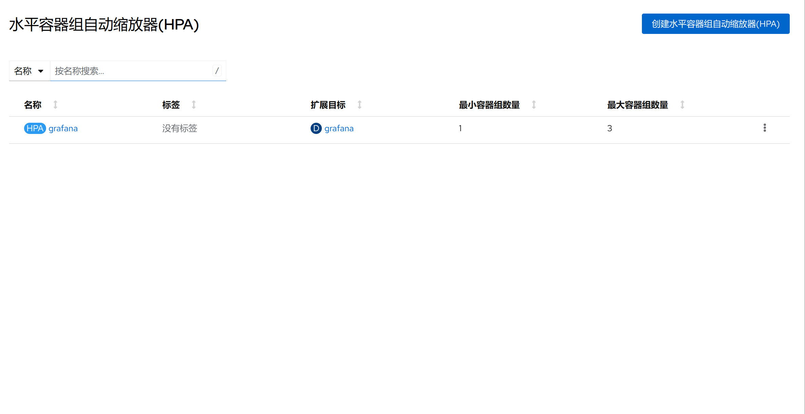

1. TOC
{:toc}

## 介绍

{: .note }
在 Kubernetes 中，HorizontalPodAutoscaler 自动更新工作负载资源 （例如 Deployment 或者 StatefulSet）， 目的是自动扩缩工作负载以满足需求。
水平扩缩意味着对增加的负载的响应是部署更多的 Pod。 这与“垂直（Vertical）”扩缩不同，对于 Kubernetes， 垂直扩缩意味着将更多资源（例如：内存或 CPU）分配给已经为工作负载运行的 Pod。
如果负载减少，并且 Pod 的数量高于配置的最小值， HorizontalPodAutoscaler 会指示工作负载资源（Deployment、StatefulSet 或其他类似资源）缩减。
水平 Pod 自动扩缩不适用于无法扩缩的对象（例如：DaemonSet。）
HorizontalPodAutoscaler 被实现为 Kubernetes API 资源和控制器。
资源决定了控制器的行为。 在 Kubernetes 控制平面内运行的水平 Pod 自动扩缩控制器会定期调整其目标（例如：Deployment）的所需规模，以匹配观察到的指标， 例如，平均 CPU 利用率、平均内存利用率或你指定的任何其他自定义指标。

