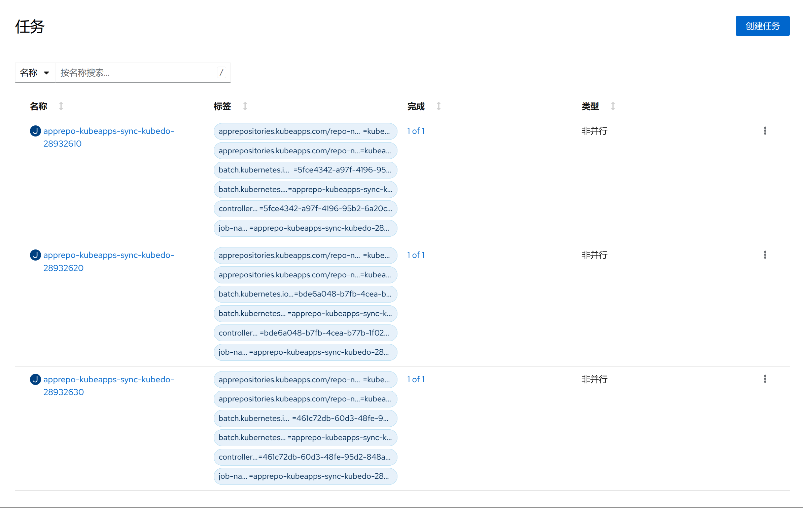

1. TOC
{:toc}

## 介绍

{: .note }
任务(Jobs)会创建一个或者多个 Pod，并将继续重试 Pod 的执行，直到指定数量的 Pod 成功终止。 随着 Pod 成功结束，Job 跟踪记录成功完成的 Pod 个数。 当数量达到指定的成功个数阈值时，任务（即 Job）结束。 删除 Job 的操作会清除所创建的全部 Pod。 挂起 Job 的操作会删除 Job 的所有活跃 Pod，直到 Job 被再次恢复执行。
一种简单的使用场景下，你会创建一个 Job 对象以便以一种可靠的方式运行某 Pod 直到完成。 当第一个 Pod 失败或者被删除（比如因为节点硬件失效或者重启）时，Job 对象会启动一个新的 Pod。
你也可以使用 Job 以并行的方式运行多个 Pod。
如果你想按某种排期表（Schedule）运行 Job（单个任务或多个并行任务），请参阅 [定时任务CronJob](../cronjobs)。

