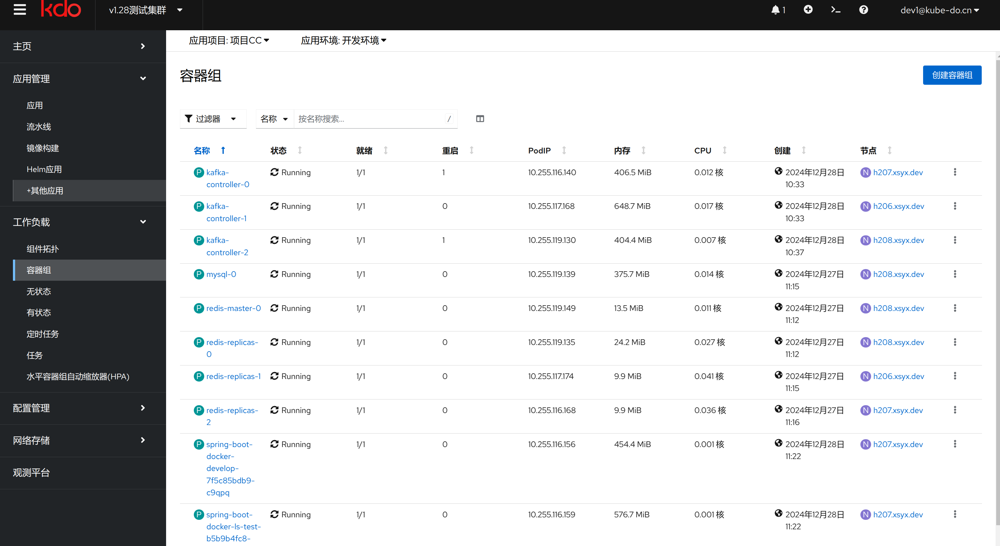
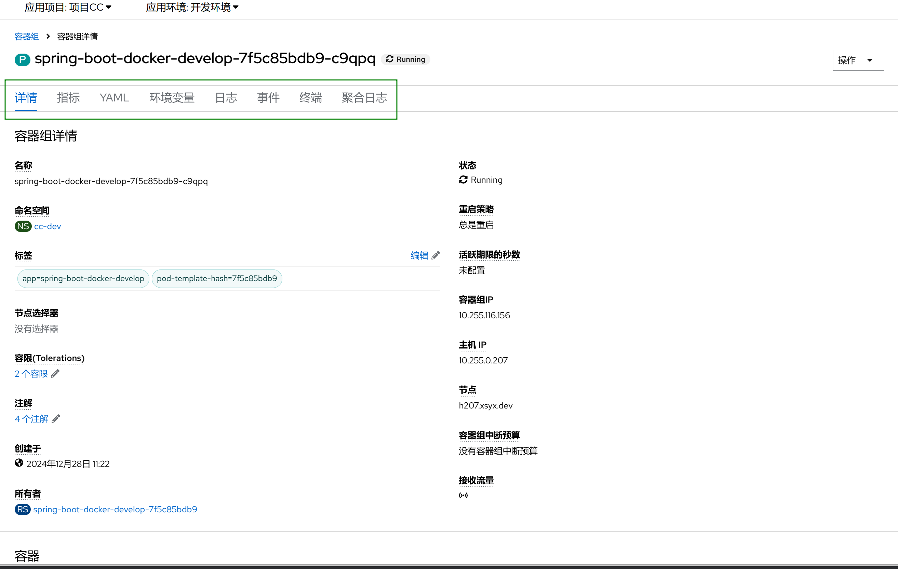

1. TOC
{:toc}

## 介绍

{: .note }
容器组（Pod）是 Kubernetes 中最小的可部署计算单元，用于创建和管理。一个Pod可以包含一个或多个紧密相关的容器，这些容器共享存储资源、网络命名空间以及运行规约。
容器组（Pod）是 Kubernetes 中最小的可部署计算单元，用于创建和管理。一个Pod可以包含一个或多个紧密相关的容器，这些容器共享存储资源、网络命名空间以及运行规约。
[更多信息](https://kubernetes.io/zh-cn/docs/concepts/workloads/pods/)

## 容器组主页

{: .note }
点击`工作负载 -> 容器组`访问容器组菜单，可以访问当前环境的容器组，看到以下菜单。

| 菜单    | 说明                                                                                                             |
|:------|:---------------------------------------------------------------------------------------------------------------|
| 名称    | 容器组的名字                                                                                                         |
| 状态    | 容器组的状态，容器组有很多状态，Running表示正在运行。 [更多信息](https://kubernetes.io/zh-cn/docs/concepts/workloads/pods/pod-lifecycle/) |
| 就绪    | 容器组是否就绪，就绪后就能进行访问了                                                                                             |
| 重启    | 容器组重启的次数，容器组发生异常就会重启，可以通过日志或者事件查看原因。                                                                           |
| PodIP | 容器组的IP地址                                                                                                       |
| 内存    | 容器组的当前内存使用量                                                                                                    |
| CPU   | 容器组的当前CPU使用量                                                                                                   |
| 创建    | 容器组的创建时间                                                                                                       |
| 节点    | 容器组所在的节点                                                                                                       |

## 容器组内容

{: .note }
点击容器组，可以打开容器组的页面，会看到以下菜单：

| 菜单   | 说明                                                                          |
|:-----|:----------------------------------------------------------------------------|
| 详情   | 容器组的详细信息                                                                    |
| 指标   | 容器组的监控指标，包括CPU, 内存，网络，磁盘                                                    |
| YAML | 容器组资源对象的YAML                                                                |
| 环境变量 | 容器组的环境变量，继承它的拥有者（Owner），一般为[无状态应用](../deployments)或[有状态应用](../statefulsets) |
| 日志   | 容器组打印到标准输出的日志内容                                                             |
| 事件   | [事件详情](../../../observability/events)                                       |
| 终端   | 容器组的访问终端，并且支持上传和下载文件                                                        |
| 聚合日志 | 存储在日志平台的日志，可以访问更久时间的日志.[日志详情](../../../observability/logging#容器组页面访问)       |

