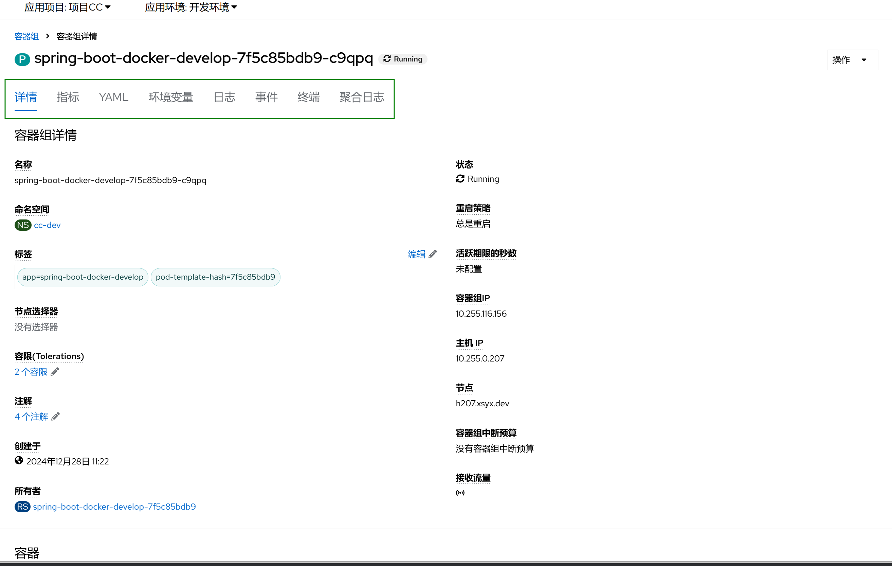

1. TOC
{:toc}

## 介绍

{: .note }
容器组（Pod）是可以在 Kubernetes 中创建和管理的、最小的可部署的计算单元。
是一组（一个或多个） 容器，这些容器共享存储、网络、以及怎样运行这些容器的规约。
容器组中的内容总是并置的并且一同调度，在共享的上下文中运行。
容器组所建模的是特定于应用的 “逻辑主机”，其中包含一个或多个应用容器， 这些容器相对紧密地耦合在一起。 
在非云环境中，在相同的物理机或虚拟机上运行的应用类似于在同一逻辑主机上运行的云应用。
[更多信息](https://kubernetes.io/zh-cn/docs/concepts/workloads/pods/)

## 容器组主页
点击`工作负载 -> 容器组`访问容器组菜单，可以访问当前环境的容器组，看到以下菜单。

| 菜单    | 说明                                                                                                             |
|:------|:---------------------------------------------------------------------------------------------------------------|
| 名称    | 容器组的名字                                                                                                         |
| 状态    | 容器组的状态，容器组有很多状态，Running表示正在运行。 [更多信息](https://kubernetes.io/zh-cn/docs/concepts/workloads/pods/pod-lifecycle/) |
| 就绪    | 容器组是否就绪，就绪后就能接受访问了                                                                                             |
| 重启    | 容器组重启的次数，容器组发生就会重启，可以通过日志或者事件查看原因                                                                              |
| PodIP | 容器组的IP地址                                                                                                       |
| 内存    | 容器组的当前内存使用量                                                                                                    |
| CPU   | 容器组的当前CPU使用量                                                                                                   |
| 创建    | 容器组的创建时间                                                                                                       |
| 节点    | 容器组所在的节点                                                                                                       |

## 容器组内容

点击容器组，可以打开容器组的页面，会看到以下菜单

| 菜单   | 说明                       |
|:-----|:-------------------------|
| 详情   | 容器组的详细信息，                |
| 指标   | 容器组的监控指标，包括CPU, 内存，网络，磁盘 |
| YAML | 容器组的资源YAML内存             |
| 环境变量 | 容器组的环境变量                 |
| 日志   | 容器组打印到标准输出的日志内容          |
| 事件   | 容器组的事件，                  |
| 终端   | 容器组的访问终端                 |
| 聚合日志 | 存储在日志平台的日志               |

