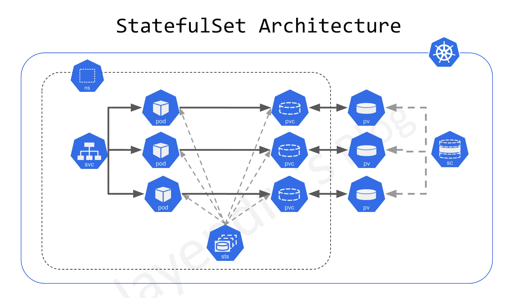
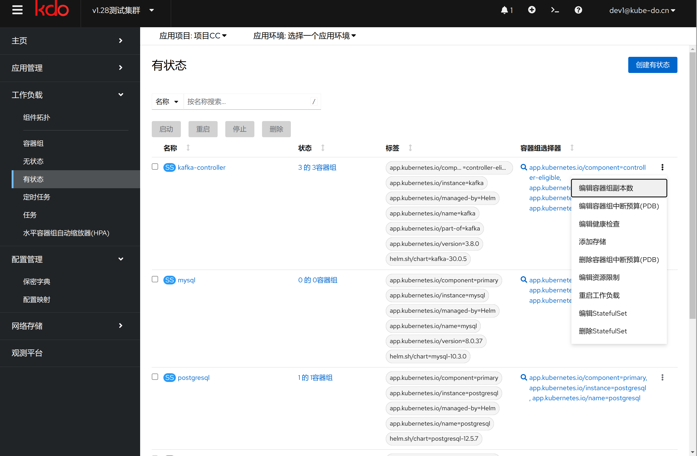
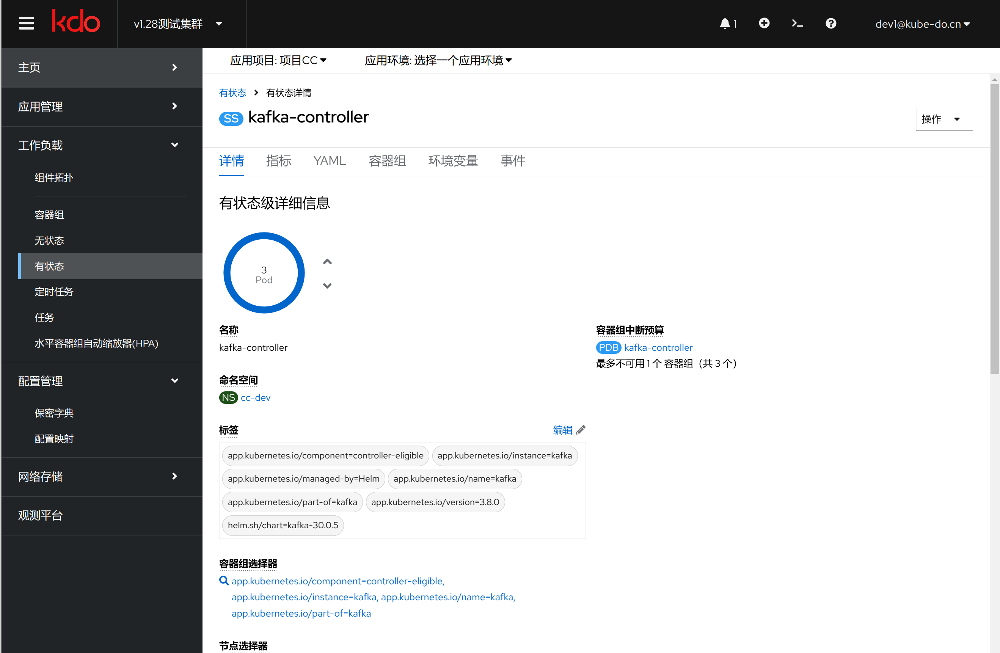
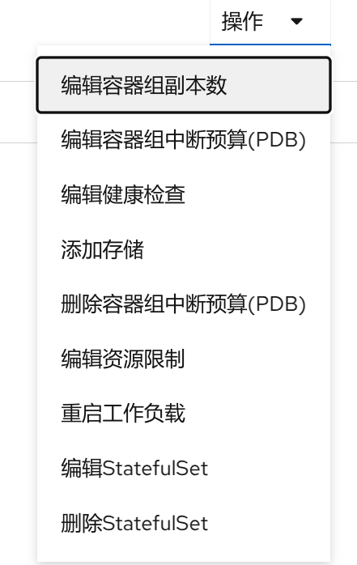

1. TOC
{:toc}

## 介绍

{: .note }
Kubernetes 有`状态应用(Statefulset)` 是一种工作负载 API 对象，它管理有状态应用的部署和扩展。
与 [无状态应用(Deployment)](../deployments) 不同的是，`有状态应用(Statefulset)` 为每个 `容器组(Pod)` 提供了稳定的、唯一的网络标识符，并且保证有序的、优雅的部署和缩放。
这意味着当你创建一个 `有状态应用(Statefulset)` 来管理一组 `容器组(Pod)` 时，每个 容器组(Pod) 都会有一个持久的身份，即使它被重新调度到集群中的其他节点上。
使用`状态应用(Statefulset)`的典型场景包括数据库（如 MySQL、PostgreSQL）、缓存系统（如 Redis 集群）和其他需要持久存储和稳定网络标识的应用程序。

## 关键特性
1. **稳定的网络身份:** 每个 Pod 在 StatefulSet 中都有一个基于其序号的固定名称（例如，web-0、web-1），这个名称在 Pod 整个生命周期中保持不变，即使 Pod 被删除和重建。
2. **持久存储:** 通常与 StatefulSet 一起使用的是 PersistentVolume(PV) 和 PersistentVolumeClaim(PVC)。当 StatefulSet 创建 Pod 时，这些卷声明会被绑定到特定的持久卷，确保数据可以在 Pod 重启或重新调度后仍然存在。
3. **有序部署和扩展:** StatefulSet 确保按顺序创建 Pod，并且只有在前一个 Pod 成功启动并运行之后才会继续下一个。同样，在缩放过程中，Pod 按照逆序终止。
4. **有序地滚动更新:** StatefulSet 支持滚动更新，但与 Deployments 不同，它按照反向顺序进行更新（从最后一个 Pod 开始），并且在确认每个新版本的 Pod 正常运行之前不会继续更新下一个。
5. **无头服务(Headless Service):** 通常会为 StatefulSet 创建一个特殊的无头服务（Headless Service），用于命名和发现 Pod。由于 StatefulSet 的 Pod 拥有稳定的身份，所以它们可以通过这个服务来访问彼此。

## 有状态列表

{: .note }
在有状态列表上有个四个按钮，可以批量化操作有状态应用。

| 按钮                       | 说明                                                                                 |
|:-------------------------|:-----------------------------------------------------------------------------------|
| [启动](){: .btn .btn-blue} | 批量启动有状态应用，默认是启动一个副本，如果应用是通过批量停止的， 启动会恢复到停止前的副本数                                    |
| [重启](){: .btn .btn-blue} | 批量重启有状态应用                                                                          |
| [停止](){: .btn .btn-blue} | 批量停止有状态应用，在停止时会记录当前运行的副本数                                                          |
| [删除](){: .btn .btn-blue} | 批量删除有状态应用，需要键入`confirmed`进行确认                                                      |

## 访问有状态应用

{: .note }
有状态应用的访问页面基本和无状态应用一样，可以参考[访问无状态应用](../deployments#访问无状态应用)

## 操作有状态应用

{: .note }
操作有状态应用基本也和无状态应用一样，只是有些不适合有状态应用菜单没有显示，可以参考[操作无状态应用](../deployments#操作无状态应用)

