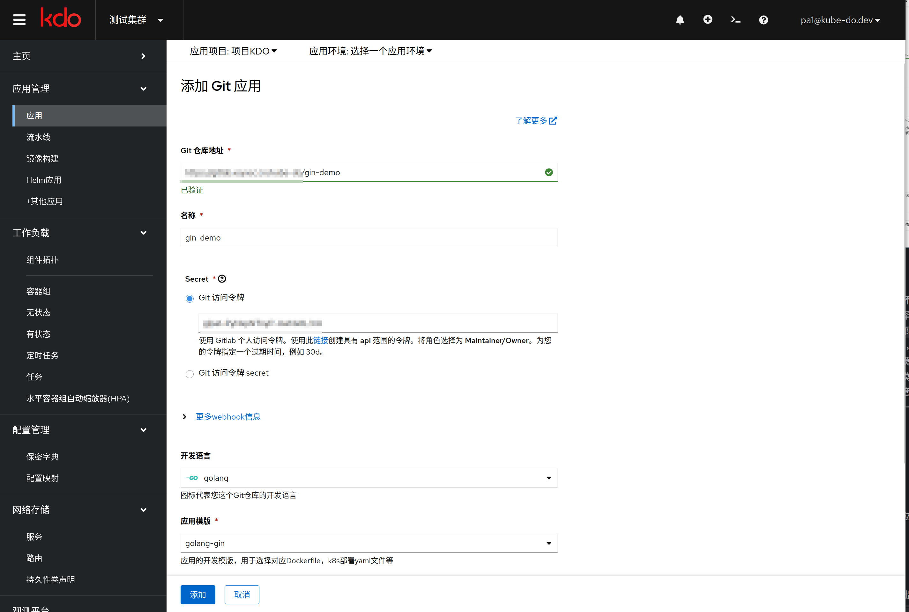
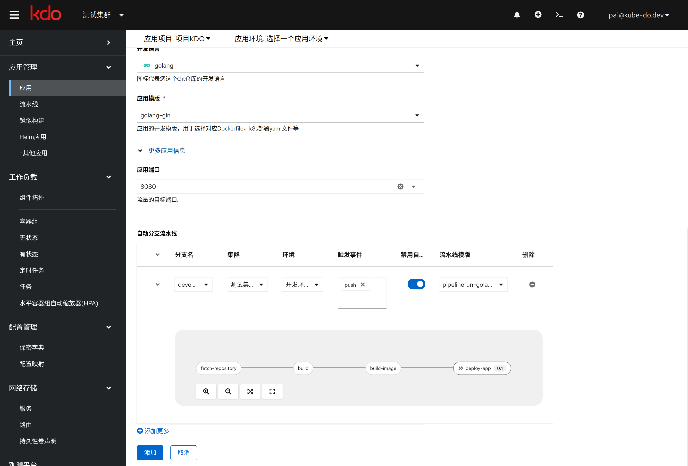
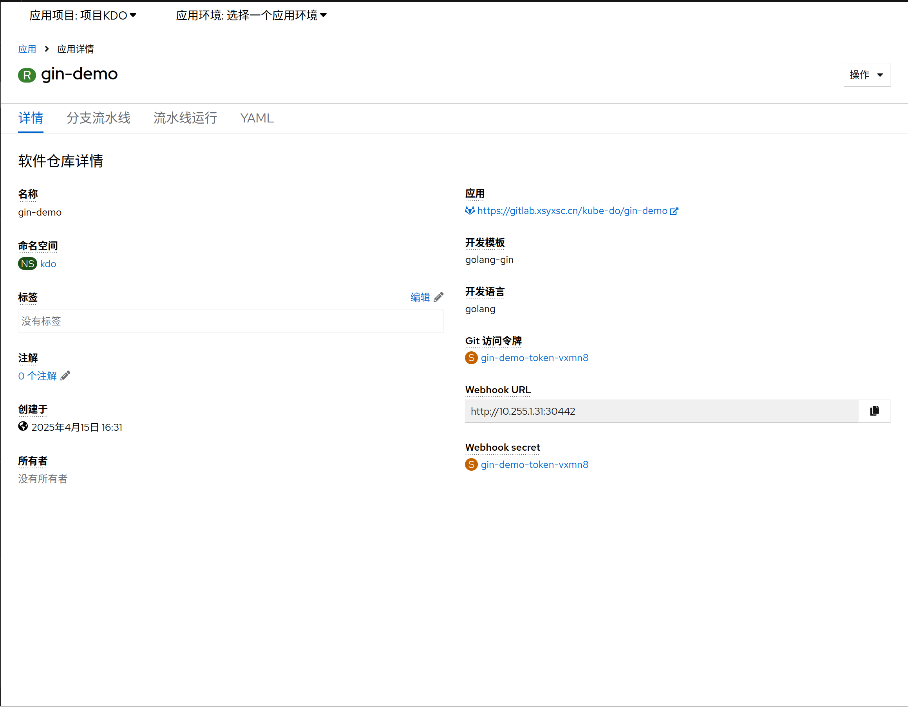
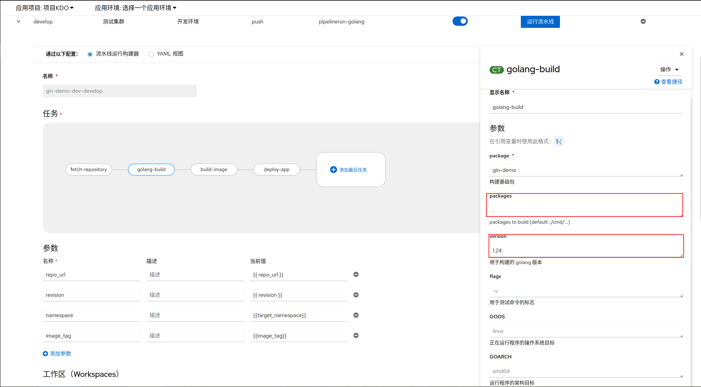
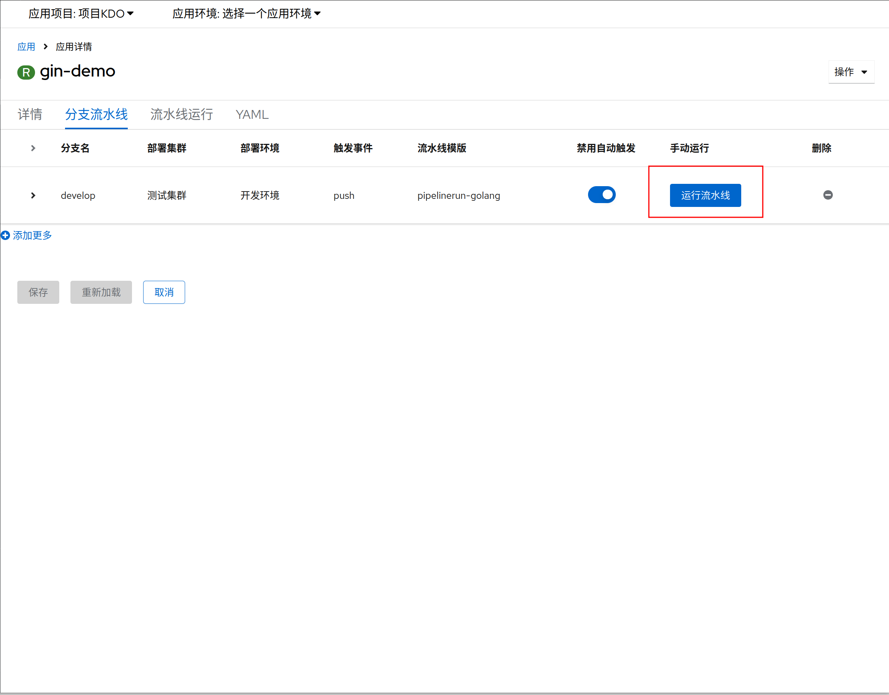
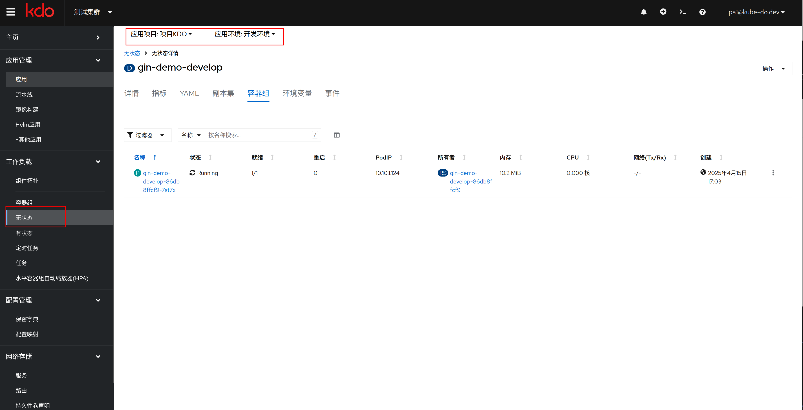
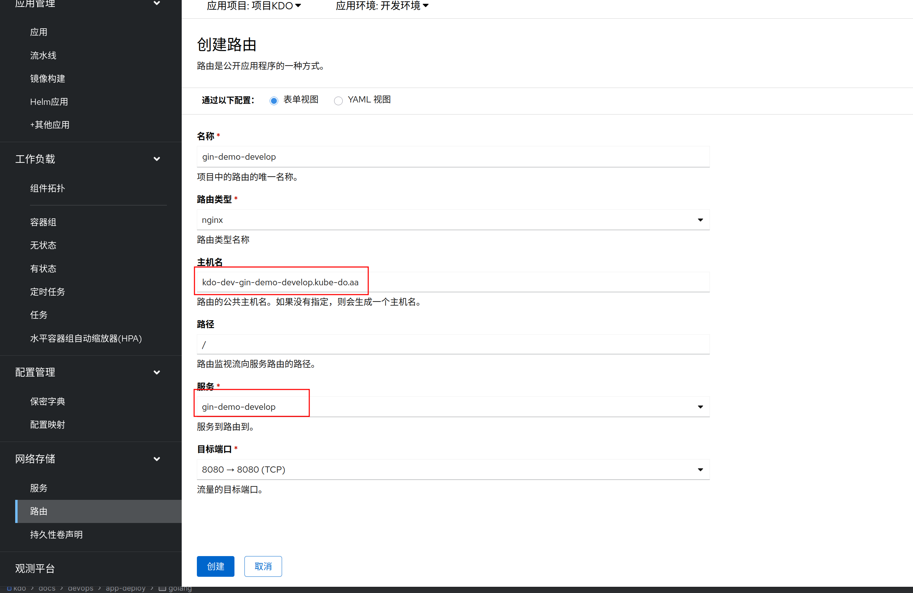
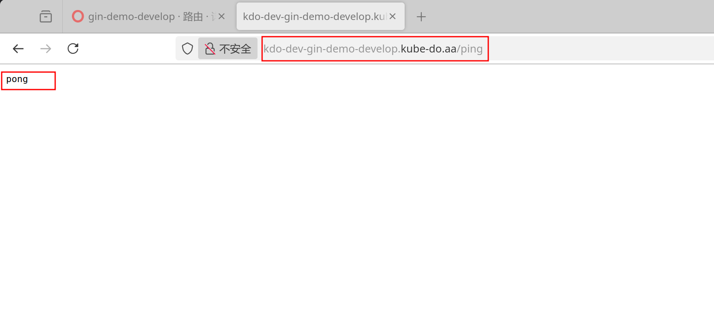

1. TOC
{:toc}

## 概述
Go语言（Golang）因其简洁性、高效性和强大的并发支持，已成为现代软件开发中的热门选择。

## 创建应用

### 应用基本信息
1. 输入源码根目录，平台默认会根据源码根目录是否有 `go.mod` 文件来自动识别为`Golang`项目。
2. 在`Git访问令牌`输入Git仓库的令牌，如果没有现存的令牌，通过访问`链接`到对应的仓库，创建一个新的令牌。
3. 开发语言会自动识别为`golang`。
4. 在`应用模板`中选择对应的 Golang 应用模板，选择对应的开发模块。

### 应用扩展信息
1. 应用端口为8080，这里**不要修改**，因为Golang Gin框架的默认端口为8080。
2. 在自动分支流水线，选择对于应的分支进行流水线构建，比如 `develop` 分支流水线构建，还有`部署集群`和`部署环境`。
   流水线触发默认为手动触发，也可以选择自动触发，根据`触发事件`会自动触发，`触发事件`默认为`push`，也可以选择`pull request`等。
   最后需要选择对应的流水线模板，点击`下箭头`按钮，会扩展图表，可以查看模板的组件组成。
3. 可以选择多个分支进行管理，`分支`和`部署环境`的可以是多对多的关系，就是一个分支可以部署到多个环境上，一个环境也可以部署多个分支。
4. 选择完成后，点击**添加**，应用创建就完成了。

## 管理应用
应用创建完成后，就可以对应用进行管理了。[更多信息](/docs/dev/applications/repository#应用管理)

### 定制流水线
1. Golang应用的基础流水线一般有四个[任务](/docs/dev/applications/pipelines#task)，分别是`拉取代码`、`golang build`、`构建镜像`、`部署镜像`。[更多信息](/docs/dev/applications/pipelines)
2. 流水线可以根据需要进行定制。
3. `GOPROXY`默认的参数为`https://goproxy.cn,direct` ，可以通过`流水线编辑`选择`golang-build`组件进行修改。
4. 由于Golang的版本差异，在`golang-build`组件可以根据需要选择对应的Golang版本，默认为`1.24`，也可以选择`1.15`、`1.18-24`等。

### 手动运行流水线
1. 进入`分支流水线`页面，选择一个分支，点击**运行流水线**，就可以进行应用构建和部署了。

### 查看流水线运行信息
1. 进入`流水线运行`页面，选择对应的流水线运行，就可以查看流水线运行信息了。[更多信息](/docs/dev/applications/pipelines)

### 查看应用运行信息
进入`工作负载`菜单，选择`无状态`，选择对应的`应用名称`，就可以查看应用运行信息了。[更多信息](/docs/dev/workloads/deployments)

### 创建应用路由
如应用属于 `web` 类型应用，可以创建对应的路由，通过路由访问到应用。[更多信息](/docs/dev/network-stroage/ingresses#新增路由)

### 访问应用
路由创建完成后，就可以通过域名访问到应用了（需要确认已经配置了域名解析或设置hosts文件）。

