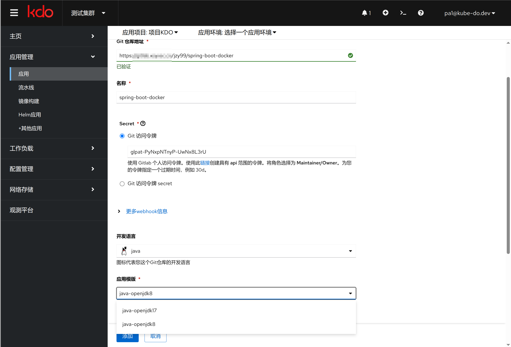
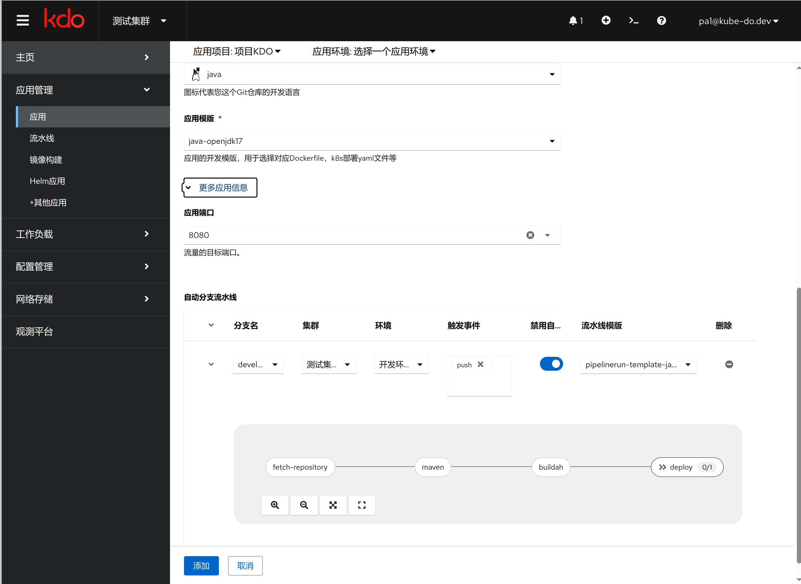
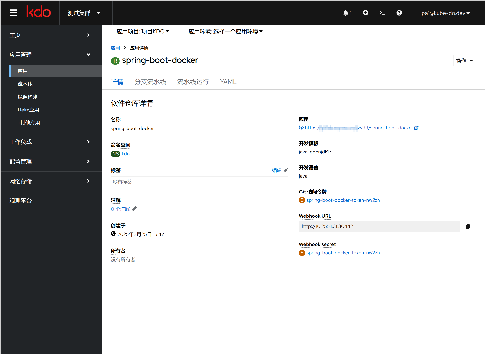
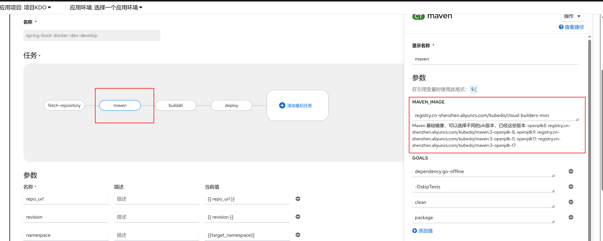
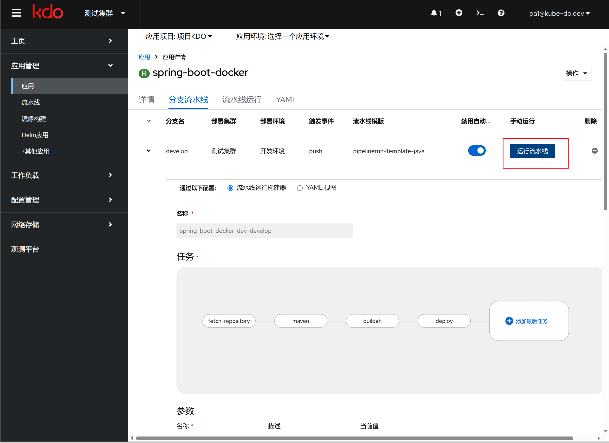
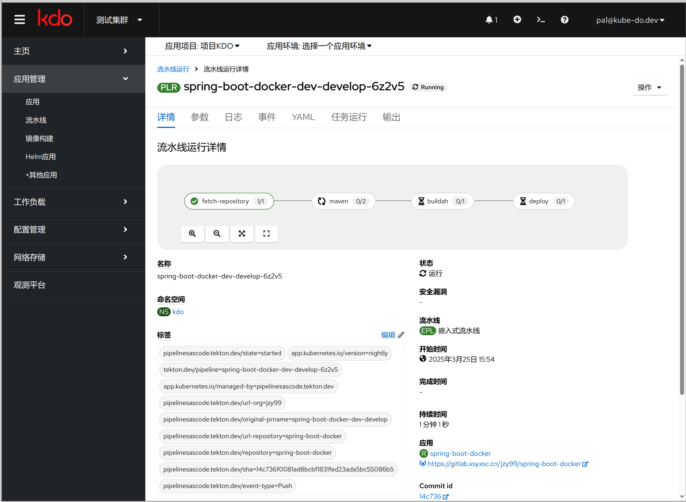
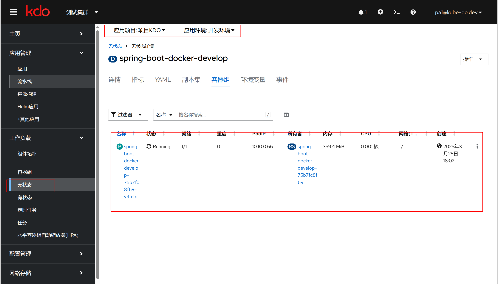
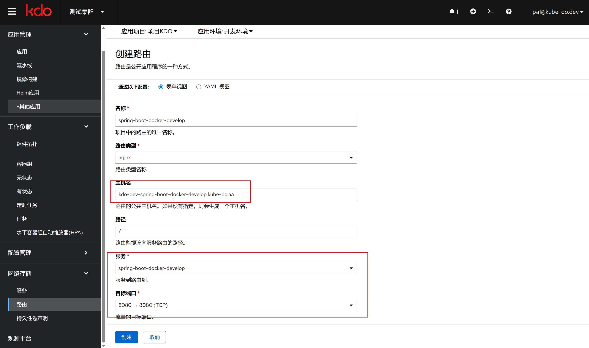
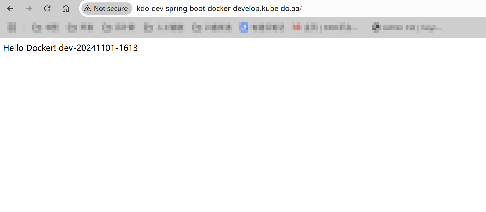

## 概述

KDO 支持构建 Java 单模块的项目，并自动识别。当源代码根目录下存在 `pom.xml` 文件，KDO 会将源代码识别为`Java Maven`单模块项目。

## 创建应用

### 应用基本信息
1. 输入源码根目录，平台默认会根据源码根目录是否有 `pom.xml` 文件来自动识别为`Java Maven`项目。
2. 在`Git访问令牌`输入Git仓库的令牌，如果没有现存的令牌，通过访问`链接`到对应的仓库，创建一个新的令牌。
3. 开发语言会自动识别为`Java`。
4. 在`应用模板`中选择对应的 Java 应用模板，选择对应的 Java 版本。

### 应用扩展信息
1. 应用端口默认为 8080，如果有需要，可以修改其他端口。
2. 在自动分支流水线，选择对于应的分支进行流水线构建，比如 `develop` 分支流水线构建，还有`部署集群`和`部署环境`。
   流水线触发默认为手动触发，也可以选择自动触发，根据`触发事件`会自动触发，`触发事件`默认为`push`，也可以选择`pull request`等。
   最后需要选择对应的流水线模板，点击`下箭头`按钮，会扩展图表，可以查看模板的组件组成。
3. 可以选择多个分支进行管理，`分支`和`部署环境`的可以是多对多的关系，就是一个分支可以部署到多个环境上，一个环境也可以部署多个分支。
4. 选择完成后，点击**添加**，应用创建就完成了。

## 管理应用
应用创建完成后，就可以对应用进行管理了。[更多信息](/docs/dev/applications/repository#应用管理)

### 定制流水线
1. Java应用的流水线一般有四个[任务](/docs/dev/applications/pipelines#task)，分别是`拉取代码`、`Maven构建`、`构建镜像`、`部署镜像`。[更多信息](/docs/dev/applications/pipelines) 
2. 流水线可以根据需要进行定制。
3. 默认maven仓库默认为`https://maven.aliyun.com/repository/public` ，可以通过`流水线编辑`选择maven组件进行修改。
4. 由于Java的版本差异，在Maven构建可以根据需要选择对应的Java版本，默认为`11`，也可以选择`8`、`17`、`21`等。
   

### 手动运行流水线
1. 进入`分支流水线`页面，选择一个分支，点击**运行流水线**，就可以进行应用构建和部署了。

### 查看流水线运行信息
1. 进入`流水线运行`页面，选择对应的流水线运行，就可以查看流水线运行信息了。[更多信息](/docs/dev/applications/pipelines)
2. KDO平台会在项目内创建一个[持久存储卷PVC](/docs/storage#存储概念)，用来缓存这个项目所有应用安装包(包括Java)的依赖，所以只有第一次构建的时候，时间比较长，后续构建时间会比较短。

### 查看应用运行信息
进入`工作负载`菜单，选择`应用拓扑`，就可以查看应用运行信息了。[更多信息](/docs/dev/workloads/topology)

### 创建应用路由
如应用属于 `web` 类型应用，可以创建对应的路由，通过路由访问到应用。[更多信息](/docs/dev/network-stroage/ingresses#新增路由)

### 访问应用
路由创建完成后，就可以通过域名访问到应用了（需要确认已经配置了域名解析或设置hosts文件）。
