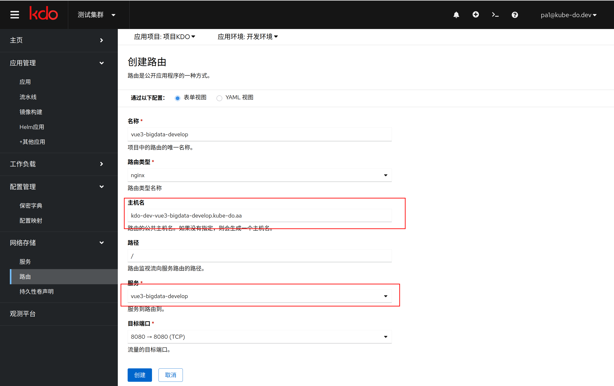

本篇文档介绍如何在 KDO 平台上通过源代码部署 NodeJS 前端项目和后端项目。例如 Vue、React 等前端项目和 Express、Koa 等后端项目。

## 概述

在基于源码构建时，KDO 会识别项目根目录的 **package.json** 文件来判断为 NodeJS 项目。
1. 支持在页面上选择为 Node 前端项目或者后端项目并自动添加下述文件，并选择使用 NPM 还是 YARN 构建项目。
2. 在源代码根目录根据下述描述添加文件来确定项目类型。

KDO 会根据源码根目录是否有`package.json`来识别为 NodeJS 项目。根据是否存在`nodestate.json`文件来识别为 Node 前端项目。

- **package-lock.json:** 如源码根目录存在则使用 NPM 构建，不可与 yarn.lock 同时存在。
- **yarn.lock:** 如源码根目录存在则使用 YARN 构建，不可与 package-lock.json 同时存在。
- **nodestatic.json:** 如源码根目录存在则为 Node 前端项目，默认如下：
  ```json
  {
    "path": "dist"
  }
  ```
  > 指定静态文件编译后的输出目录，默认为 dist
- **web.conf:** Nginx配置文件。如源码根目录存在则使用，不存在则采用下述默认配置。
  ```conf
  server {
      listen       8080;
      
      location / {
          root   /app/www;
          try_files $uri $uri/ /index.html;
          index  index.html index.htm;
      }
  }
  ```
  > 容器内 Nginx 默认路径为 /app/nginx，静态文件默认路径为 /app/www。如 /app/nginx/nginx.conf、/app/nginx/conf.d/web.conf


## 创建应用

### 应用基本信息
1. 输入源码根目录，平台默认会根据源码根目录是否有 `package.json` 文件来自动识别为`NodeJS`项目。
2. 在`Git访问令牌`输入Git仓库的令牌，如果没有现存的令牌，通过访问`链接`到对应的仓库，创建一个新的令牌。
3. 开发语言会自动识别为`nodejs`。
4. 在`应用模板`中选择对应的 NodeJS 应用模板，选择对应的开发模块。


### 应用扩展信息
1. 应用端口为8080，这里**不要修改**，因为Nginx的默认端口为8080。
2. 在自动分支流水线，选择对于应的分支进行流水线构建，比如 `develop` 分支流水线构建，还有`部署集群`和`部署环境`。
   流水线触发默认为手动触发，也可以选择自动触发，根据`触发事件`会自动触发，`触发事件`默认为`push`，也可以选择`pull request`等。
   最后需要选择对应的流水线模板(可以选择`npm`和 `yarn`两种构建方式)，点击`下箭头`按钮，会扩展图表，可以查看模板的组件组成。
3. 可以选择多个分支进行管理，`分支`和`部署环境`的可以是多对多的关系，就是一个分支可以部署到多个环境上，一个环境也可以部署多个分支。
4. 选择完成后，点击**添加**，应用创建就完成了。


## 管理应用
应用创建完成后，就可以对应用进行管理了。[更多信息](/docs/dev/applications/repository#应用管理)


### 定制流水线
1. 基于npm构建应用的基础流水线一般有五个[任务](/docs/dev/applications/pipelines#task)，分别是`拉取代码`、`npm install`、`npm run build`、`构建镜像`、`部署镜像`。[更多信息](/docs/dev/applications/pipelines)
2. 流水线可以根据需要进行定制。
3. npm仓库默认为淘宝的镜像仓库`https://registry.npmmirror.com` ，可以通过`流水线编辑`选择npm组件进行修改。
4. 由于Nodejs的版本差异，在npm组件可以根据需要选择对应的Nodejs版本，默认为`18`，也可以选择`12`、`14`、`16`、`20`、`22`等。


### 手动运行流水线
1. 进入`分支流水线`页面，选择一个分支，点击**运行流水线**，就可以进行应用构建和部署了。


### 查看流水线运行信息
1. 进入`流水线运行`页面，选择对应的流水线运行，就可以查看流水线运行信息了。[更多信息](/docs/dev/applications/pipelines)


### 查看应用运行信息
进入`工作负载`菜单，选择`无状态`，选择对应的`应用名称`，就可以查看应用运行信息了。[更多信息](/docs/dev/workloads/deployments)


### 创建应用路由
如应用属于 `web` 类型应用，可以创建对应的路由，通过路由访问到应用。[更多信息](/docs/dev/network-stroage/ingresses#新增路由)


### 访问应用
路由创建完成后，就可以通过域名访问到应用了（需要确认已经配置了域名解析或设置hosts文件）。

