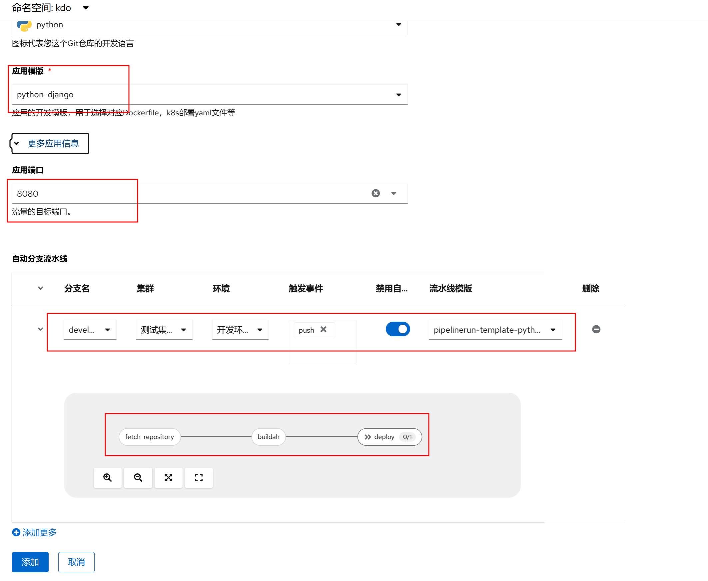

## 概述

代码主目录下有 `requirements.txt` 文件，KDO 会识别代码语言类型为 **Python** 。

### requirements.txt 规范

若无 `requirements.txt` 可用如下命令生成

```bash
pip freeze > requirements.txt
```

### Django 静态文件支持

由于 [Django](https://www.djangoproject.com/) 的静态文件支持（CSS、图片等）不是很容易配置而且不方便调试，这里给出一个示例：

**settings.py**

```python
# Static files (CSS, JavaScript, Images)
# https://docs.djangoproject.com/en/1.7/howto/static-files/

BASE_DIR = os.path.dirname(os.path.abspath(__file__))
STATIC_ROOT = 'staticfiles'
STATIC_URL = '/static/'

STATICFILES_DIRS = (
    os.path.join(BASE_DIR, 'static'),
)
```


## 创建应用

### 应用基本信息

1. 输入源码根目录，点击**创建**，平台默认会根据源码根目录是否有 `requirements.txt` 文件来自动识别为 Python 项目。
2. 在`Git访问令牌`输入Git仓库的令牌，如果没有现存的令牌，通过访问`链接`到对应的仓库，创建一个新的令牌。
3. 在应用模板中选择对应的 Python 应用模板，比如使用Django的应用，选择python-django，也选择不同的 Python 版本。


### 应用扩展信息

1. 应用端口默认为 8080，如果有需要，可以修改其他端口。
2. 在自动分支流水线，选择对于应的分支进行流水线构建，比如 `develop` 分支流水线构建，还有`部署集群`和`部署环境`。
流水线触发默认为手动触发，也可以选择自动触发，根据`触发事件`，自动触发，`触发事件`默认为`push`，也可以选择`pull request`等。
最后需要选择对应的流水线模板，点击`扩展`按钮，可以查看模板的详细介绍。
3. 可以选择多个分支进行管理，`分支`和`部署环境`的可以是多对多的关系，就是一个分支可以部署到多个环境上，一个环境也可以部署多个分支。
4. 选择完成后，点击**添加**，应用创建就完成了。


## 管理应用
应用创建完成后，就可以对应用进行管理了，[更多信息](/docs/dev/applications/repository)。

### 手动运行流水线
进入`分支流水线`页面，选择一个分支，点击**运行流水线**，就可以进行应用构建和部署了。


### 查看流水线运行信息
进入`流水线运行`页面，选择对应的流水线运行，就可以查看流水线运行信息了,[更多信息](/docs/dev/applications/pipelines)。


### 查看应用运行信息
进入`工作负载`菜单，选择`无状态`，选择对应的`应用名称`，就可以查看应用运行信息了，[更多信息](/docs/dev/workloads/deployments)。


### 创建应用路由
如应用属于 `web` 类型应用，可以创建对应的路由，通过路由访问到应用，[更多信息](/docs/dev/network-stroage/ingresses)


### 访问应用
路由创建完成后，就可以通过域名访问到应用了（需要确认已经配置了域名解析或设置hosts文件）。

