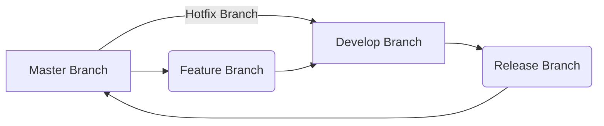
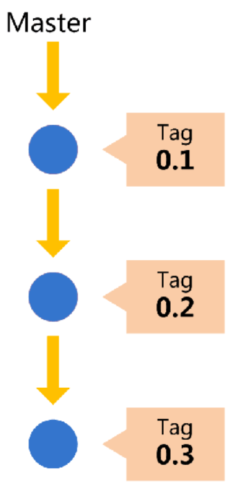
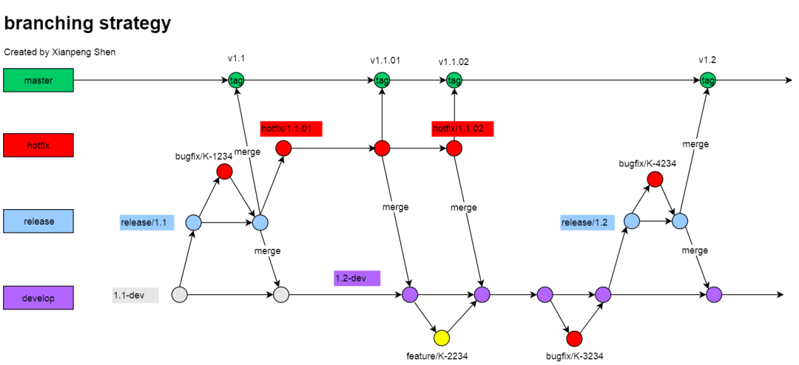
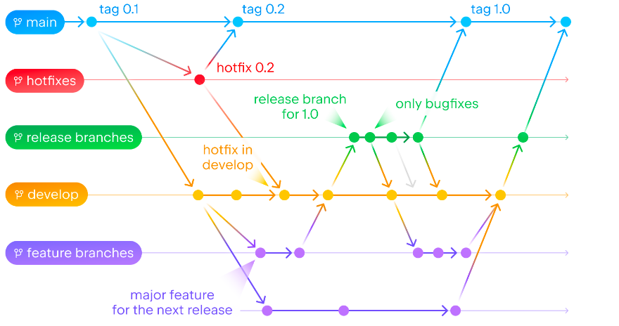
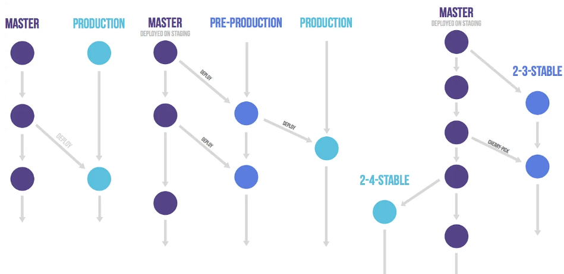
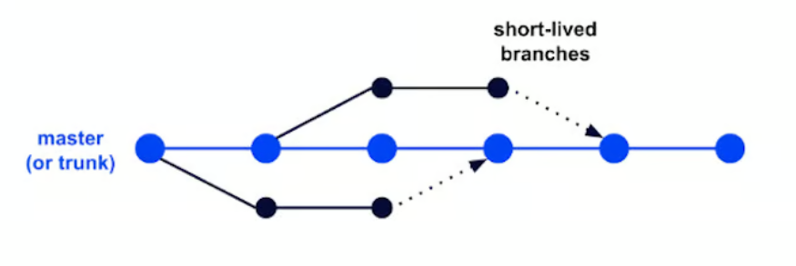
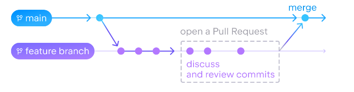

https://cloud.tencent.com/developer/article/2449812

## 介绍

{: .note }
在现代软件开发中，特别是多人协作的开发环境中，选择适合的 Git 分支策略对项目的成功至关重要。
不同的团队规模、项目复杂度和发布频率都可能需要不同的分支策略。
常见的 Git 分支策略包括 [Git Flow](#1-git-flow)、[GitHub Flow](#2-github-flow) 和 [Trunk Based Development (主干开发)](#3-trunk-based-development-主干开发)。
本文将深入分析这些分支策略的优缺点，并探讨如何根据团队规模和项目需求选择合适的工作流程。
我们还通过kdo平台和对应的 Git 分支策略进行结，同时，我们将提供相应的代码示例和最佳实践，帮助团队避免常见的协作问题。


##  一、Git 分支策略概述

### 1. Git Flow

Git Flow 是 Vincent Driessen 于 2010 年提出的分支模型。它基于两个长期分支（`master` 和 `develop`），并引入了多个短期分支用于不同的开发任务。

**主要分支：**
- `master`：生产环境的主分支，始终保持可发布的状态。
- `develop`：开发分支，所有新功能的开发都会在此分支进行。

**短期分支：**
- `feature` 分支：用于开发新功能，通常从 `develop` 分支创建，完成后合并回 `develop`。
- `release` 分支：在发布前创建的分支，主要用于准备发布版本，进行最后的测试和修复。
- `hotfix` 分支：用于紧急修复生产环境的问题，直接从 `master` 创建并最终合并回 `master` 和 `develop`。

**Git Flow 流程图：**



**示例代码：**
假设我们需要为项目开发一个新功能，使用 Git Flow 创建 `feature` 分支并完成开发：

```shell
# 切换到 develop 分支并确保最新
git checkout develop
git pull origin develop

# 创建一个新功能分支
git checkout -b feature/new-feature

# 开发新功能
# git add 和 git commit 提交代码

# 完成后，合并回 develop 分支
git checkout develop
git merge feature/new-feature

# 删除 feature 分支
git branch -d feature/new-feature
```

**优点：**
- 清晰的结构，适用于较大团队和发布频率较低的项目。
- 明确的发布准备阶段（`release` 分支）和紧急修复通道（`hotfix` 分支）。

**缺点：**
- 分支管理较为复杂，适合中大型项目，不适合需要频繁发布的小型项目。

### 2. GitHub Flow
GitHub Flow 是 GitHub 提出的轻量化分支模型，主要适用于需要持续集成和持续交付（CI/CD）的团队。它的主要原则是保持 `main` 分支（或 `master` 分支）始终可发布。

**GitHub Flow 的特点：**
- 只有一个长期分支，即 `main` 分支。
- 所有功能和修复都通过创建分支进行开发，并通过 Pull Request 进行代码审查和合并。
- 功能完成并通过测试后，直接合并回 `main` 分支并自动部署。
<div align=center>

</div>

**示例代码：**

假设我们使用 GitHub Flow 开发一个新功能：

```shell
# 切换到 main 分支并确保最新
git checkout main
git pull origin main

# 创建一个新功能分支
git checkout -b new-feature

# 开发新功能
# git add 和 git commit 提交代码

# 提交 Pull Request 进行代码审查

# 合并 Pull Request 后，删除本地分支
git checkout main
git pull origin main
git branch -d new-feature
```

**优点：**
- 简单易用，适合小型团队和需要频繁发布的项目。
- 持续交付友好，每次合并都会触发自动部署。

**缺点：**
- 缺乏发布准备阶段，可能不适合复杂的项目。
- 适合 CI/CD 集成度高的项目，但对于大团队可能略显简单。

### 3. Trunk Based Development (主干开发)
Trunk Based Development 是一种更为简单、激进的分支策略，开发人员尽量将所有代码直接提交到 `main`（或 `trunk`）分支，避免长期的分支开发。开发人员通过频繁的小规模提交和自动化测试确保代码质量。

**Trunk Based Development 的特点：**
- 代码频繁提交到 `main` 分支。
- 短期开发分支（如 `feature` 分支）存在时间非常短，通常只存在几小时到几天。
- 需要强大的自动化测试体系和严格的代码审查流程。

**示例代码：**
在主干开发中，开发人员直接在主分支上进行小的功能迭代：

```shell
# 切换到 main 分支并确保最新
git checkout main
git pull origin main

# 创建一个短期开发分支
git checkout -b short-feature

# 开发小功能或修复
# git add 和 git commit 提交代码

# 迅速合并回 main 分支
git checkout main
git merge short-feature

# 删除分支
git branch -d short-feature
```

**优点：**
- 极简分支模型，适合需要频繁集成的小团队。
- 强调持续集成，代码提交频率高，有助于保持项目的高迭代速度。

**缺点：**
- 对代码质量和自动化测试要求极高，适合经验丰富的团队。
- 如果没有良好的测试和审查机制，容易引入问题。

<div align=center>

</div>

## 二、如何选择适合的分支策略？

### 1. 根据团队规模
- **小团队（1-5人）：** 推荐使用 `GitHub Flow` 或 `Trunk Based Development`。这些策略简洁易用，分支管理成本低，非常适合小团队的快速迭代。
- **中型团队（5-20人）：** 推荐使用 `Git Flow`，因为它提供了明确的功能开发、测试、发布流程，适合有明确发布计划的中型项目。
- **大型团队（20+人）：** 推荐使用 `Git Flow` 或主干开发。`Git Flow` 适合有明确发布周期的大型团队，而主干开发则适合自动化测试和持续交付非常成熟的团队。

### 2. 根据项目需求
- **持续集成项目：** 如果项目需要频繁发布并且已经集成了 CI/CD 系统，推荐使用 `GitHub Flow` 或 `Trunk Based Development`。它们支持快速迭代和自动部署。 
- **复杂项目：** 对于具有多个发布阶段或功能复杂度较高的项目，`Git Flow` 提供了更加详细的分支管理，有助于确保项目的稳定性。

### 3. 根据发布频率
- **频繁发布：** 对于每日、每周频繁发布的项目，推荐使用 `GitHub Flow` 或 `Trunk Based Development`。
- **较长发布周期：** 对于有明确的发布周期，且每次发布包含多个功能的项目，推荐使用 `Git Flow`。 
   

## 三、最佳实践
1. **持续集成：** 无论选择哪种分支策略，持续集成（CI）都是保证代码质量的关键。建议在每次提交代码时自动运行测试。
2. **代码审查：** 通过 Pull Request 进行代码审查可以减少错误和提升代码质量，特别是在多人协作开发时。
3. **自动化部署：** 对于使用 `GitHub Flow` 或 `Trunk Based Development` 的团队，自动化部署可以大大减少发布风险。

<div align=center>

</div>


## 四、Trunk Based Development 的最佳实践
虽然 Trunk Based Development 是一种相对简单的分支策略，但它依赖于高效的流程和工具支持。
下面介绍一些具体的最佳实践，帮助团队在采用该策略时确保代码质量和开发速度。

### 1. 频繁集成和快速提交

在 Trunk Based Development 中，开发人员应尽量保持频繁的小规模提交，而不是等待功能完全开发完成后才提交。这种方式可以减少合并冲突，并确保代码库始终保持最新状态。

```shell
# 切换到短期开发分支
git checkout -b short-lived-feature

# 开发小功能
# 提交时可以只提交完成的部分代码
git add .
git commit -m "Partial implementation of feature X"

# 频繁合并到 main 分支
git checkout main
git pull origin main
git merge short-lived-feature

# 删除短期分支
git branch -d short-lived-feature
```

### 2. 自动化测试

为了确保频繁提交的代码不会引入错误，团队应构建强大的自动化测试体系。在每次提交代码时，自动化测试应该立即运行。Jenkins、CircleCI 等持续集成工具可以帮助团队实现这一点。

```yaml
# 示例 Jenkinsfile 配置
pipeline {
    agent any
    stages {
        stage('Build') {
            steps {
                sh 'make build'
            }
        }
        stage('Test') {
            steps {
                sh 'make test'
            }
        }
    }
}
```

在这种开发模式下，任何失败的测试都应该立即修复，避免问题积累。

<div align=center>

</div>

### 3. 特性开关（Feature Toggles）

为了避免未完成的功能影响生产环境，Trunk Based Development 鼓励使用特性开关（Feature Toggles）。通过这种技术，开发人员可以将未完成的代码合并到主干，但不影响用户体验。

```python
# 示例特性开关代码
def new_feature_enabled():
    return os.getenv("NEW_FEATURE_FLAG") == "true"

def main_logic():
    if new_feature_enabled():
        print("New feature is enabled!")
    else:
        print("Running old logic.")

# 设置环境变量以启用或禁用新功能
# export NEW_FEATURE_FLAG=true
```

通过控制特性开关，团队可以在不破坏现有功能的前提下快速发布新代码。

### 4. 代码审查

尽管 Trunk Based Development 提倡频繁提交，团队仍需通过 Pull Request 或代码审查机制来确保代码质量。代码审查不仅有助于发现潜在问题，还能提升团队成员的代码质量意识。

```shell
# 在开发分支上创建 Pull Request
git checkout -b short-feature
# 提交代码并创建 PR 供团队审查
git push origin short-feature
# 在 GitHub 上创建 Pull Request，等待其他开发人员的反馈
```

代码审查不应阻碍频繁集成，而是确保在小范围内对代码进行有效验证。

### 5. 持续交付
Trunk Based Development 的一个核心思想是尽量保持主分支始终可部署。因此，团队应搭建自动化部署管道，在合并到 `main` 分支后，立即部署到测试或生产环境。

以下是基于 GitLab CI 的持续交付配置示例：

```shell
stages:
  - build
  - test
  - deploy

build:
  script:
    - make build

test:
  script:
    - make test

deploy:
  script:
    - make deploy
  only:
    - main
```

在合并代码后，系统会自动运行构建、测试、部署流程，确保主分支始终保持稳定且可用。

<div align=center>

</div>

## 五、Git Flow 的最佳实践
Git Flow 的分支管理较为复杂，但它在处理大型项目和有明确发布周期的项目中非常有效。以下是 Git Flow 中一些行之有效的实践方法，帮助团队优化开发流程。

### 1. 合理使用 `feature` 分支
在 Git Flow 中，`feature` 分支用于新功能开发，分支命名应清晰、易于识别。团队可以使用带有功能描述的分支名称，并在开发结束后及时删除以保持代码库的整洁。

```shell
# 创建 feature 分支，命名清晰
git checkout develop
git checkout -b feature/user-authentication

# 开发功能
# 提交代码

# 合并完成后删除分支
git checkout develop
git merge feature/user-authentication
git branch -d feature/user-authentication
```

#### 2. 严格的发布流程
Git Flow 的一个核心优势在于 `release` 分支。通过在发布前创建 `release` 分支，团队可以专注于修复 bug 和测试，而不再添加新的功能，从而确保发布的稳定性。

```shell
# 从 develop 创建 release 分支
git checkout develop
git checkout -b release/1.0.0

# 进行最后的 bug 修复和优化

# 测试完成后合并回 master 和 develop
git checkout master
git merge release/1.0.0
git checkout develop
git merge release/1.0.0

# 删除 release 分支
git branch -d release/1.0.0
```

### 3. `hotfix` 分支的紧急修复

生产环境遇到紧急问题时，可以直接从 `master` 分支创建 `hotfix` 分支，进行快速修复后立即发布。



```shell
# 从 master 创建 hotfix 分支
git checkout master
git checkout -b hotfix/critical-bugfix

# 修复问题并提交
# git add 和 git commit

# 修复后合并回 master 和 develop
git checkout master
git merge hotfix/critical-bugfix
git checkout develop
git merge hotfix/critical-bugfix

# 删除 hotfix 分支
git branch -d hotfix/critical-bugfix
```

这种紧急修复策略保证了项目的灵活性，确保团队能迅速响应生产问题。

### 4. 自动化测试和持续集成
无论是 Git Flow 还是其他分支策略，自动化测试和持续集成都非常重要。在 Git Flow 中，可以为 `develop` 分支设置自动化测试，确保功能开发期间代码的稳定性，同时为 `release` 和 `master` 分支设置严格的测试与部署流水线。

```yaml
# Jenkinsfile 示例
pipeline {
    agent any
    stages {
        stage('Test on Develop') {
            when {
                branch 'develop'
            }
            steps {
                sh 'make test'
            }
        }
        stage('Deploy on Master') {
            when {
                branch 'master'
            }
            steps {
                sh 'make deploy'
            }
        }
    }
}
```


自动化测试与持续集成可以减少人为错误，并提高开发流程的效率。

## 六、GitHub Flow 的最佳实践
GitHub Flow 是一个轻量化的流程，适合频繁发布的小型团队。虽然流程简单，但也有一些关键的最佳实践可以帮助团队最大化利用这一策略。

### 1. 保持 `main` 分支的清洁
GitHub Flow 的核心是保持 `main` 分支始终可发布。因此，团队应确保 `main` 分支上的代码质量，并在每次合并前通过代码审查与自动化测试来确保稳定性。

```shell
# 在本地更新 main 分支
git checkout main
git pull origin main

# 确保代码可以发布
```

### 2. 小步快跑
GitHub Flow 倡导通过小步提交和频繁合并来保持项目的快速迭代。团队应避免大型功能一次性开发完成后再合并，而是应将功能拆分为多个小任务，分别开发并逐步合并。


```shell
# 开发小功能分支
git checkout -b feature/small-task

# 完成小功能并合并回 main
git checkout main
git merge feature/small-task
```

### 3. Pull Request 的高效使用
在 GitHub Flow 中，所有代码的变更都应通过 Pull Request 进行合并。Pull Request 不仅是代码审查的工具，也是团队沟通和协作的重要方式。


```shell
# 创建 Pull Request 并请求代码审查
git push origin feature/new-feature
# 在 GitHub 上提交 PR，等待审查和反馈
```

通过 Pull Request，团队可以保持代码库的高质量，同时确保每个成员都了解最新的代码变更。

### 4. 自动化部署
由于 GitHub Flow 通常用于持续集成和持续交付，自动化部署是一个关键环节。团队可以通过 CI/CD 管道在每次合并到 `main` 分支时自动部署新版本。

```yaml
# GitLab CI 配置
deploy:
  script:
    - make deploy
  only:
    - main
```

这样可以确保每次合并到 `main` 分支时，代码立即部署到生产环境，减少人工发布带来的风险。

## 七、总结
不同的 Git 分支策略适合不同规模的团队和项目需求。通过分析 Git Flow、GitHub Flow 和 Trunk Based Development 这三种常见的工作流程，可以看到每种策略各有优缺点。在选择适合团队的分支策略时，应考虑以下因素：

1. **团队规模：** 小团队可以选择 GitHub Flow 这样简单且高效的工作流程，大团队可能更倾向于使用 Git Flow 来应对复杂的功能和发布需求。
2. **发布频率：** 如果项目需要频繁发布和快速响应问题，Trunk Based Development 或 GitHub Flow 可能更合适。而有明确发布周期的项目，Git Flow 则能很好地管理版本和发布流程。
3. **自动化工具的支持：** 无论选择哪种分支策略，持续集成、自动化测试和部署工具都是提高效率和减少错误的重要保障。选择适合团队的自动化工具，并构建相应的管道，是确保分支策略成功实施的关键。

### 最佳实践总结
**Git Flow：** 适合大型项目和团队，注重稳定的发布流程，但分支管理较为复杂。
**GitHub Flow：** 轻量、灵活，适合小型团队和快速发布的项目，但要求高效的自动化测试和部署。
**Trunk Based Development：** 通过频繁集成和短期分支加速开发节奏，适合快速迭代的项目，特别需要强大的自动化测试和持续交付工具的支持。
根据项目的复杂性、团队的协作习惯、发布周期和工具支持，选择最适合的 Git 分支策略，能够显著提高开发效率，减少合并冲突，确保代码质量和发布稳定性。

无论选择哪种策略，关键在于团队的执行力和流程的规范化。团队应根据实际需求不断调整和优化工作流程，确保分支策略与项目发展相适应。

代码库管理的未来方向
随着 DevOps 和自动化技术的发展，未来的代码库管理可能会进一步自动化和智能化。团队可以借助 AI 驱动的工具来优化代码合并、冲突解决和自动化测试流程，减少人工干预，提升效率。

此外，像 GitOps 这样的新兴策略也将进一步推动代码管理与基础设施自动化的深度结合，帮助团队在更大规模、更复杂的环境中保持代码的高质量和可持续交付。

在选择分支策略时，不仅要考虑当前的需求，还要关注技术发展趋势和团队未来的扩展性，以确保开发流程能够持续支持项目的长期成功。