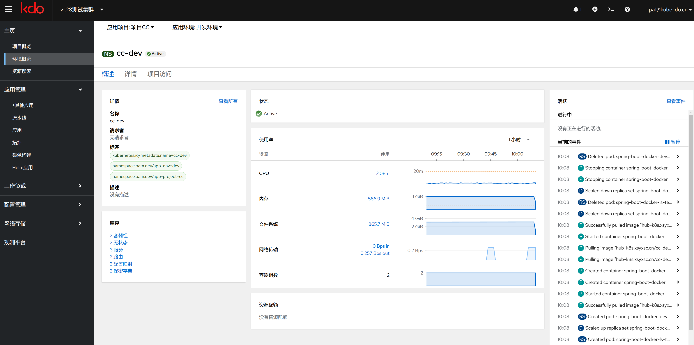
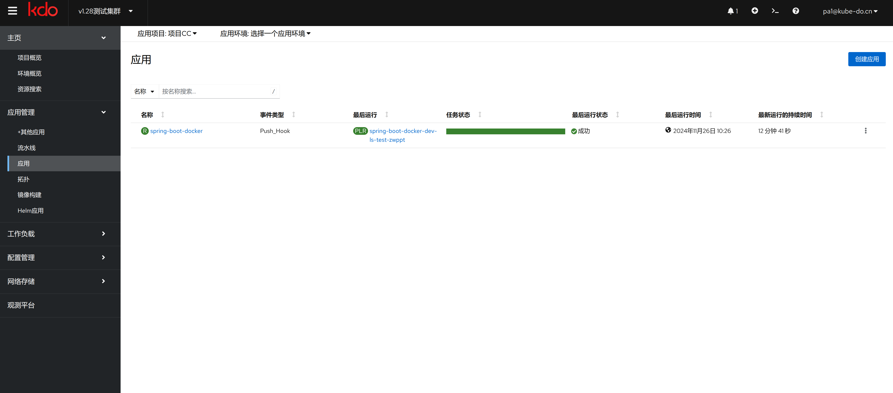

## kdo DevOps 指南概述

DevOps 是文化理念、技术实践和工具的组合，可促进技术运维和软件开发团队之间的集成、协作、沟通和自动化，从而提高软件交付的质量和速度。

### 功能

kdo DevOps 提供了以下功能：

- 源码构建，从源码开始构建应用
- 镜像构建，从镜像开始构建应用
- 应用商店构建，从应用商店中安装应用
- 二进制构建，从二进制文件开始构建应用
- Kubernetes YAML 构建，从 Kubernetes YAML 开始构建应用
- Helm 构建，从 Helm Chart 开始构建应用
- 第三方服务构建，对接平台外的第三方服务。

### kdo CI/CD

kdo CI/CD 是基于 [Tekton](https://tekton.dev/docs/) 的 CI/CD 工具，它可以帮助用户快速的从源码构建应用，同时支持多种语言和框架。无需编写复杂的 Pipeline，只需要简单的配置即可。

## kdo DevOps介绍

**kdo** DevOps平台是一个支持多租户，多集群，多环境的DevOps平台，用户能够在不了解复杂基础设施的情况下，操作并维护应用程序。而运维人员将会是这个平台的管理员，他们将会负责管理整个平台的运行。
kdo DevOps平台有应用项目，应用环境，应用三层模型

### 应用项目

应用项目是指应用系统集合，它里面包含多种资源，可能包括多个环境和多个应用。

### 应用环境
kdo的应用环境是对应kubernetes的命名空间，对应方式是: 项目名-环境名。比如，项目名是abc,环境名是dev，那这个环境对应的命名空间就是abc-dev

应用环境里面主要包括当前环境的概述，包括资源使用情况，监控告警，事件（event）
### 应用

