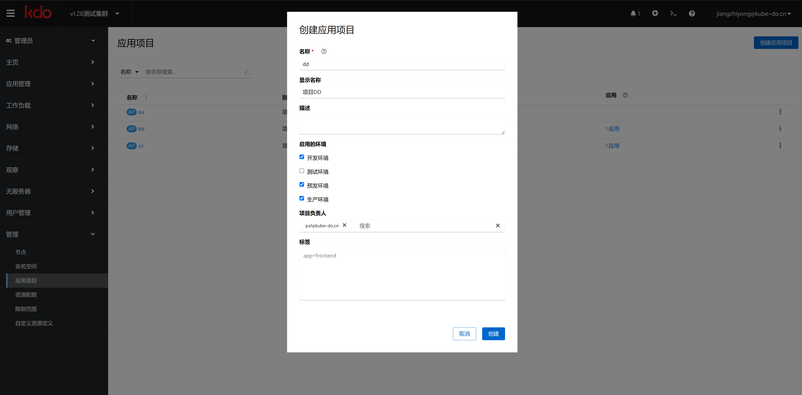

1. TOC
{:toc}

在软件开发过程中，项目、环境和应用这三个概念各自有着特定的意义，并且相互关联。

应用（Application）:
应用是指为用户提供特定功能和服务的软件程序。它可以是移动应用、桌面应用、Web应用等形式。在一个项目中可能会开发多个应用，这些应用可能需要在不同的环境中进行开发、测试和部署。
三者之间的关系：

## 概述
项目是指为了实现一个或多个目标而进行的一系列协调的活动。在软件开发中，项目通常指的是构建一个新软件产品或对现有软件进行重大更新的过程。
项目有明确的开始和结束时间，以及预定的目标和范围。项目可以包含多个应用，并涉及从需求分析、设计、编码、测试到部署等多个阶段。

一个项目可能会涉及到开发和维护多个应用。 这些应用会在不同的环境中经历它们的生命周期，从开发、测试到最后上线。
不同的应用可能根据其特性或者服务的对象不同，被部署到不同的环境之中。例如，内部使用的工具可能只需要部署在公司内部的服务器上，而面向公众的服务则需要部署在具有更高可用性和扩展性的生产环境中。

## 创建项目

{: .note }
项目只有集群管理员才能创建，菜单选择:`管理->应用项目`，点击新建。
在KDO平台创建项目时会自动创建一个同名的[命名空间](/docs/admin/management/namespaces)，这个命名空间用管理项目的[应用](/docs/dev/applications/repository)。
这个项目里面的应用运行流水线，都运行在这个命名空间里面。

| 菜单    | 说明                                                 |
|:------|:---------------------------------------------------|
| 名称    | 项目的英文名字，不能重复。只能包含字母、数字、下划线、短横线，不能以数字开头，不能以短横线结尾    |
| 显示名称  | 项目在kdo平台显示名字，便于用户识别，支持中文，默认为名称                     |                            
| 描述    | 关于这个项目的描述                                          |
| 启用的环境 | 默认启用的环境，主要有开发(dev)、测试(test)、预发(stage)、生产(prod)四个环境 |
| 项目负责人 | 这个项目的负责人，负责人可以管理项目成员和项目环境                          |

## 项目管理

{: .note }
项目作为应用开发的资源集合，可以管理整个项目的资源，只有项目管理员才有权限管理项目，其他项目用户没有这个菜单。

| 菜单           | 说明                                                               |
|:-------------|:-----------------------------------------------------------------|
| 项目概述         | 项目整体概述，项目资源和应用展示。                                                |
| 项目成员(仅项目管理员) | 对项目成员的管理，每种人员在不同环境有不同的权限。                                        |
| 项目环境(仅项目管理员) | 项目环境的管理，包括增加、修改、删除、查看等功能。[更多信息](/docs/devops/project-manage/env) |  
| YAML(仅项目管理员) | 资源的YAML配置文件。                                                     |

## KDO平台环境介绍
 在KDO平台中，一个环境对应 `Kubernetes` 的一个命名空间，比如项目 `abc` 的开发环境(`dev`)的命名空间就为`abc-dev`。在KDO平台默认定义了四种环境：

1. **开发环境：** 开发者编写和调试代码的地方。
2. **测试环境：** 用于质量保证团队进行功能测试、性能测试等。
3. **预生产环境：** 模拟生产环境进行最后的验证，确保所有组件都能正常工作。
4. **生产环境：** 最终用户使用软件产品的实际运行环境。

## KDO平台项目成员和项目环境权限关系
在KDO平台中，项目成员默认定义了四类用户，分别有项目管理员、开发人员、测试人员、运维人员。项目成员和项目环境权限关系如下：

1. **项目管理员：** 可以管理项目成员和项目环境，可以管理该项目下`所有环境`的资源。
2. **开发人员：** 可以查看和修改`开发环境`的资源，可以查看`测试环境`、`预发环境`和`生产环境`的资源。
3. **测试人员：** 可以查看和修改`测试环境`的资源，可以查看`开发环境`、`预发环境`和`生产环境`的资源。
4. **运维人员：** 可以查看和修改`预发环境`和`生产环境`的资源，可以查看`开发环境`和`测试环境`的资源。

## 开发、测试环境管理
应用开发过程中，同一个业务系统开发者可能需要重复多次的进行开发环境搭建。比如以下几类情况：

- 多个新功能在不同的分支进行同时迭代，那么不同的分支代码需要独立的部署；
- 团队中多个开发者进行开发，每个开发者都需要自己独立的一套开发环境；
- 开发环境应用开发完成，希望快速部署到测试环境或预发布环境；
- 生产环境灰度发布，希望快速部署指定组件使用指定的源代码版本；

遇到以上的情况，如果应用只有一个组件，或许从头开始创建并不复杂。那如果应用包括 5 个甚至更多组件的时候呢，创建过程将耗费大量时间且是在做重复的事情。这个时候基于已经部署好的应用直接进行复制则可有效解决效率问题。

### 前提条件

1. 准备一个部署好的应用，可以包括使用源码、镜像创建的多个组件。
2. 准备至少两个团队，验证跨团队应用复制。
3. 组件对应的源码可以准备多个分支或者镜像可以准备多个 Tag，验证复制时便捷修改构建源版本。

### 操作流程

1. 进入 **应用视图 -> 总览拓扑** 页面，点击右上方 **快速复制** 按钮；
2. 弹窗中上方区域显示复制的目标应用，默认是当前应用，可以根据需求选择不同的团队或应用，也可以直接在指定团队中创建新的应用。
3. 弹窗中下方区域显示当前应用的所有组件信息及其构建源信息，默认选中所有组件进行复制，可根据需要选择部分组件。且可根据需要更改组件的构建源版本，比如代码分支或镜像的 Tag。
4. 点击确定则开始进行复制，复制完成后自己构建并启动所有复制的组件，页面跳转到目标应用中。

### 了解原理

**应用模型的关键性体现**

KDO 中默认基于应用模型对各类型软件进行抽象管理，因此复制其实就是模型属性的复制，可以保障复制出来的组件与源组件属性保持一致。这再一次说明了一点，在 KDO 中部署组件的过程其实是在组装应用模型的过程，一旦部署完成即完成了业务模型的定义。

**组件复制时依赖关系的处理**

组件之间目前有两个属性具有关联性，包括组件依赖和存储依赖。复制组件时会存在两种情况，组件和依赖的组件双方一起被复制和只有依赖方被复制。若是双方都同时被复制，那么它们之间的依赖关系将保持，在新的组件双方之间进行建立，不管是否跨团队复制。若只有依赖方被复制，将会出现两种处理模式。复制的目标应用在当前团队下，则复制出的新组件依然依赖源依赖的组件，若复制的目标应用不在当前团队，那么依赖关系在复制时进行解除。
