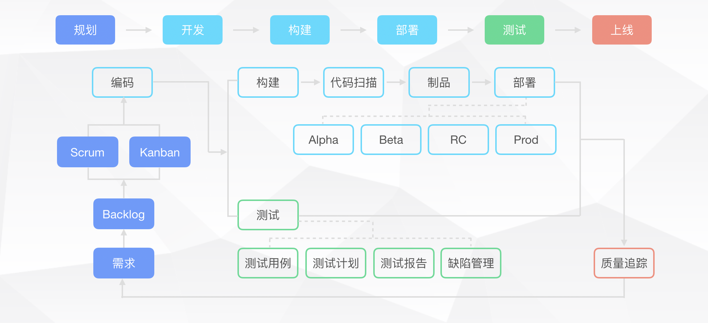
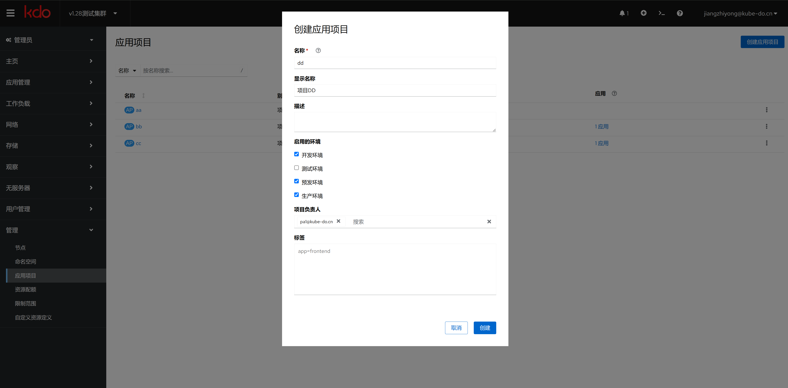

1. TOC
{:toc}

## 概述
项目是指为了实现一个或多个目标而进行的一系列协调的活动。在软件开发中，项目通常指的是构建一个新软件产品或对现有软件进行重大更新的过程。
项目有明确的开始和结束时间，以及预定的目标和范围。项目可以包含多个应用，并涉及从需求分析、设计、编码、测试到部署等多个阶段。

## 创建项目

{: .note }
项目只有集群管理员才能创建，菜单选择:`管理->应用项目`，点击新建。
在KDO平台创建项目时会自动创建一个同名的[命名空间](/docs/admin/management/namespaces)，这个命名空间用管理项目的[应用](/docs/dev/applications/repository)。
这个项目里面的应用运行流水线，都运行在这个命名空间里面。

| 菜单    | 说明                                                 |
|:------|:---------------------------------------------------|
| 名称    | 项目的英文名字，不能重复。只能包含字母、数字、下划线、短横线，不能以数字开头，不能以短横线结尾    |
| 显示名称  | 项目在kdo平台显示名字，便于用户识别，支持中文，默认为名称                     |                            
| 描述    | 关于这个项目的描述                                          |
| 启用的环境 | 默认启用的环境，主要有开发(dev)、测试(test)、预发(stage)、生产(prod)四个环境 |
| 项目负责人 | 这个项目的负责人，负责人可以管理项目成员和项目环境                          |

## 项目管理

{: .note }
项目作为应用开发的资源集合，可以管理整个项目的资源，只有项目管理员才有权限管理项目，其他项目用户没有这个菜单。

| 菜单           | 说明                                                               |
|:-------------|:-----------------------------------------------------------------|
| 项目概述         | 项目整体概述，项目资源和应用展示。                                                |
| 项目成员(仅项目管理员) | 对项目成员的管理，每种人员在不同环境有不同的权限。                                        |
| 项目环境(仅项目管理员) | 项目环境的管理，包括增加、修改、删除、查看等功能。[更多信息](/docs/devops/project-manage/env) |  
| YAML(仅项目管理员) | 资源的YAML配置文件。                                                     |

## KDO平台项目成员和项目环境权限关系

1. **项目管理员：** 可以管理项目成员和项目环境，可以管理该项目下`所有环境`的资源。
2. **开发人员：** 可以查看和修改`开发环境`的资源，可以查看`测试环境`、`预发环境`和`生产环境`的资源。
3. **测试人员：** 可以查看和修改`测试环境`的资源，可以查看`开发环境`、`预发环境`和`生产环境`的资源。
4. **运维人员：** 可以查看和修改`预发环境`和`生产环境`的资源，可以查看`开发环境`和`测试环境`的资源。