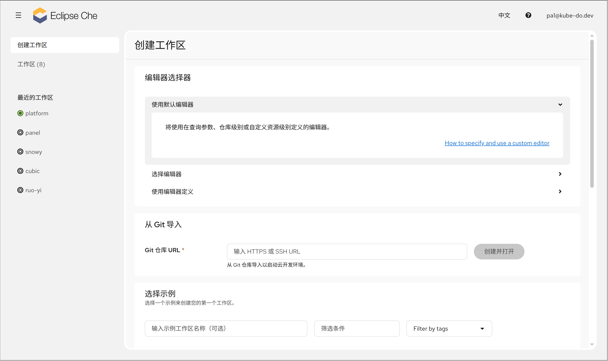

1. TOC
{:toc}

Che Dashboard 的 **创建工作区** 页面（路由 `/create-workspace`）是创建云开发环境的统一入口。页面从上到下依次为：编辑器选择器 → AI 提供商选择器（平台启用 AI 能力时显示）→ 从 Git 导入 → 示例列表。

## 编辑器选择器

在创建前可选择工作区使用的编辑器，提供三种方式：

| 方式 | 说明 |
|------|------|
| **使用默认编辑器** | 使用平台/管理员定义的默认编辑器（将使用在查询参数、仓库级别或自定义资源级别定义的编辑器） |
| **选择编辑器** | 从预置的编辑器列表中选择 |
| **使用编辑器定义** | 输入自定义编辑器定义 URL 或编辑器 ID，并可指定 **编辑器镜像**（容器镜像地址） |

{: .note }
编辑器选择仅影响**本次创建**的工作区。若需修改全局默认编辑器，请在 [用户偏好设置](/docs/ide/user-preferences/) 中调整；默认编辑器只对新建工作区生效。

## AI 提供商选择器

平台启用 AI 能力时显示，用于为工作区注入 AI 编码工具：

- **使用默认 AI 提供商**：使用管理员配置的默认 AI 提供商
- **选择 AI 提供商**：手动选择一个或多个 AI 提供商
- **在用户偏好设置中管理 API 密钥**：跳转到 [用户偏好设置](/docs/ide/user-preferences/) 的 AI 提供商密钥 Tab

{: .note }
AI 编码工具在启动时通过 init 容器注入工作区容器。所选工具二进制文件将复制到共享卷并添加到 PATH。若选择器加载失败，仍可不在选择 AI 提供商的情况下创建工作区。

## 从 Git 导入

从已有 Git 仓库创建工作区是最常用的方式。

### 基本流程

1. 在 **Git 仓库 URL** 输入框中粘贴仓库地址，支持 **HTTPS** 或 **SSH** 两种协议：
   - 占位提示：`输入 HTTPS 或 SSH URL`
   - SSH 地址需要已配置 SSH 密钥；未配置时会提示到 [用户偏好设置](/docs/ide/user-preferences/) 中添加 SSH 密钥
2. 点击 **创建并打开** 按钮
3. 若仓库来源不受信任，会弹出确认框 **「您信任此仓库的作者吗？」**，确认后继续创建；若已在信任列表或为平台允许来源则自动跳过
4. 系统在新标签页中进入 [工厂加载流程](/docs/ide/ide-loader/)，完成代码克隆、环境创建与 IDE 启动

{: .warning }
从不受信任的仓库创建工作区会执行仓库中的代码与配置，请仅信任可信来源。

### Git Repo Options（仓库选项）

URL 校验通过后，展开 **Git Repo Options** 手风琴可配置：

| 字段 | 说明 |
|------|------|
| **Git 分支** | 指定克隆的分支（输入 Git 仓库的分支）；仅当是受支持 Git 服务（GitHub/GitLab/Bitbucket/Azure DevOps/Gitee）或 SSH 时显示 |
| **附加 Git 远程仓库** | 添加额外的 Git remote（origin + HTTP 或 SSH URL），用于多远端协作 |
| **Devfile 路径** | 指定 devfile 在仓库内的相对路径；留空则自动查找仓库根目录的 `devfile.yaml` |

### Advanced Options（高级选项）

| 字段 | 说明 |
|------|------|
| **容器镜像** | 输入容器镜像，覆盖默认开发镜像 |
| **Temporary Storage（临时存储）** | 开启后使用临时存储，I/O 更快但重启后数据不持久 |
| **Create New If Existing** | 仓库已存在工作区时创建新的（复用策略开关） |
| **内存 / CPU 限制** | 为工作区设置资源上限 |

## 从示例创建

在 **选择示例** 区域，可从平台预置的语言/框架示例（Java、Node.js、Python、Go 等）快速创建工作区，无需关联自己的仓库。

### 工具栏

| 控件 | 说明 |
|------|------|
| **工作区名称** | 可选，≤ 63 字符，仅允许字母、数字、连字符与下划线，必须以字母或数字开头和结尾；输入名称会自动开启"创建新工作区" |
| **创建新工作区** | 开启时每次创建新工作区；关闭时复用现有工作区 |
| **临时存储** | 临时存储允许更快的 I/O，但存储空间可能有限且不持久 |
| **搜索 / 标签 / 语言筛选** | 按文本、标签或语言过滤示例 |

### 工作区名称规则

- 最大长度 **63** 字符
- 合法字符：`字母、数字、连字符（-）、下划线（_）`
- 必须以字母或数字开头和结尾，不能包含空格或特殊字符（如 `$`、`@`、`#`）
- 与已有工作区重名时会提示「名称已被使用」

### 示例卡片

每个示例卡片显示图标、名称、描述与可见标签（如 `Community`、`Tech-Preview`、`Devfile.io`、`AirGap`）。空工作区示例优先展示。点击卡片即进入工厂加载流程创建并启动工作区。

## 创建后发生了什么

无论通过 Git 导入还是示例创建，最终都会打开新标签页进入 **Factory Loader**（工厂加载页），依次执行：

1. 初始化（校验 URL、信任来源与创建策略）
2. 检查运行工作区数量限制
3. 创建工作区（获取 devfile → 检查现有工作区 → 等待 SCC 权限 → 应用 devfile）
4. 等待工作区启动
5. 打开 IDE

详细说明见 [打开 IDE 与工厂加载](/docs/ide/ide-loader/)。

<!-- 截图：创建工作区页面（占位，待补充） -->

## FAQ

#### Q: 输入 SSH 地址提示「未找到 SSH 密钥」？

**解决方法：** 在 [用户偏好设置](/docs/ide/user-preferences/) 的 SSH Keys Tab 中添加你的 SSH 密钥对，然后重试。

#### Q: 点击「创建并打开」后一直停留在加载页？

**原因：** 工厂加载需要解析仓库、创建与启动工作区，通常耗时 2-3 分钟（首次拉取镜像更久）。

**解决方法：** 查看 [打开 IDE 与工厂加载](/docs/ide/ide-loader/) 中的进度步骤，耐心等待；若长时间卡在某一步，查看日志 Tab 定位问题。