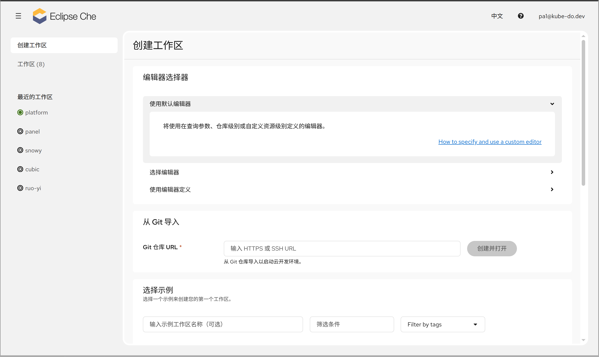
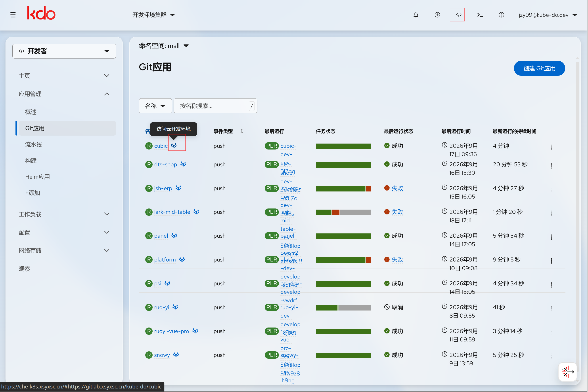
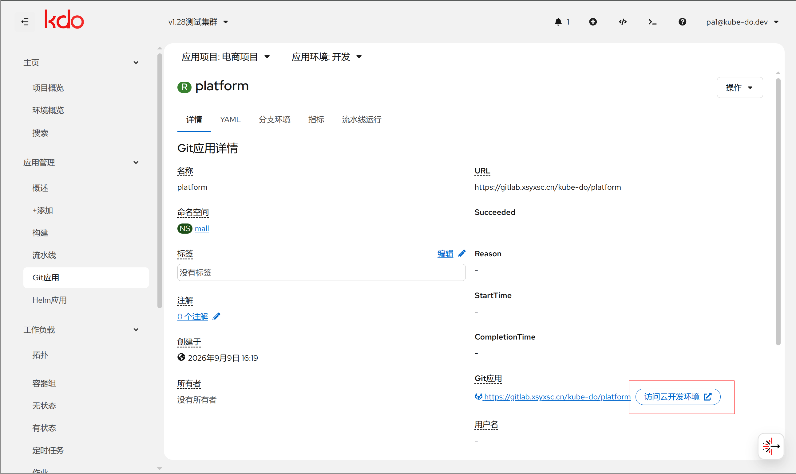
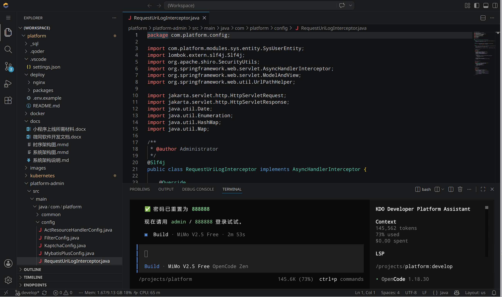

1. TOC
{:toc}

{: .note }
KDO 平台已集成 [Eclipse Che](https://eclipse.dev/che/)，为开发者提供**浏览器即用的云开发环境（Cloud Development Environment, CDE）**。
无需在本地安装 IDE、配置依赖或克隆代码，只需浏览器即可在 Kubernetes 集群中完成编码、构建、测试与调试。

## 简介

Eclipse Che 是 Kubernetes 原生的云 IDE 平台，KDO 平台内置集成后，开发环境直接运行在集群的 Pod 中：

- **零安装**：浏览器即开发环境，无需本地配置开发工具链
- **环境一致**：所有团队成员的开发环境由统一的镜像定义，告别"在我电脑上能跑"
- **安全可控**：代码保留在集群侧，权限与 KDO 平台账号一致
- **高性能**：依赖下载、构建编译在云端完成，充分利用集群算力

{: .highlight }
与 [命令行模式(CloudShell)](/docs/terminal/) 的分工：CloudShell 面向 CLI 快速操作与排查，Eclipse Che 面向完整的 IDE 编码、调试与交付。二者互补，可配合使用。

## 核心概念

| 概念 | 说明 |
|------|------|
| **Workspace（工作区）** | 一个独立、可复用的云开发环境，包含一个或多个容器（dev 组件）、编辑器与项目代码。每个工作区有唯一的名称（≤ 63 字符）与所在的 Kubernetes 命名空间 |
| **Devfile** | 描述工作区"是什么"的 YAML 文件（`devfile.yaml`），声明组件、项目、命令与编辑器。存放在仓库根目录即被自动识别 |
| **Che Dashboard** | 平台的 Web 管理界面，用于创建、启动、停止、备份与恢复工作区，以及管理用户偏好与访问凭据 |
| **编辑器** | 工作区使用的 IDE（默认 Che Code，即 VS Code Web 版），可由管理员预置或由用户按工作区选择 |
| **工厂（Factory）** | 通过 URL 一键从 Git 仓库创建并启动工作区的机制 |

## 页面导航

Che Dashboard 提供以下核心页面，本手册按此组织：

| 页面 | 路由 | 说明 |
|------|------|------|
| [创建工作区](/docs/ide/create-workspace/) | `/create-workspace` | 从 Git 仓库或示例创建新的工作区 |
| [工作区管理](/docs/ide/workspace-management/) | `/workspaces` | 查看、启动、停止、删除、批量管理全部工作区 |
| [打开 IDE 与工厂加载](/docs/ide/ide-loader/) | `/ide/...`、`/load-factory` | 启动工作区与加载进度，以及一键工厂创建 |
| [备份与恢复](/docs/ide/backup-and-restore/) | `/restore-from-backup` | 从备份镜像恢复工作区（含跨集群迁移） |
| [用户偏好设置](/docs/ide/user-preferences/) | `/user-preferences` | 配置容器注册表、Git 服务、SSH 密钥、Git 身份等 |
| [个人访问令牌](/docs/ide/personal-access-tokens/) | `/user-preferences` | 配置 Git 访问令牌，克隆私有仓库与推送代码 |

{: .highlight }
使用云开发环境前，请先为 Git 仓库配置好[个人访问令牌](/docs/ide/personal-access-tokens/)。如有多个不同的 Git 服务商或仓库，需要分别配置。

## 快速开始

1. 登录 KDO 平台 Web 控制台
2. 在控制台顶部导航中点击 **云开发环境** 入口，浏览器将自动打开 Che Dashboard
3. 首次启动一个 Workspace 需要 2-3 分钟（拉取开发镜像、初始化持久化存储），后续启动因镜像缓存会显著加快

## 从 Git 仓库应用访问

{: .highlight }
通过 Git 仓库应用可以直接将代码加载到云开发环境，无需手动克隆。

1. 登录 KDO 平台 Web 控制台
2. 进入某个 Git 仓库应用的详情页面，点击 **访问云开发环境**，即可把该应用直接加载到云开发环境

## 在 IDE 中开发

Workspace 启动后，浏览器中打开的是 VS Code 风格的 IDE，具备：

| 能力 | 说明 |
|------|------|
| **文件树** | 代码已自动克隆到 Workspace 文件系统，直接在浏览器中浏览与编辑 |
| **内置终端** | 底部集成 bash 终端，工作目录为项目目录，可直接运行构建与测试命令 |
| **Git 集成** | 支持提交、推送、切换分支；配置 Git 服务 OAuth 或个人访问令牌后可免密推送 |
| **智能补全** | 基于语言服务器的代码补全、跳转、重构、错误提示 |
| **调试** | 支持断点调试，调试器与代码同处云环境，无需本地端口转发 |
| **构建运行** | 可在容器内直接编译并运行应用，甚至部署到集群测试 |

## 资源与环境

### 预装工具链

Workspace 使用通用开发镜像（Universal Developer Image），预置了主流语言的编译器、运行时与构建工具（Java、Go、Python、Node.js 等）。若项目需要额外工具，可在 `devfile.yaml` 中声明依赖组件。

### 持久化存储

- 项目代码默认存放在持久化卷（PV）中，**停止/重启 Workspace 后代码不会丢失**
- 未挂载到 PV 的容器内文件为临时存储，Workspace 停止后会被清理
- 存储类型（临时 / 按用户 / 按工作区）可在工作区详情页调整，详见 [工作区管理](/docs/ide/workspace-management/)

### 资源配额

{: .warning }
Workspace 运行在 Kubernetes Pod 中，受命名空间资源配额限制。请合理规划并发 Workspace 数量，避免因资源不足导致启动失败或响应缓慢。

## 注意事项与安全

- **认证与权限**：Workspace 使用 KDO 平台账号认证，权限与用户在平台的权限一致，无法越权访问其他命名空间资源
- **代码安全**：代码始终保留在集群侧，不在本地落盘，适合敏感项目与代码不落地场景
- **访问时效**：登录态有时效性，若访问异常，请重新登录 KDO 平台后再打开 CloudShell 与 Eclipse Che
- **Git 访问**：私有仓库需配置个人访问令牌或接受 SCM 认证授权后，方可克隆与推送，详见 [个人访问令牌](/docs/ide/personal-access-tokens/)
- **信任来源**：从不受信任的仓库创建工作区时，需要确认"您信任此仓库的作者吗？"，避免执行来源不明的代码

## FAQ / 故障排查

#### Q: 首次启动 Workspace 为什么很慢？

**原因：** 首次启动需要拉取开发镜像、初始化持久化卷，通常耗时 2-3 分钟。

**解决方法：** 耐心等待启动页进度；镜像在节点缓存后，后续启动会明显加快。

#### Q: Workspace 打开后提示资源不足 / 启动失败

**原因：** 命名空间资源配额不足。

**解决方法：** 联系平台管理员确认资源配额；停止不使用的 Workspace 释放资源后重试。

#### Q: 代码在 Workspace 中修改后丢失？

**原因：** 代码未存放在持久化卷中（如在 `/tmp` 或非项目目录中修改）。

**解决方法：** 始终在项目目录（自动挂载到 PV）中编码；若使用了临时目录，请先提交或拷贝回项目目录。

#### Q: 推送代码时提示认证失败？

**原因：** 尚未配置 Git 服务的 OAuth 或个人访问令牌。

**解决方法：** 在 Che Dashboard 中完成 Git 服务授权，或为私有仓库配置个人访问令牌后重试。

更多问题参见各子页面的 FAQ 小节。