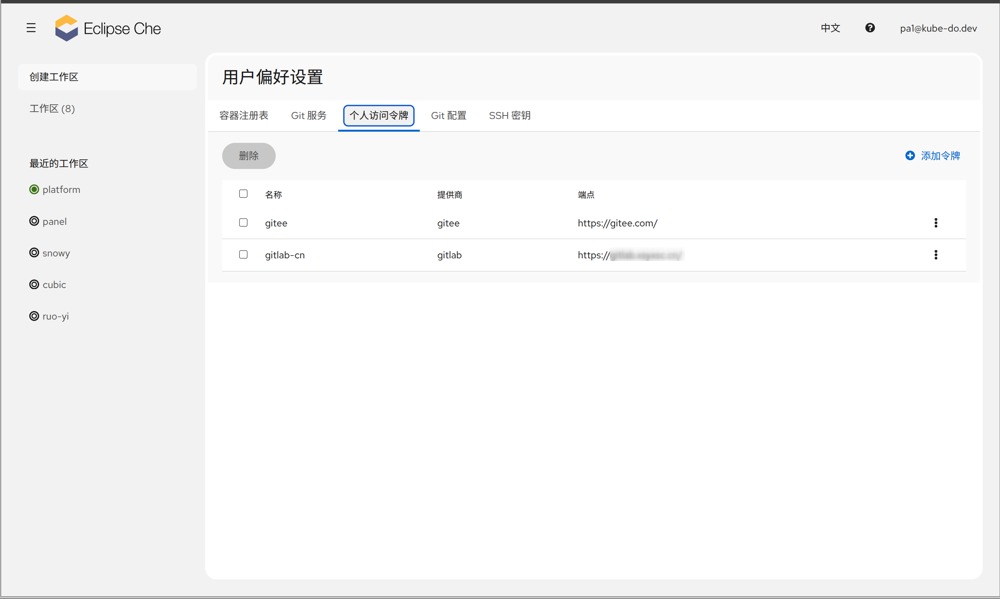
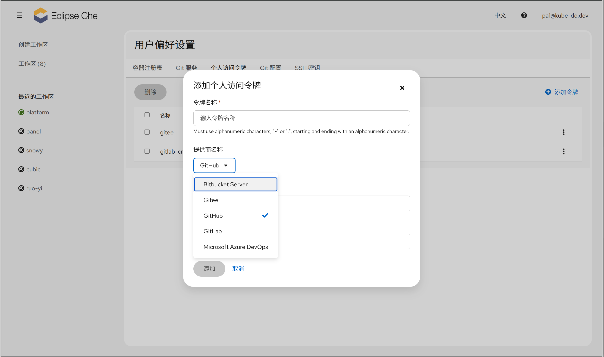

1. TOC
{:toc}


{: .important }
Personal Access Tokens（个人访问令牌，简称 PAT）用于让 Eclipse Che 访问你的 Git 仓库。在克隆**私有仓库**、从 Git 仓库创建 Workspace 以及**推送代码**时，都需要配置 PAT（或由管理员配置 OAuth）。

## 用途

配置 PAT 后，Eclipse Che 可以在以下场景使用你的 Git 身份：

| 场景 | 说明 |
|------|------|
| **克隆私有仓库** | 从 Git 仓库创建 Workspace 时，Che 可读取并克隆私有仓库代码 |
| **推送代码** | 在 Workspace 内通过 Git 提交并推送代码到远程仓库 |
| **访问隐藏配置** | 可访问仓库中的 `/.che`、`/.vscode` 等特殊目录 |
| **自动同步 Git 身份** | 若 Git 服务商资料中设置了姓名和邮箱，Che 会自动同步到 Git 配置 |

{: .note }
如果管理员已为 Git 服务商配置了 OAuth，则无需配置 PAT；**未配置 OAuth 时，PAT 是唯一方式**。



## 支持的 Git 服务商

PAT 支持以下 Git 服务商（默认 GitHub）：

- **GitHub**
- **GitLab**
- **Bitbucket**
- **Bitbucket Server**
- **Azure DevOps**
- **Gitee**

## 配置步骤

### 1. 在 Git 服务商处生成令牌

以 GitHub 为例（其他服务商类似）：

1. 登录 GitHub，进入 **Settings → Developer settings → Personal access tokens**
2. 点击 **Generate new token**，选择需要的仓库权限（`repo` 读写权限，若需推送请勾选 `workflow`）
3. 生成后**立即复制并保存**令牌（离开页面后将无法再次查看完整值）

{: .warning }
令牌只显示一次，请妥善保管。遗失后需重新生成。

### 2. 在 User Preferences 中配置

1. 打开 Che Dashboard → **用户菜单 → User Preferences** → **Personal Access Tokens** Tab
2. 点击 **添加令牌**，填写以下字段：



| 字段 | 说明 |
|------|------|
| **名称（Token name）** | 令牌的显示名称，便于识别 |
| **提供商（Provider）** | Git 服务商（GitHub / GitLab / Bitbucket / Bitbucket Server / Azure DevOps / Gitee） |
| **端点（Endpoint）** | Git 服务商地址，选择提供商后自动填充默认值（如 `https://github.com`），可修改 |
| **组织（Organization）** | 仅 **Azure DevOps** 需要填写：组织名或 Azure DevOps Server 的集合名 |
| **令牌（Token）** | Git 服务商处生成的访问令牌 |

3. 点击保存，令牌保存成功后在列表中显示

<!-- 截图：Personal Access Tokens Tab（占位，待补充） -->

配置完成后即可从私有仓库创建 Workspace，并在 Workspace 内正常推送代码。

## 工作原理

{: .note }
以下是 PAT 的工作机制，了解它有助于理解配置变更的影响。

在 User Preferences 中保存令牌后，令牌会通过 Che 后端 API（`/namespace/<你的命名空间>/personal-access-token`）保存，并作为 Kubernetes **Secret** 存储在你的用户命名空间中，带有特定标签（`app.kubernetes.io/part-of: che.eclipse.org`、`app.kubernetes.io/component: scm-personal-access-token`）及 Che 用户标识注解。令牌数据以 base64 编码存储。

Che 服务器和 DevWorkspace Operator 根据这些标签识别令牌，并在以下环节自动使用：

- **创建 Workspace 时**：克隆远程仓库（含 `/.che`、`/.vscode` 目录）
- **Workspace 运行时**：提供 Git 操作（提交、推送）的认证凭据
- **Git 身份同步**：自动从 Git 服务商获取 `user.name` / `user.email`

令牌作为 Secret 保存在集群中，不会明文出现在 Workspace 容器环境变量中。每个令牌带有一个唯一的 `tokenName`，可通过该名称编辑或删除。

## 安全注意事项

{: .warning }
- **视为密码保管**：PAT 等同于密码，泄露后他人可访问你的仓库。切勿提交到代码仓库或分享
- **最小权限**：只授予所需的最小权限（如只读克隆则无需 `workflow` 权限），使用后及时吊销
- **定期轮换**：建议定期更换令牌；发现泄露应立即在 Git 服务商处吊销，并在 User Preferences 中删除对应配置
- **令牌过期**：GitHub / GitLab 的令牌支持设置有效期，建议设置合理的过期时间

## OAuth 与 PAT 的对比

| 方式 | 前置条件 | 适用场景 |
|------|---------|---------|
| **OAuth** | 管理员在 Che 中配置了 Git 服务商 OAuth | 团队统一接入，无需用户手工配置 |
| **PAT** | 用户自行在 Git 服务商处生成令牌 | OAuth 未配置，或个人需要额外凭据 |

## FAQ

#### Q: 从 Git 仓库创建 Workspace 时提示无法访问仓库？

**原因：** 未配置 PAT 或令牌权限不足。

**解决方法：**
1. 确认已在 User Preferences → Personal Access Tokens 中配置了对应服务商的令牌
2. 检查令牌是否仍有效、权限是否包含该仓库的读取权限
3. 可用本地命令验证令牌有效性：
   ```bash
   git clone https://<PAT>@github.com/<用户名>/<仓库>.git
   ```
   克隆成功则令牌有效且权限正确。

#### Q: 令牌已配置但推送代码仍提示认证失败？

**解决方法：**
1. 确认令牌包含写权限（推送需要 `repo` 权限）
2. 若令牌已过期或被吊销，重新生成后更新 User Preferences 中的配置
3. 重启 Workspace 使新的令牌配置生效

#### Q: 需要配置多个 Git 服务商的令牌吗？

**是的。** 每个服务商可配置独立令牌，也可为同一服务商配置多个令牌（如不同组织或账号）。每个令牌使用独立的名称（tokenName）标识，分别保存在用户命名空间中。