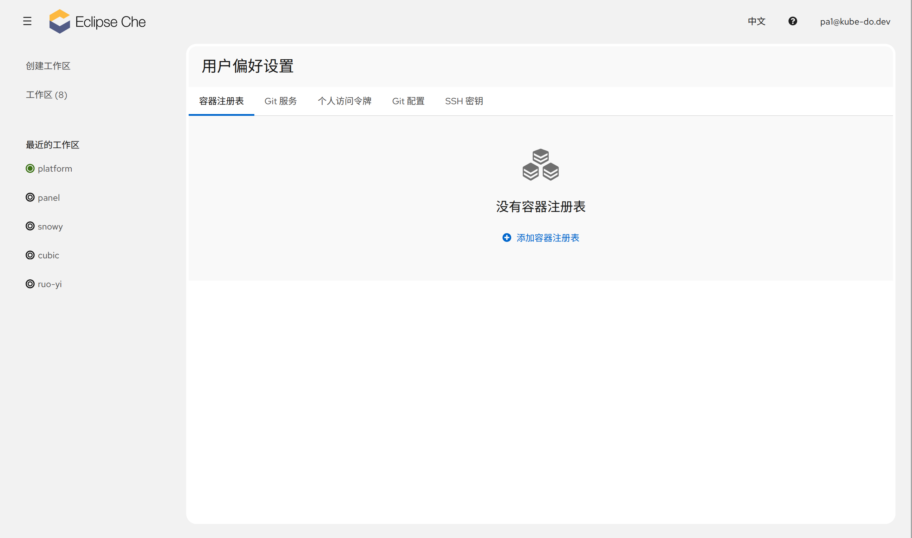
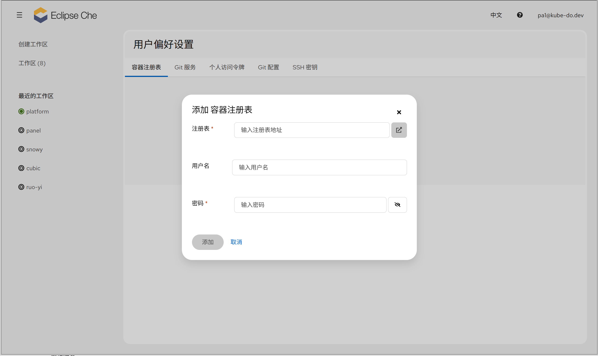
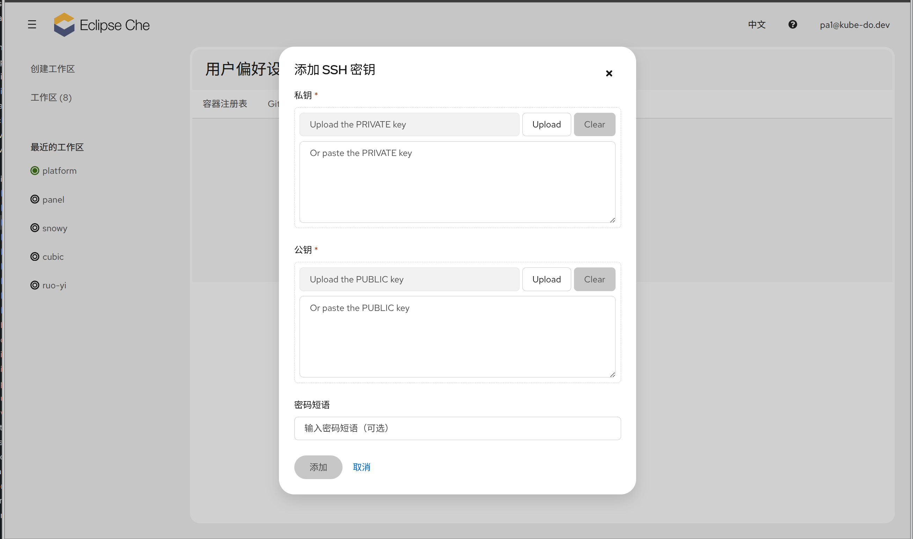
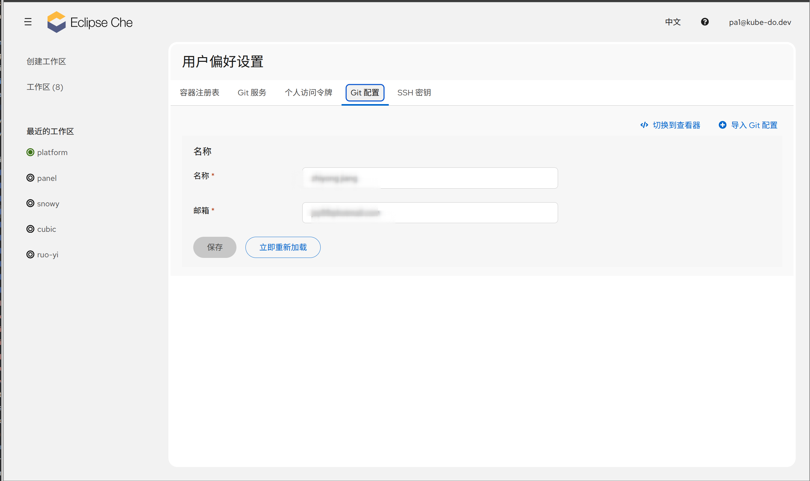

1. TOC
{:toc}


User Preferences 是 Che Dashboard 中的个人设置页面，用于配置默认编辑器、编辑器主题、SSH 密钥、Git 身份以及 Git 访问令牌等开发环境偏好。设置保存后，对之后创建和启动的所有 Workspace 生效。

## 访问入口

1. 打开 Che Dashboard
2. 点击页面右上角 **用户菜单**（用户名/头像）
3. 选择 **User Preferences**


## 选项说明

User Preferences 页面包含以下 Tab：

| Tab | 说明 |
|-----|------|
| **Container Registries（容器注册表）** | 配置私有容器镜像仓库的访问凭据（主机、用户名、密码） |
| **Git Services（Git 服务）** | 查看 Git 服务商的 OAuth 授权状态，可撤销授权 |
| **Personal Access Tokens（个人访问令牌）** | 配置 Git 服务访问令牌，详见 [个人访问令牌(Personal Access Tokens)](personal-access-tokens) |
| **Git Config（Git 配置）** | 配置 Git 身份（`user.name` / `user.email`） |
| **SSH Keys（SSH 密钥）** | 管理 SSH 密钥，用于通过 SSH 方式访问 Git 仓库 |
| **AI Provider Keys（AI 提供商密钥）** | 配置 AI 服务商的 API 密钥（平台启用 AI 能力时显示） |

### Container Registries

配置私有容器镜像仓库的访问凭据，使 Workspace 能够拉取私有镜像。

| 字段 | 说明 |
|------|------|
| **Host（主机）** | 镜像仓库地址 |
| **Username（用户名）** | 登录用户名 |
| **Password（密码）** | 登录密码 |

支持添加多个仓库，可随时编辑或删除。



### Git Services

查看通过 OAuth 授权的 Git 服务商及其授权状态：

- **已授权**：该服务商已通过 OAuth 完成授权
- **未授权**：尚未授权，可点击授权
- **已拒绝**：用户拒绝了授权请求

如需解除某服务商的授权，点击 **撤销** 即可。


### SSH Keys

用于将 Git 仓库通过 SSH 协议访问。将你的 SSH 密钥对保存到此处后，Workspace 内即可通过 SSH 方式克隆和推送代码。

1. 在本地生成 SSH 密钥对（如已有可跳过）：
   ```bash
   ssh-keygen -t ed25519 -C "your_email@example.com"
   ```
2. 在 **SSH Keys** Tab 中点击 **添加 SSH 密钥**，粘贴**公钥**与**私钥**内容，如有需要可设置口令（passphrase）
3. 保存后，将公钥添加到你的 Git 服务商（GitHub / GitLab 等）账户的 SSH Keys 中

{: .note }
系统会根据 SSH Keys 中的内容自动生成默认 SSH 配置（`ssh_config`），在 Workspace 内自动生效。



### Git Config

配置 Git 提交身份。填写后，Workspace 内会自动生成 Git 配置，无需在每个 Workspace 中重复设置。

| 字段 | 说明 |
|------|------|
| **user.name** | Git 提交者姓名 |
| **user.email** | Git 提交者邮箱 |

支持表单编辑与查看器两种模式，也可**导入 Git 配置**。

{: .note }
如果已通过 OAuth 或 [个人访问令牌](personal-access-tokens) 连接了 Git 服务商，且其用户资料中设置了姓名和邮箱，则此处会自动同步对应值。



### AI Provider Keys

平台启用 AI 能力时显示。可在此为各 AI 提供商配置 API 密钥（通过环境变量注入），无需密钥的提供商显示「无需 API 密钥」。

## 生效范围

- 偏好设置按用户保存，作用于该用户创建的所有 Workspace
- 修改后新启动的 Workspace 立即生效；正在运行中的 Workspace 需重启后生效

## FAQ

#### Q: 修改默认编辑器后，已打开的 Workspace 没有变化？

**解决方法：** 默认编辑器仅对新建的 Workspace 生效。已存在的 Workspace 请删除后基于同一仓库重新创建，或在 Workspace 内手动切换编辑器。