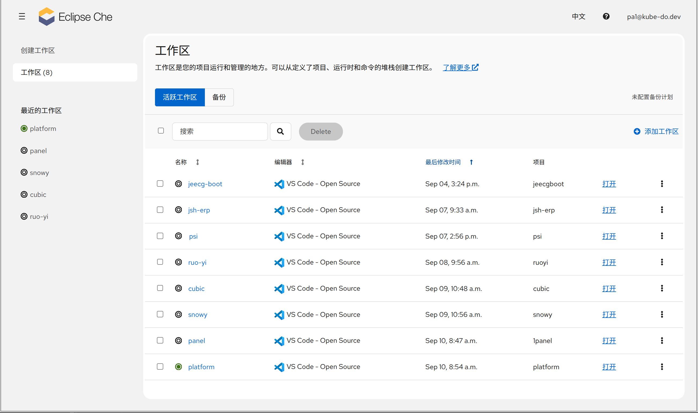
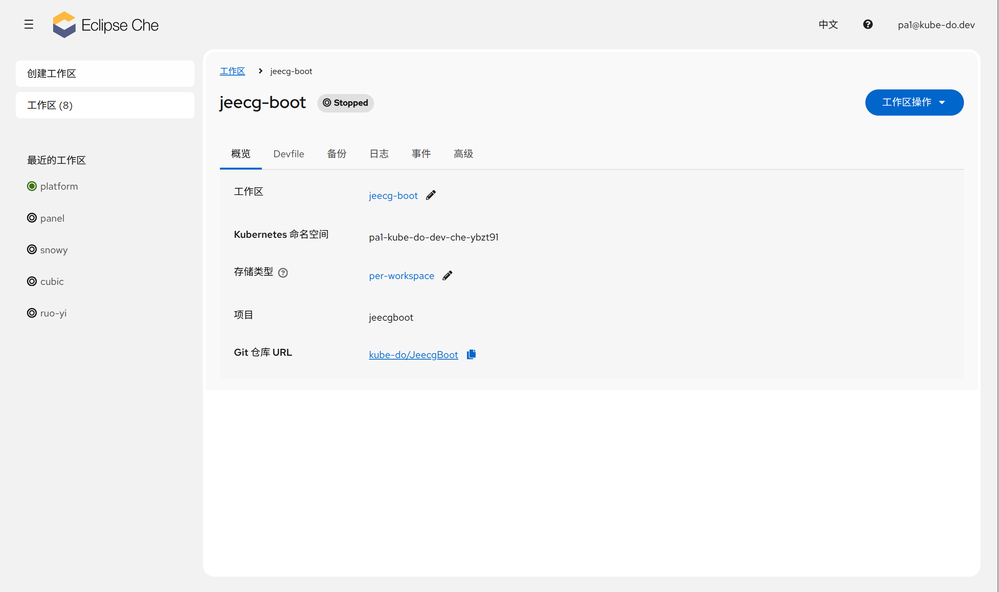

1. TOC
{:toc}

Che Dashboard 的 **工作区** 页面（路由 `/workspaces`）集中管理你的全部云开发环境，支持查看状态、启动、停止、删除与备份恢复等操作。

## 工作区列表页

### 视图切换

页面顶部提供两个视图：

| 视图 | 说明 |
|------|------|
| **活跃工作区** | 默认视图，列出全部工作区 |
| **备份** | 展示由 DevWorkspace Operator 自动创建的备份镜像列表，用于从备份恢复 |

右侧显示下次备份计划（如「备份计划：每天 02:00」）或「未配置备份计划」。

### 列表列

| 列 | 说明 |
|------|------|
| **名称** | 状态图标 + 工作区名称（点击进入详情页） |
| **编辑器** | 编辑器图标与名称，无编辑器显示 `-` |
| **AI 提供商** | 仅当平台配置了 AI 工具时显示 |
| **最后修改时间** | 1 小时内显示相对时间（如"几分钟前"），否则显示日期 |
| **备份状态** | 仅当配置了备份 registry 时显示（成功/失败/进行中/从未/不可用） |
| **项目** | devfile 中声明的项目名（逗号分隔），无则显示 `-` |

{: .note }
列表页不显示命名空间列；工作区所在的 Kubernetes 命名空间在详情页的「Kubernetes 命名空间」字段查看。

### 工作区状态

| 状态 | 含义 |
|------|------|
| **Running** | 运行中（绿色图标） |
| **Starting** | 启动中（蓝色旋转图标） |
| **Stopping** | 停止中（灰色旋转图标） |
| **Stopped** | 已停止（灰色图标） |
| **Failed / Failing** | 失败（橙色警告图标） |
| **Terminating** | 正在删除 |
| **Deprecated** | 已弃用（旧版工作区，需删除重建） |

{: .note }
若工作区存在 SCC（Security Context Constraints，OpenShift 安全上下文约束）不匹配，会显示失败警告图标。

### 行操作

每行有一个 **打开** 按钮与 **⋮（更多操作）** 菜单：

| 操作 | 说明 | 可用条件 |
|------|------|---------|
| **打开** | 在新标签页打开 IDE | 非删除中 |
| **以调试模式打开** | 以调试模式启动并打开 | 工作区已停止 |
| **后台启动** | 后台启动工作区（不打开 IDE） | 工作区已停止 |
| **重启工作区** | 停止后重新启动 | 非停止状态 |
| **以调试模式重启** | 以调试模式重启 | 非停止状态 |
| **停止工作区** | 释放 Pod 资源（代码保留在持久化卷） | 非停止状态 |
| **删除工作区** | 删除工作区与其持久化数据（不可恢复） | 非删除中 |
| **工作区详情** | 进入详情页 | 仅列表页 |

### 批量删除

1. 勾选全选复选框或逐个勾选工作区
2. 点击工具栏的 **Delete** 批量删除按钮
3. 在弹出的确认框中确认（单选「您要删除工作区「{{name}}」吗？」/ 多选「您要删除 {{count}} 个工作区吗？」），并勾选 **「我理解此操作无法撤销。」**
4. 点击 **删除**

{: .warning }
若涉及 **Per-user 存储** 的工作区（多个工作区共享同一 PVC 且为 RWO 模式），删除前会弹出警告：
**「为防止删除时出现问题，请在删除前停止其他使用 Per-user 存储类型的工作区。」** 可选择「仍然继续」或取消。

### 空状态

- 没有任何工作区时：显示 **「没有工作区」** + **「添加工作区」** 按钮（跳转到创建工作区页）
- 筛选无结果时：显示 **「未找到内容」**，可清除筛选条件

## 工作区详情页

在工作区列表中点击工作区名称进入详情页（路由 `/workspace/:namespace/:workspaceName`），包含 **6 个 Tab**：

| Tab | 说明 |
|-----|------|
| **概览** | 基本信息与可编辑配置 |
| **Devfile** | 查看工作区的 devfile YAML（只读） |
| **备份** | 备份状态、备份计划与备份镜像 |
| **日志** | 工作区运行日志 |
| **事件** | 工作区相关 Kubernetes 事件 |
| **高级** | 高级运维操作（刷新 Kubeconfig） |

### 概览 Tab

| 字段 | 说明 | 可编辑 |
|------|------|--------|
| **工作区名称** | 点击铅笔图标弹窗编辑名称 | 停止/失败状态时可编辑 |
| **Kubernetes 命名空间** | 工作区所在的命名空间 | 只读 |
| **存储类型** | 临时存储 / 按用户 / 按工作区 | 停止/失败状态时可编辑 |
| **AI 工具** | 工作区注入的 AI 工具，无则显示「无」 | 停止/失败状态时可编辑 |
| **项目** | devfile 中的项目名列表 | 只读 |
| **Git 仓库 URL** | 工作区关联的仓库地址，带复制按钮 | 只读 |

{: .warning }
更改存储类型后**可能会丢失工作区数据**。三种存储类型的区别：

- **临时存储（ephemeral）**：使用临时存储，I/O 快，但工作区停止后数据不持久
- **按用户（per-user）**：同一用户的工作区共享持久化卷，节省存储
- **按工作区（per-workspace）**：每个工作区独立的持久化卷，隔离性最好

{: .note }
工作区运行中、已弃用或正在删除时，概览整体只读，需先停止工作区才能修改。

### Devfile Tab

使用只读编辑器展示工作区的 devfile YAML，提供 **复制**、**下载**（保存为 `<工作区名>.devfile.yaml`）、**展开全屏** 等操作。无内容时显示「Devfile 内容不可用」。

### 备份 Tab

展示该工作区的备份信息（备份由 DevWorkspace Operator 根据集群配置自动创建）：

| 字段 | 说明 |
|------|------|
| **状态** | 成功 / 失败 / 进行中 / 从未 / 不可用 |
| **错误** | 仅备份失败时显示 |
| **备份计划** | 以自然语言展示（如"每天 02:00"），未配置显示「未配置」 |
| **下次运行** | 下一次备份触发时间 |
| **上次备份** | 相对时间 + 绝对时间 |
| **备份镜像** | 备份镜像地址，带复制按钮 |

### 日志 / 事件 Tab

- **日志**：实时查看工作区容器的运行日志，便于排查启动失败或运行异常
- **事件**：查看工作区相关的 Kubernetes 事件（如调度、拉取镜像、卷挂载等）

### 高级 Tab — 刷新 Kubeconfig

将当前 Kubernetes 凭据和 podman 注册表登录信息重新注入工作区容器，适用于凭据变更后使工作区内的工具（kubectl、podman 等）获取新凭据：

- 仅工作区 **运行中** 可用，否则提示「工作区必须处于运行状态才能刷新 kubeconfig」
- 刷新成功后提示「Kubeconfig 已刷新」，需重新加载工作区 IDE 选项卡（或重启），使依赖 kubeconfig 的扩展获取新凭据
- 若 podman 登录失败，会提示「Kubeconfig 已刷新，但 podman 登录失败」

## 工作区操作（Header）

详情页右上角的 **工作区操作** 下拉菜单与列表页操作一致（不含"工作区详情"）。工作区已弃用时，会额外显示红色 **删除工作区** 按钮；从旧工作区跳转而来时，会显示 **「显示原始 Devfile」** 链接。

## FAQ

#### Q: 修改工作区名称或存储类型时无法保存？

**原因：** 工作区运行中、已弃用或正在删除时，概览为只读。

**解决方法：** 先停止工作区，再修改名称、存储类型或 AI 工具。

#### Q: 如何彻底清理某个工作区（含代码）？

**操作方法：** 在列表页或详情页选择 **删除工作区**，并在确认框勾选「我理解此操作无法撤销。」后确认。删除会同时清理其持久化数据，**不可恢复**，如需保留请先通过备份恢复机制导出。

#### Q: 删除工作区提示需要先停止其他 Per-user 存储的工作区？

**原因：** 多个使用按用户存储的工作区共享同一持久化卷，直接删除可能破坏其他运行中工作区的存储。

**解决方法：** 按警告提示，先停止其他使用 Per-user 存储类型的工作区，再执行删除。